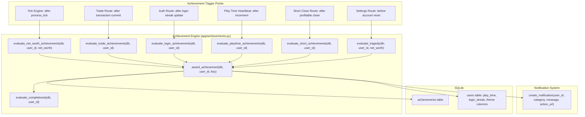
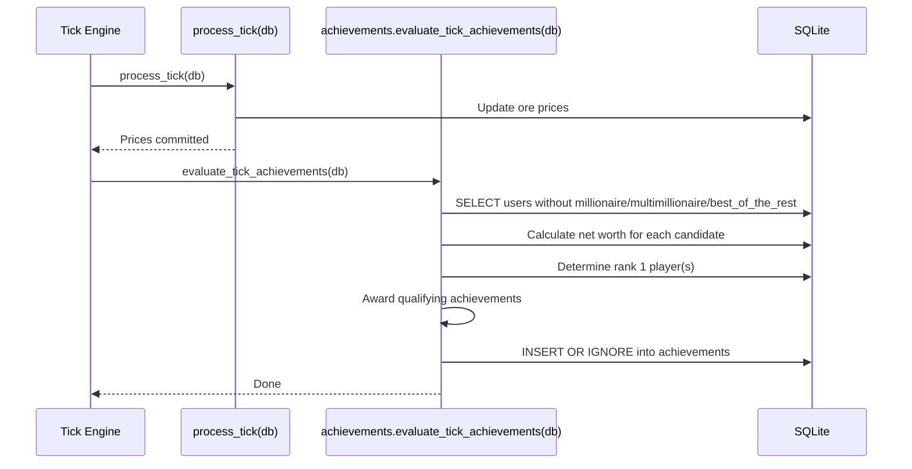

# Design Document: Achievements System

## Overview

The Achievements System adds a progression layer to OreX by rewarding players with nine permanent badges for reaching milestones in trading performance, engagement, and mastery. The system introduces infrastructure for tracking play time (session-based accumulation) and login streaks (consecutive-day counting), while integrating with the existing tick engine, transaction flow, account reset logic, and separately-spec'd Advanced Mode and Shorting System features.

Two achievements (Multimillionaire and Completionist) unlock cosmetic themes (Money and Gold respectively) that layer on top of the existing UI without affecting functional layout or trading mechanics.

### Key Design Decisions

| Decision | Rationale |
|----------|-----------|
| `achievements` table with unique constraint on (user_id, achievement_key) | Simple, idempotent — `INSERT OR IGNORE` means award logic is safe to call multiple times without branching |
| Achievement evaluation skips players who already have the achievement | Avoids recomputing net worth / trade count for players who can't earn anything new from that check |
| Play time tracked via session heartbeat (5-minute DB writes) with in-memory accumulator | Balances accuracy against DB write frequency; a 5-min flush interval means max 5 min of play time loss on crash |
| Login streak uses date comparison (not timestamp diff) | Calendar-day semantics match player expectations; simple `date(last_streak_date) + 1 day == today` check |
| Net-worth achievements evaluated in tick engine (post-price-update) | Net worth changes with every price tick; evaluating in the request path would miss passive gains from market movement |
| Theme unlock stored as boolean columns on users table | Fast lookup for the context processor; avoids joins on every page load |
| Trade count uses `COUNT(*)` on transactions (including archived) | Survives account resets; the `archived` flag doesn't affect achievement progress |
| Completionist evaluated after every other award | Simple cascade — `award_achievement()` checks completionist at the end |

## Architecture



### Achievement Evaluation Flow (Tick Engine)



## Components and Interfaces

### 1. Achievement Engine (`app/achievements.py`)

Central module containing all evaluation and award logic.

```python
# --- Constants ---
ACHIEVEMENT_KEYS = [
    "millionaire", "multimillionaire", "the_big_short",
    "dedicated", "day_trader", "budding_enthusiast",
    "completionist", "tragedy", "best_of_the_rest"
]

ACHIEVEMENT_METADATA = {
    "millionaire": {"name": "Millionaire", "description": "Reach $1,000,000 net worth", "threshold": 1_000_000},
    "multimillionaire": {"name": "Multimillionaire", "description": "Reach $10,000,000 net worth", "threshold": 10_000_000},
    "the_big_short": {"name": "The Big Short", "description": "Close a profitable short position", "threshold": None},
    "dedicated": {"name": "Dedicated", "description": "Log in 3 days in a row", "threshold": 3},
    "day_trader": {"name": "Day Trader", "description": "Complete 100 trades", "threshold": 100},
    "budding_enthusiast": {"name": "Budding Enthusiast", "description": "Play for 20 minutes", "threshold": 20},
    "completionist": {"name": "Completionist", "description": "Earn all other 8 achievements", "threshold": 8},
    "tragedy": {"name": "Tragedy", "description": "Reset account when net worth is below $10,000", "threshold": 10_000},
    "best_of_the_rest": {"name": "Best of the Rest", "description": "Reach rank 1 on the leaderboard", "threshold": 1},
}

# --- Core Award Function ---
def award_achievement(db, user_id: int, achievement_key: str) -> bool:
    """Award an achievement. Returns True if newly awarded, False if already owned.
    Uses INSERT OR IGNORE for idempotency. On new award:
    - Handles theme unlock (multimillionaire -> money, completionist -> gold)
    - Emits notification via create_notification()
    - Evaluates completionist condition
    """

def has_achievement(db, user_id: int, achievement_key: str) -> bool:
    """Check if a player already has a specific achievement."""

def get_user_achievements(db, user_id: int) -> list[dict]:
    """Return all earned achievements for a user with earned_at timestamps."""

def get_achievement_progress(db, user_id: int) -> dict:
    """Return progress indicators: trade_count, play_time, login_streak, net_worth."""

# --- Evaluation Functions (called from trigger points) ---
def evaluate_tick_achievements(db):
    """Called after process_tick(). Evaluates millionaire, multimillionaire, best_of_the_rest
    for all players who don't already have them. Batches net worth calculation."""

def evaluate_trade_achievement(db, user_id: int):
    """Called after a trade commit. Checks day_trader (100 trades)."""

def evaluate_login_achievements(db, user_id: int):
    """Called after login streak update. Checks dedicated (3-day streak)."""

def evaluate_playtime_achievement(db, user_id: int):
    """Called after play_time increment. Checks budding_enthusiast (20 min)."""

def evaluate_short_achievement(db, user_id: int):
    """Called after a profitable short close. Awards the_big_short."""

def evaluate_tragedy(db, user_id: int, net_worth: float):
    """Called before account reset. Awards tragedy if net_worth < $10,000."""

def evaluate_completionist(db, user_id: int):
    """Called after any achievement is awarded. Awards completionist if user has all other 8."""
```

### 2. Play Time Tracker (`app/playtime.py`)

Session-based play time accumulation with periodic DB flushes.

```python
def get_session_start_key(user_id: int) -> str:
    """Return the Flask session key for tracking this user's last heartbeat."""

def record_heartbeat(user_id: int):
    """Called on each authenticated request (throttled to once per minute via session timestamp).
    Increments play_time by elapsed minutes since last heartbeat (capped at 5 min to handle
    stale sessions). Triggers achievement evaluation when play_time crosses 20 min."""

def flush_playtime(db, user_id: int, minutes: int):
    """Atomically increment the user's play_time column by the given minutes."""

def reset_playtime(db, user_id: int):
    """Reset play_time to 0 (called during account reset)."""
```

**Heartbeat Strategy:**
- On each authenticated page request, check `session['last_heartbeat']` timestamp
- If >= 60 seconds have elapsed, compute `elapsed_minutes = min(floor(elapsed / 60), 5)`
- Increment `play_time` in DB by `elapsed_minutes`
- Update `session['last_heartbeat']` to now
- The 5-minute cap prevents a stale/zombie session from awarding unbounded time
- Multiple tabs: Flask sessions are shared across tabs in the same browser, so the single session timestamp prevents double-counting

### 3. Login Streak Logic (in `app/achievements.py` or `app/models.py`)

```python
def update_login_streak(db, user_id: int):
    """Called on successful login. Compares today's date with last_streak_date:
    - Same day: no change
    - Yesterday: increment login_streak by 1, update last_streak_date
    - Older/NULL: reset login_streak to 1, set last_streak_date to today
    After update, calls evaluate_login_achievements()."""
```

### 4. Tick Engine Integration (`app/market/engine.py`)

After `process_tick(db)` (and after `process_short_positions(db)` if shorting is active), call:

```python
from app.achievements import evaluate_tick_achievements
evaluate_tick_achievements(db)
```

This evaluates net-worth-based achievements (millionaire, multimillionaire, best_of_the_rest) for players who don't already have them.

### 5. Trade Route Integration (`app/routes/trade.py`)

After a successful buy/sell transaction commit:

```python
from app.achievements import evaluate_trade_achievement
evaluate_trade_achievement(db, current_user.id)
```

For short_close (in the shorting route, when profit > 0 and close_type is voluntary or take_profit):

```python
from app.achievements import evaluate_short_achievement
evaluate_short_achievement(db, current_user.id)
```

### 6. Auth Route Integration (`app/routes/auth.py`)

After successful login (after `update_last_login`):

```python
from app.achievements import update_login_streak
update_login_streak(db, user_id)
```

### 7. Settings Route Integration (`app/routes/settings.py`)

Before `reset_account()` executes:

```python
from app.achievements import evaluate_tragedy
from app.models import get_net_worth
net_worth = get_net_worth(user_id)
evaluate_tragedy(db, user_id, net_worth)
```

Inside `reset_account()`, add:
```python
db.execute("UPDATE users SET play_time = 0, login_streak = 0, last_streak_date = NULL WHERE id = ?", (user_id,))
# Note: achievements table is NOT touched — achievements persist across resets
# Theme unlock columns are NOT reset — themes persist once earned
```

### 8. Context Processor (in `app/__init__.py`)

```python
@app.context_processor
def inject_achievement_themes():
    if current_user.is_authenticated:
        from app.database import get_db
        db = get_db()
        row = db.execute(
            "SELECT money_theme_unlocked, gold_theme_unlocked FROM users WHERE id = ?",
            (current_user.id,)
        ).fetchone()
        return {
            'money_theme_unlocked': bool(row['money_theme_unlocked']) if row else False,
            'gold_theme_unlocked': bool(row['gold_theme_unlocked']) if row else False,
        }
    return {'money_theme_unlocked': False, 'gold_theme_unlocked': False}
```

### 9. Achievements Display Route (`app/routes/profile.py` or dedicated endpoint)

```python
@bp.route('/achievements')
@login_required
def achievements_page():
    """Display all 9 achievements with earned/locked state and progress bars."""
    db = get_db()
    earned = get_user_achievements(db, current_user.id)
    progress = get_achievement_progress(db, current_user.id)
    return render_template('pages/achievements.html', 
                           achievements=ACHIEVEMENT_METADATA,
                           earned=earned,
                           progress=progress)
```

## Data Models

### New Table: `achievements`

```sql
CREATE TABLE IF NOT EXISTS achievements (
    id INTEGER PRIMARY KEY,
    user_id INTEGER NOT NULL,
    achievement_key TEXT NOT NULL,
    earned_at TEXT NOT NULL DEFAULT (datetime('now', 'localtime')),
    UNIQUE(user_id, achievement_key),
    FOREIGN KEY (user_id) REFERENCES users(id) ON DELETE CASCADE
);

CREATE INDEX IF NOT EXISTS idx_achievements_user ON achievements(user_id);
```

### Users Table Additions

```sql
-- Play time and login streak tracking
ALTER TABLE users ADD COLUMN play_time INTEGER NOT NULL DEFAULT 0;
ALTER TABLE users ADD COLUMN login_streak INTEGER NOT NULL DEFAULT 0;
ALTER TABLE users ADD COLUMN last_streak_date TEXT DEFAULT NULL;

-- Theme unlock flags
ALTER TABLE users ADD COLUMN money_theme_unlocked INTEGER NOT NULL DEFAULT 0;
ALTER TABLE users ADD COLUMN gold_theme_unlocked INTEGER NOT NULL DEFAULT 0;
```

| Column | Type | Description |
|--------|------|-------------|
| `play_time` | INTEGER | Cumulative minutes of authenticated session time |
| `login_streak` | INTEGER | Current consecutive login day count |
| `last_streak_date` | TEXT (date) | Date of last streak-qualifying login (YYYY-MM-DD format) |
| `money_theme_unlocked` | INTEGER (0/1) | Set to 1 when multimillionaire is earned; never reverts |
| `gold_theme_unlocked` | INTEGER (0/1) | Set to 1 when completionist is earned; never reverts |

### Net Worth Calculation (shared with shorting system)

The `get_net_worth(user_id)` function (defined in the shorting-system spec) computes:

```
Net_Worth = FreeCash + SUM(holdings.qty * ore.price) + SUM(locked_collateral - short_value)
```

For the tick engine batch evaluation, a set-based query is used:

```sql
SELECT
    u.id,
    u.balance +
    COALESCE((SELECT SUM(h.quantity * o2.current_price)
              FROM holdings h JOIN ores o2 ON h.ore_id = o2.id
              WHERE h.user_id = u.id), 0) +
    COALESCE((SELECT SUM(sp.locked_collateral - (sp.share_quantity * o3.current_price))
              FROM short_positions sp JOIN ores o3 ON sp.ore_id = o3.id
              WHERE sp.user_id = u.id AND sp.status = 'active'), 0)
    AS net_worth
FROM users u
WHERE u.id NOT IN (
    SELECT a.user_id FROM achievements a
    WHERE a.achievement_key IN ('millionaire', 'multimillionaire', 'best_of_the_rest')
    GROUP BY a.user_id
    HAVING COUNT(DISTINCT a.achievement_key) = 3
)
```

This query only evaluates net worth for players who are still missing at least one of the three net-worth-related achievements, keeping tick processing efficient.

### Leaderboard Rank Determination

For `best_of_the_rest`, rank is determined by ordering all players by net worth descending. Ties at rank 1 all receive the achievement:

```sql
-- Find rank-1 net worth value, then award to all players at that value
WITH ranked AS (
    SELECT user_id, net_worth,
           RANK() OVER (ORDER BY net_worth DESC) as rank
    FROM (/* net worth subquery */) nw
)
SELECT user_id FROM ranked WHERE rank = 1
```

### Config Additions (`app/config.py`)

```python
# Achievement System
ACHIEVEMENT_MILLIONAIRE_THRESHOLD = 1_000_000
ACHIEVEMENT_MULTIMILLIONAIRE_THRESHOLD = 10_000_000
ACHIEVEMENT_DAY_TRADER_TRADES = 100
ACHIEVEMENT_BUDDING_ENTHUSIAST_MINUTES = 20
ACHIEVEMENT_DEDICATED_STREAK = 3
ACHIEVEMENT_TRAGEDY_THRESHOLD = 10_000
PLAYTIME_HEARTBEAT_INTERVAL = 60    # seconds between heartbeat checks
PLAYTIME_MAX_INCREMENT = 5          # max minutes awarded per heartbeat (stale session cap)
```

### Account Lifecycle Impact

**Account Reset (`reset_account`):**
- `play_time` → 0
- `login_streak` → 0
- `last_streak_date` → NULL
- `achievements` table → **unchanged** (achievements persist)
- `money_theme_unlocked` → **unchanged** (themes persist)
- `gold_theme_unlocked` → **unchanged** (themes persist)

**Account Delete (`delete_account`):**
- All `achievements` rows deleted via `ON DELETE CASCADE`
- User row deleted (columns go with it)

## Correctness Properties

*A property is a characteristic or behavior that should hold true across all valid executions of a system — essentially, a formal statement about what the system should do. Properties serve as the bridge between human-readable specifications and machine-verifiable correctness guarantees.*

### Property 1: Achievement Award Idempotency

*For any* user and any valid achievement key, calling `award_achievement(db, user_id, key)` multiple times SHALL result in exactly one row in the achievements table for that (user_id, achievement_key) pair, and the `earned_at` timestamp SHALL remain the value from the first successful award.

**Validates: Requirements 1.2, 4.3, 5.3, 6.4, 7.3, 9.3, 10.4, 11.4, 12.3**

### Property 2: Login Streak State Machine

*For any* current login_streak value S, last_streak_date D, and current date T: if T == D, the streak SHALL remain S; if T == D + 1 day, the streak SHALL become S + 1; if T > D + 1 day OR D is NULL, the streak SHALL become 1. In all cases, last_streak_date SHALL be updated to T (except when T == D, where it stays D).

**Validates: Requirements 3.2, 3.3, 3.4, 3.5**

### Property 3: Net Worth Threshold Achievement Awards

*For any* player with net worth N who does not already have the achievement: "millionaire" SHALL be awarded if and only if N >= 1,000,000, and "multimillionaire" SHALL be awarded if and only if N >= 10,000,000. If N < the respective threshold, the achievement SHALL NOT be awarded.

**Validates: Requirements 4.1, 5.1**

### Property 4: The Big Short Preconditions

*For any* short position close event with profit P, close_type C, and player advanced_mode_active A: "the_big_short" SHALL be awarded if and only if P > 0 AND A is true AND C is in {"voluntary", "take_profit"}. If any condition fails (P <= 0, A is false, or C is "liquidated"), the achievement SHALL NOT be awarded.

**Validates: Requirements 6.1, 6.2, 6.3**

### Property 5: Day Trader Trade Count

*For any* player with transactions of types {buy, sell, short_open, short_close, short_liquidated} across both archived and non-archived records, the Trade_Count SHALL equal the total number of all such transactions regardless of type or archived status. "day_trader" SHALL be awarded if and only if Trade_Count >= 100.

**Validates: Requirements 8.1, 8.2, 8.3**

### Property 6: Budding Enthusiast Threshold

*For any* player with cumulative play_time P minutes, "budding_enthusiast" SHALL be awarded if and only if P >= 20.

**Validates: Requirements 9.1**

### Property 7: Dedicated Streak Threshold

*For any* player with login_streak S, "dedicated" SHALL be awarded if and only if S >= 3.

**Validates: Requirements 7.1**

### Property 8: Tragedy Threshold

*For any* player triggering an account reset with current net worth N, "tragedy" SHALL be awarded if and only if N < 10,000. If N >= 10,000, the achievement SHALL NOT be awarded.

**Validates: Requirements 11.1, 11.3**

### Property 9: Best of the Rest Rank Determination

*For any* set of players with their respective net worths, "best_of_the_rest" SHALL be awarded to all players whose net worth equals the maximum net worth in the set (rank 1), and SHALL NOT be awarded to any player whose net worth is less than the maximum.

**Validates: Requirements 12.1, 12.4**

### Property 10: Completionist Requires All Eight

*For any* player with a set of earned achievements E (excluding "completionist"), "completionist" SHALL be awarded if and only if E contains all eight other achievement keys. If any of the eight is missing, "completionist" SHALL NOT be awarded.

**Validates: Requirements 10.1**

### Property 11: Theme Unlock on Achievement Award

*For any* player, when "multimillionaire" is awarded, the player's `money_theme_unlocked` SHALL become 1. When "completionist" is awarded, the player's `gold_theme_unlocked` SHALL become 1. No other achievement SHALL modify either theme flag.

**Validates: Requirements 5.4, 10.3, 13.1, 13.2**

### Property 12: Account Reset Preserves Achievements and Themes

*For any* player with any set of earned achievements and any combination of theme unlocks, after `reset_account()` executes, all achievement rows SHALL remain unchanged and both `money_theme_unlocked` and `gold_theme_unlocked` SHALL retain their pre-reset values.

**Validates: Requirements 16.1, 16.4, 13.4**

### Property 13: Account Reset Clears Progress Counters

*For any* player with any play_time value P > 0 and any login_streak value S > 0, after `reset_account()` executes, `play_time` SHALL be 0, `login_streak` SHALL be 0, and `last_streak_date` SHALL be NULL.

**Validates: Requirements 16.2, 16.3**

### Property 14: CASCADE Delete Removes All Achievements

*For any* player with any set of earned achievements, after `delete_account()` (which deletes the user row), zero achievement records SHALL exist for that user_id in the achievements table.

**Validates: Requirements 1.4, 16.5**

### Property 15: Play Time Heartbeat Increment Calculation

*For any* elapsed time E seconds since the last heartbeat: the play_time increment SHALL equal min(floor(E / 60), 5). If E < 60 seconds, the increment SHALL be 0 (no DB write occurs). The 5-minute cap prevents stale sessions from awarding unbounded time.

**Validates: Requirements 2.2, 2.4**

### Property 16: Achievement Display State Correctness

*For any* player with a set of earned achievements E (a subset of the 9 possible achievements), the display function SHALL return "earned" status with a non-null `earned_at` date for every key in E, and "locked" status for every key NOT in E, with the total always being exactly 9 entries.

**Validates: Requirements 14.1, 14.4**

## Error Handling

| Scenario | Response | User Feedback |
|----------|----------|---------------|
| `award_achievement` called with invalid achievement_key | Raise `ValueError` | N/A (internal error — should never reach user) |
| `award_achievement` called with non-existent user_id | Foreign key violation caught; no insert | Log warning server-side |
| Heartbeat called with no session timestamp | Initialize `last_heartbeat` to now; no play_time increment | None (first request of session) |
| Heartbeat elapsed > 5 minutes (stale session) | Cap increment at 5 minutes | None (silent cap) |
| Login streak date in the future (clock skew) | Treat as same-day (no increment) | None (defensive) |
| Net worth calculation fails for a user during tick (e.g., missing ore data) | Skip that user, continue processing others | Log error server-side |
| `evaluate_tick_achievements` encounters DB error | Rollback, continue; retry on next tick | None (background process) |
| Achievement notification creation fails | Log error; achievement still awarded (notification is non-critical) | Achievement earned but no toast shown |
| Trade count query returns NULL (new user, no transactions) | Treat as 0 | None |
| Attempt to award "completionist" when not all 8 earned | No-op (guard clause returns False) | None |
| Account reset during tick evaluation (race condition) | Tick uses its own DB connection; worst case awards an achievement to a just-reset user (harmless since achievements persist anyway) | None |

### Defensive Measures

- `INSERT OR IGNORE` semantics for achievement awards — safe to call repeatedly
- All achievement evaluation functions check `has_achievement()` first to short-circuit
- Tick engine wraps achievement evaluation in try/except to prevent blocking price updates
- Play time heartbeat uses session-level throttling (not request-level) to minimize DB writes
- Theme unlock columns are write-once (only set to 1, never back to 0) except on account delete
- Login streak uses server-local date (not client-submitted) to prevent manipulation

## Testing Strategy

### Property-Based Tests (Hypothesis)

The project already uses Hypothesis (`.hypothesis/` directory present). Each correctness property maps to one property-based test with a minimum of 100 iterations.

**Library**: [Hypothesis](https://hypothesis.readthedocs.io/) (already in use)

**Configuration**:
- `@settings(max_examples=100)` minimum per test
- Tag format: `# Feature: achievements-system, Property N: <property_text>`

**Test file**: `tests/test_achievements_properties.py`

| Property | Test Description | Key Generators |
|----------|-----------------|----------------|
| 1 | Award idempotency — duplicate awards don't create extra rows | `st.sampled_from(ACHIEVEMENT_KEYS)`, `st.integers(1, 3)` repeat count |
| 2 | Login streak state machine transitions | `st.integers(1, 365)` streak, `st.dates()` last_date, `st.integers(0, 5)` day_offset |
| 3 | Net worth threshold awards | `st.floats(0, 20_000_000)` net_worth |
| 4 | The Big Short preconditions | `st.floats(-10000, 10000)` profit, `st.booleans()` advanced_active, `st.sampled_from(['voluntary', 'take_profit', 'liquidated'])` close_type |
| 5 | Trade count includes all types and archived | `st.lists(st.tuples(st.sampled_from(['buy','sell','short_open','short_close','short_liquidated']), st.booleans()))` transactions (type, archived) |
| 6 | Budding enthusiast threshold | `st.integers(0, 100)` play_time |
| 7 | Dedicated streak threshold | `st.integers(1, 30)` login_streak |
| 8 | Tragedy threshold | `st.floats(0, 50_000)` net_worth |
| 9 | Best of the rest rank with ties | `st.lists(st.floats(1000, 10_000_000), min_size=2, max_size=20)` player_net_worths |
| 10 | Completionist requires all 8 | `st.sets(st.sampled_from(ACHIEVEMENT_KEYS[:-1]), min_size=0, max_size=8)` earned_set (excluding completionist) |
| 11 | Theme unlock on specific awards | `st.sampled_from(ACHIEVEMENT_KEYS)` key, verify theme only changes for multimillionaire/completionist |
| 12 | Account reset preserves achievements/themes | `st.sets(st.sampled_from(ACHIEVEMENT_KEYS))` earned, `st.booleans()` money_unlocked, `st.booleans()` gold_unlocked |
| 13 | Account reset clears counters | `st.integers(0, 1000)` play_time, `st.integers(0, 100)` login_streak |
| 14 | CASCADE delete removes all | `st.sets(st.sampled_from(ACHIEVEMENT_KEYS), min_size=1)` earned achievements |
| 15 | Heartbeat increment calculation | `st.integers(0, 7200)` elapsed_seconds |
| 16 | Display state correctness | `st.sets(st.sampled_from(ACHIEVEMENT_KEYS))` earned_subset |

### Unit Tests (pytest)

Example-based tests for specific scenarios:

- First login initializes streak to 1
- Same-day login does not modify streak
- Streak resets after 2-day gap
- Trade count query with zero transactions returns 0
- Achievement notification includes theme mention for multimillionaire
- Achievement notification includes theme mention for completionist
- Achievement notifications for non-theme achievements do NOT mention themes
- Notification action_url points to achievements page
- Notification category is "achievement"
- Achievements page renders all 9 entries
- Progress data includes correct thresholds (100 trades, 20 min, 3 days, $1M, $10M)
- Context processor returns correct theme flags
- `ACHIEVEMENT_KEYS` constant contains exactly 9 expected strings

### Integration Tests

- **Full award lifecycle**: Create user → trigger condition → verify achievement row + notification created
- **Tick engine evaluation**: Set up user at $1M net worth → run process_tick → verify millionaire awarded
- **Completionist cascade**: Award 8 achievements sequentially → verify completionist auto-awarded on 8th
- **Account reset preservation**: Earn achievements → reset → verify achievements intact, play_time/streak zeroed
- **Account delete cleanup**: Earn achievements → delete → verify zero rows in achievements table
- **Play time accumulation**: Simulate heartbeats → verify play_time increments → verify budding_enthusiast at 20 min
- **Tragedy before reset**: Set user below $10K → trigger reset → verify tragedy awarded before data cleared
- **Best of the rest tie**: Create multiple users at same max net worth → run tick → verify all get achievement
- **The Big Short with forced liquidation**: Close short via liquidation with profit → verify NOT awarded
- **The Big Short with voluntary close**: Close short voluntarily with profit → verify awarded

### Manual Testing

- Visual verification of achievement cards (locked/unlocked states)
- Toast notification appearance (yellow, longer duration, clickable)
- Money theme visual application after multimillionaire unlock
- Gold theme visual application after completionist unlock
- Progress bars animate correctly as values change
- Theme selector appears in settings after unlock

