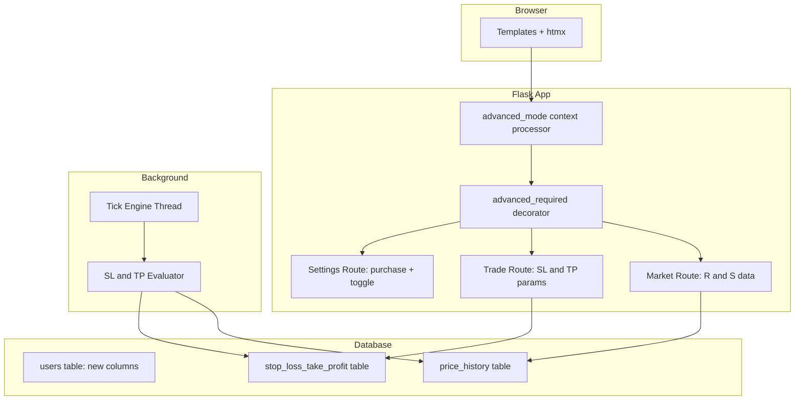

# Design Document: Advanced Mode

## Overview

Advanced Mode is a per-user feature flag system that gates prestige-tier trading mechanics behind a progression threshold. Once a player's net worth reaches $100,000, they become permanently eligible to purchase Advanced Mode for $50,000 from their free cash. After purchase, the player can toggle the mode on/off (with a 5-minute cooldown), unlocking stop loss/take profit automation, resistance/support chart overlays, and the OreX Advanced theme.

The design leverages the existing Flask + SQLite architecture by adding columns to the `users` table and a new `stop_loss_take_profit` table. A Python decorator gates advanced-only routes, and Jinja2 template conditionals control UI visibility. The tick engine is extended to evaluate stop loss/take profit triggers each cycle.

### Key Design Decisions

| Decision | Rationale |
|----------|-----------|
| Columns on `users` vs. separate table | Minimal join overhead for a per-user flag checked on every request; avoids N+1 queries |
| Decorator-based route gating | Consistent pattern with existing `@login_required`; composable |
| Tick engine evaluates SL/TP | Orders must trigger between requests; the engine already has its own DB connection and runs every 20s |
| Rolling lookback of 50 ticks for R/S | Matches the existing `get_price_history(limit=50)` default; avoids heavy queries |
| CSS class on `<body>` for theme | Allows pure CSS toggling without full page reload; htmx-friendly |

## Architecture



### Request Flow for Advanced Features

1. Every request passes through a Jinja2 context processor that injects `is_advanced_active` and `has_advanced_purchased` into all templates.
2. Routes serving advanced-only data (e.g., resistance/support JSON) are gated by `@advanced_required`.
3. The trade route conditionally accepts `stop_loss` and `take_profit` parameters when advanced mode is active.
4. The tick engine runs `evaluate_stop_loss_take_profit()` after each price update cycle.

## Components and Interfaces

### 1. Database Migration (`migrations/add_advanced_mode.sql`)

Adds columns to `users` and creates the `stop_loss_take_profit` table.

### 2. Advanced Mode Helpers (`app/advanced.py`)

```python
# Core utility module

def check_eligibility(user_id: int) -> bool:
    """Return True if user's net worth >= $100,000."""

def purchase_advanced_mode(user_id: int) -> tuple[bool, str]:
    """Deduct $50,000 and set advanced_purchased=1. Returns (success, message)."""

def toggle_advanced_mode(user_id: int) -> tuple[bool, str]:
    """Toggle active state with 5-min cooldown check. Returns (success, message)."""

def is_advanced_active(user_id: int) -> bool:
    """Return True if the user has advanced mode purchased AND currently active."""

def get_advanced_status(user_id: int) -> dict:
    """Return full status dict: {eligible, purchased, active, cooldown_remaining}."""
```

### 3. Decorator (`app/decorators.py`)

```python
from functools import wraps
from flask import abort
from flask_login import current_user

def advanced_required(f):
    """Block access unless the current user has Advanced Mode active."""
    @wraps(f)
    def decorated(*args, **kwargs):
        if not current_user.is_authenticated:
            abort(401)
        from app.advanced import is_advanced_active
        if not is_advanced_active(current_user.id):
            abort(403)
        return f(*args, **kwargs)
    return decorated
```

### 4. Context Processor (in `app/__init__.py`)

```python
@app.context_processor
def inject_advanced_mode():
    if current_user.is_authenticated:
        from app.advanced import get_advanced_status
        status = get_advanced_status(current_user.id)
        return {
            'is_advanced_active': status['active'],
            'has_advanced_purchased': status['purchased'],
            'advanced_eligible': status['eligible'],
        }
    return {'is_advanced_active': False, 'has_advanced_purchased': False, 'advanced_eligible': False}
```

### 5. Settings Route Extensions (`app/routes/settings.py`)

New endpoints:
- `POST /settings/advanced/purchase` — processes the $50,000 purchase
- `POST /settings/advanced/toggle` — toggles on/off with cooldown enforcement

### 6. Trade Route Extensions (`app/routes/trade.py`)

- Accept optional `stop_loss` and `take_profit` float params on buy orders
- Validate: `stop_loss < current_price` and `take_profit > current_price`
- Store in `stop_loss_take_profit` table on successful trade
- New endpoint: `POST /trade/sltp/<int:holding_id>` to update/remove SL/TP on existing holdings

### 7. Market Route Extensions (`app/routes/market.py`)

- New endpoint: `GET /market/ore/<int:ore_id>/levels` (returns JSON `{resistance, support}`)
- Calculated from `price_history` using rolling 50-tick lookback (configurable via `Config.RS_LOOKBACK_WINDOW`)

### 8. Tick Engine Extension (`app/market/engine.py`)

After `process_tick(db)` completes, call `evaluate_stop_loss_take_profit(db)`:

```python
def evaluate_stop_loss_take_profit(db):
    """Check all active SL/TP orders against current prices and execute triggered ones."""
    orders = db.execute("""
        SELECT sltp.*, h.quantity, h.user_id, o.current_price
        FROM stop_loss_take_profit sltp
        JOIN holdings h ON sltp.holding_id = h.id
        JOIN ores o ON h.ore_id = o.id
        WHERE sltp.active = 1
    """).fetchall()

    for order in orders:
        triggered = False
        if order['stop_loss'] and order['current_price'] <= order['stop_loss']:
            triggered = True
        elif order['take_profit'] and order['current_price'] >= order['take_profit']:
            triggered = True

        if triggered:
            _execute_auto_sell(db, order)

    db.commit()
```

### 9. Resistance/Support Calculator (`app/market/levels.py`)

```python
def calculate_levels(ore_id: int, lookback: int = 50) -> dict:
    """Return {resistance: float, support: float} from recent price history."""
    prices = [row['price'] for row in get_price_history(ore_id, limit=lookback)]
    if not prices:
        return {'resistance': None, 'support': None}
    return {
        'resistance': max(prices),
        'support': min(prices),
    }
```

### 10. Leaderboard Extension (`app/models.py`)

Extend `get_leaderboard()` query to join `users.advanced_active` so the template can render red usernames.

### 11. Template Conditionals

All advanced UI elements wrapped in:
```jinja2

  {# SL/TP fields, R/S overlays, Advanced logo, etc. #}

```

The base template applies a CSS class:
```jinja2
<body class="advanced-theme">
```

### 12. Buy Cap Removal

`_get_buy_cap()` in `trade.py` returns `None` when advanced mode is active, removing the `MAX_BUY_QUANTITY` limit.

## Data Models

### Schema Changes

```sql
-- Add advanced mode columns to users table
ALTER TABLE users ADD COLUMN advanced_eligible INTEGER NOT NULL DEFAULT 0;
ALTER TABLE users ADD COLUMN advanced_purchased INTEGER NOT NULL DEFAULT 0;
ALTER TABLE users ADD COLUMN advanced_active INTEGER NOT NULL DEFAULT 0;
ALTER TABLE users ADD COLUMN advanced_toggled_at TEXT DEFAULT NULL;

-- Stop Loss / Take Profit orders
CREATE TABLE IF NOT EXISTS stop_loss_take_profit (
    id INTEGER PRIMARY KEY,
    holding_id INTEGER NOT NULL,
    stop_loss REAL DEFAULT NULL,
    take_profit REAL DEFAULT NULL,
    active INTEGER NOT NULL DEFAULT 1,
    created_at TEXT NOT NULL DEFAULT (datetime('now')),
    triggered_at TEXT DEFAULT NULL,
    FOREIGN KEY (holding_id) REFERENCES holdings(id) ON DELETE CASCADE
);

CREATE INDEX IF NOT EXISTS idx_sltp_holding ON stop_loss_take_profit(holding_id);
CREATE INDEX IF NOT EXISTS idx_sltp_active ON stop_loss_take_profit(active);
```

### Updated User Model

| Column | Type | Description |
|--------|------|-------------|
| `advanced_eligible` | INTEGER (0/1) | Set to 1 once net worth reaches $100,000; never reverts except on account reset |
| `advanced_purchased` | INTEGER (0/1) | Set to 1 after $50,000 purchase; permanent except on account reset |
| `advanced_active` | INTEGER (0/1) | Current toggle state; toggleable by user with cooldown |
| `advanced_toggled_at` | TEXT (ISO timestamp) | Last toggle time; used for 5-minute cooldown enforcement |

### Stop Loss / Take Profit Table

| Column | Type | Description |
|--------|------|-------------|
| `id` | INTEGER PK | Auto-increment |
| `holding_id` | INTEGER FK | References `holdings.id`; cascades on delete |
| `stop_loss` | REAL | Trigger sell at or below this price (nullable) |
| `take_profit` | REAL | Trigger sell at or above this price (nullable) |
| `active` | INTEGER (0/1) | Whether this order is live |
| `created_at` | TEXT | ISO timestamp of order creation |
| `triggered_at` | TEXT | ISO timestamp when auto-sell fired (nullable) |

### Config Additions (`app/config.py`)

```python
ADVANCED_MODE_THRESHOLD = 100_000    # Net worth eligibility threshold
ADVANCED_MODE_COST = 50_000          # Purchase cost
ADVANCED_TOGGLE_COOLDOWN = 300       # 5 minutes in seconds
RS_LOOKBACK_WINDOW = 50              # Price ticks for resistance/support
```

### Account Reset Impact

When `reset_account(user_id)` is called, it now also:
1. Sets `advanced_eligible = 0`, `advanced_purchased = 0`, `advanced_active = 0`, `advanced_toggled_at = NULL`
2. Deletes all rows from `stop_loss_take_profit` where `holding_id` references the user's holdings (cascades automatically since holdings are deleted)


## Correctness Properties

*A property is a characteristic or behavior that should hold true across all valid executions of a system — essentially, a formal statement about what the system should do. Properties serve as the bridge between human-readable specifications and machine-verifiable correctness guarantees.*

### Property 1: Net Worth Calculation Identity

*For any* user with a free cash balance B and a set of holdings H where each holding has a quantity q_i and the corresponding ore has current price p_i, the computed net worth SHALL equal B + Σ(q_i × p_i).

**Validates: Requirements 1.3**

### Property 2: Eligibility Monotonicity

*For any* user whose `advanced_eligible` flag is already set to 1, the eligibility check SHALL return True regardless of their current net worth value — including values below the $100,000 threshold.

**Validates: Requirements 1.1, 1.2**

### Property 3: Purchase Balance Deduction

*For any* eligible user with a free cash balance ≥ $50,000, after a successful Advanced Mode purchase, their new balance SHALL equal their previous balance minus exactly $50,000.

**Validates: Requirements 3.1**

### Property 4: Purchase Precondition Rejection

*For any* user where either (a) `advanced_eligible` is 0, or (b) free cash balance is below $50,000, the purchase operation SHALL be rejected and the user's balance SHALL remain unchanged.

**Validates: Requirements 3.2, 3.3**

### Property 5: Toggle State Inversion

*For any* user with `advanced_purchased = 1` and no active cooldown, invoking the toggle operation SHALL flip `advanced_active` from its current value to its logical complement (0→1 or 1→0).

**Validates: Requirements 4.2**

### Property 6: Cooldown Enforcement

*For any* user with `advanced_purchased = 1` and an `advanced_toggled_at` timestamp T, a toggle attempt at time T' SHALL be rejected if (T' - T) < 300 seconds, and SHALL succeed if (T' - T) ≥ 300 seconds.

**Validates: Requirements 4.3**

### Property 7: Stop Loss / Take Profit Trigger Execution

*For any* active stop_loss_take_profit order with stop_loss=SL and/or take_profit=TP, when the ore's current price is updated to P: if P ≤ SL or P ≥ TP, the evaluator SHALL mark the order as triggered and execute a full sell of the associated holding.

**Validates: Requirements 6.3, 6.4**

### Property 8: Stop Loss / Take Profit Validation

*For any* buy order with a stop_loss value SL and current ore price P, the validation SHALL reject the order if SL ≥ P. Similarly, for any take_profit value TP, the validation SHALL reject if TP ≤ P. Valid orders require SL < P and TP > P.

**Validates: Requirements 6.5, 6.6**

### Property 9: Resistance and Support from Rolling Window

*For any* ore with a price history of length ≥ 1, when calculating levels with a lookback window of N ticks: resistance SHALL equal max(last N prices) and support SHALL equal min(last N prices). If the history has fewer than N entries, all available entries SHALL be used.

**Validates: Requirements 7.4, 7.5, 7.6**

### Property 10: Account Reset Clears All Advanced State

*For any* user in any combination of advanced mode states (eligible/purchased/active with any number of active SL/TP orders), after account reset, `advanced_eligible`, `advanced_purchased`, and `advanced_active` SHALL all be 0, and no active SL/TP orders SHALL remain for that user.

**Validates: Requirements 10.1, 10.2**

## Error Handling

| Scenario | Response | User Feedback |
|----------|----------|---------------|
| Purchase attempted when not eligible | Reject, no balance change | Flash "You must reach $100,000 net worth before purchasing Advanced Mode." |
| Purchase attempted with insufficient funds | Reject, no balance change | Flash "Insufficient funds. You need $50,000 free cash to purchase Advanced Mode." |
| Toggle attempted during cooldown | Reject, no state change | Flash "Please wait X minutes Y seconds before toggling again." + disabled toggle with countdown |
| SL price ≥ current price on buy order | Reject order | Form validation error "Stop loss must be below current price (${current_price})" |
| TP price ≤ current price on buy order | Reject order | Form validation error "Take profit must be above current price (${current_price})" |
| SL/TP modification on non-owned holding | 403 Forbidden | Abort with 403 |
| Advanced-only route accessed by standard user | 403 Forbidden | Redirect to dashboard with flash message |
| SL/TP trigger fails during tick (DB error) | Rollback that order, continue others | Log error; order remains active for next tick retry |
| Resistance/Support calculation with no price history | Return `null` for both levels | Chart renders without R/S lines |
| Purchase attempted by already-purchased user | No-op, no deduction | Flash "You already own Advanced Mode." |

### Defensive Measures

- All advanced-mode DB writes use transactions to ensure atomicity
- The tick engine's SL/TP evaluator wraps each order in a try/except so one failed trigger doesn't block others
- The cooldown timestamp comparison uses server-side time only (not client-submitted timestamps)
- Template conditionals provide defense-in-depth even if a route-level gate is bypassed

## Testing Strategy

### Property-Based Tests (Hypothesis)

The project already uses Hypothesis (`.hypothesis/` directory present). Each correctness property maps to one property-based test with a minimum of 100 iterations.

**Library**: [Hypothesis](https://hypothesis.readthedocs.io/) (already in use)

**Configuration**:
- `@settings(max_examples=100)` minimum per test
- Tag format: `# Feature: advanced-mode, Property N: <property_text>`

**Test file**: `tests/test_advanced_mode_properties.py`

| Property | Test Description | Key Generators |
|----------|-----------------|----------------|
| 1 | Net worth = balance + Σ(qty × price) | `st.floats(0, 1e6)` for balance, `st.lists(st.tuples(st.integers(1, 10000), st.floats(0.01, 10000)))` for holdings |
| 2 | Eligible flag is sticky | `st.booleans()` for eligible flag, `st.floats(0, 200000)` for net worth |
| 3 | Purchase deducts exactly 50k | `st.floats(50000, 1e6)` for starting balance |
| 4 | Purchase rejected when preconditions fail | `st.floats(0, 49999.99)` for low balance, `st.booleans()` for eligible flag |
| 5 | Toggle inverts active flag | `st.booleans()` for current active state |
| 6 | Cooldown accepts/rejects based on elapsed time | `st.floats(0, 600)` for elapsed seconds |
| 7 | SL/TP triggers when price crosses threshold | `st.floats(0.01, 10000)` for prices, SL, TP |
| 8 | SL/TP validation rejects wrong-side values | `st.floats(0.01, 10000)` for price, SL, TP |
| 9 | R/S = max/min of windowed prices | `st.lists(st.floats(0.01, 10000), min_size=1)` for price histories, `st.integers(1, 100)` for window |
| 10 | Reset zeroes all flags and clears orders | `st.booleans()` × 3 for flag combos, `st.integers(0, 10)` for order count |

### Unit Tests (pytest)

Example-based tests for UI rendering, route responses, and integration scenarios:

- Settings page rendering in each state (ineligible, eligible, purchased-inactive, purchased-active)
- Feature gating: verify SL/TP controls absent/present based on mode
- Leaderboard red indicator rendering
- Theme class application on body tag
- Purchase flow happy path and double-purchase no-op
- Toggle with confirmation
- SL/TP CRUD on holdings

### Integration Tests

- Full purchase flow: create user → accumulate wealth → become eligible → purchase → verify deduction
- Tick engine SL/TP execution: set up holding with SL → run process_tick → verify auto-sell
- Account reset: purchase advanced → reset → verify all state cleared
- Cooldown across toggle attempts with time manipulation

### Manual Testing

- Visual verification of OreX Advanced theme (logo swap, layout changes)
- htmx partial update smoothness on toggle
- Chart resistance/support dotted lines rendering correctly in ApexCharts
