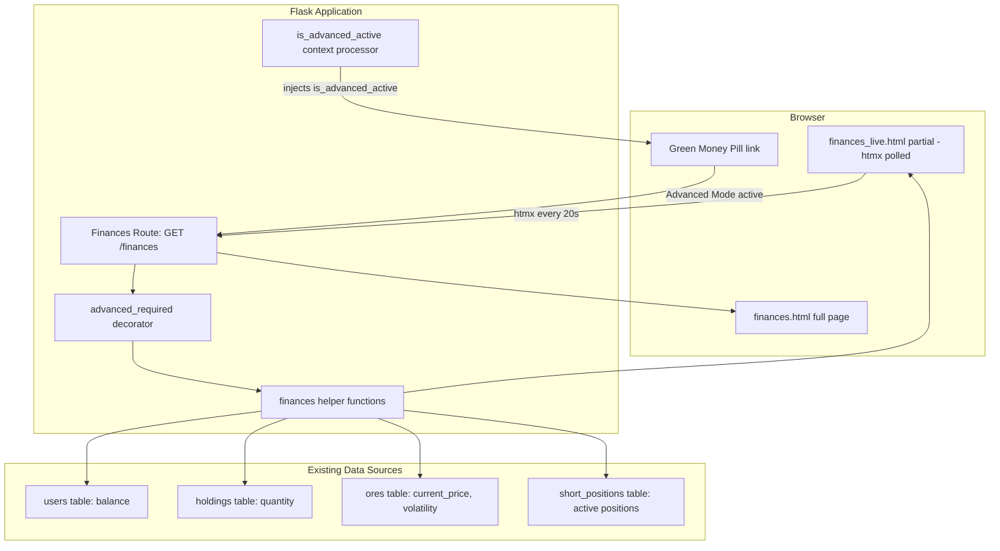
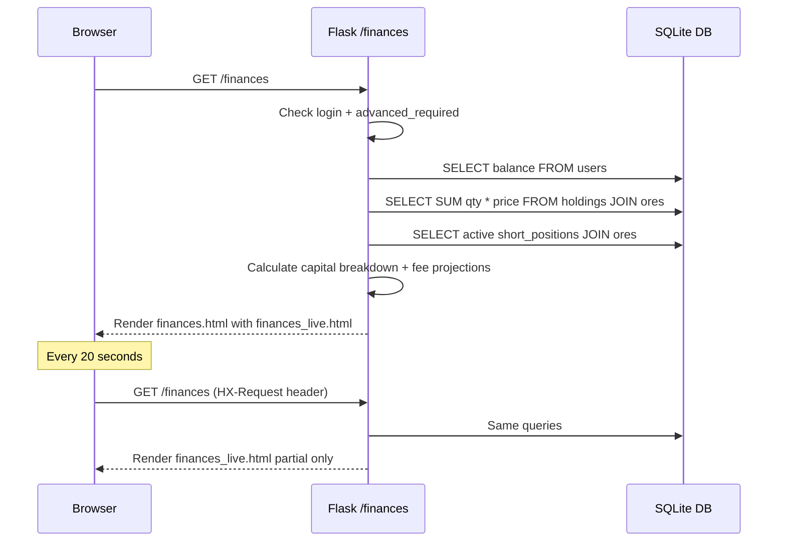

# Design Document: Finances Page

## Overview

The Finances Page is a read-only financial dashboard available exclusively to Advanced Mode players. It presents a comprehensive breakdown of capital allocation — free cash, locked collateral, short equity, long holdings value, and net worth — alongside an active short positions table with per-position metrics. Cash flow projections display fee burn rate (per tick and per hour) and a color-coded cash runway indicator warning players when liquidation is approaching.

The page follows the existing htmx polling pattern established by the portfolio page: a full-page template includes a partial that refreshes every 20 seconds (one tick). No state is modified — the page purely reads from existing tables (`users`, `holdings`, `ores`, `short_positions`).

### Key Design Decisions

| Decision | Rationale |
|----------|-----------|
| Single route with htmx partial pattern | Matches portfolio page pattern; minimal client JS; consistent UX |
| No new database tables or columns | All data already exists in users, holdings, ores, short_positions |
| Fee calculation reuses shorting engine formula | Single source of truth; avoids drift between display and actual deduction |
| Cash runway uses integer tick count as primary unit | Discrete and precise; time duration is a derived display value |
| Green money pill conditional link via context processor | Already injected by advanced-mode context processor; no new plumbing needed |
| Separate blueprint for finances route | Clean separation; easy to test in isolation |
| Collateral and equity at $0 when no shorts | Consistent display; no conditional hiding of the capital breakdown itself |

## Architecture



### Request Flow



## Components and Interfaces

### 1. Finances Blueprint (`app/routes/finances.py`)

A new blueprint registered in `app/routes/__init__.py`:

```python
from flask import Blueprint, render_template, request, current_app
from flask_login import login_required, current_user

from app.decorators import advanced_required
from app.models import get_user_by_id, get_holdings_by_user, get_portfolio_value
from app.finances import get_finances_data

finances_bp = Blueprint('finances', __name__)


@finances_bp.route('/finances')
@login_required
@advanced_required
def overview():
    """Display the finances dashboard. Returns partial on htmx requests."""
    data = get_finances_data(current_user.id)

    if request.headers.get('HX-Request'):
        return render_template('partials/finances_live.html', **data)

    return render_template('pages/finances.html', **data)
```

### 2. Finances Data Module (`app/finances.py`)

Encapsulates all read queries and calculations for the finances page:

```python
from flask import current_app
from app.database import get_db
from app.models import get_user_by_id, get_portfolio_value


def get_finances_data(user_id: int) -> dict:
    """Compute all financial data for the finances page.
    
    Returns dict with keys: free_cash, locked_collateral, total_short_equity,
    long_holdings_value, net_worth, short_positions, fee_burn_per_tick,
    fee_burn_per_hour, cash_runway_ticks, cash_runway_formatted,
    runway_color, total_exposure, total_fees_paid, position_count,
    ticks_per_hour, has_shorts.
    """


def get_active_short_positions(user_id: int) -> list[dict]:
    """Fetch active short positions with computed per-position metrics.
    
    Each dict includes: id, ore_name, share_quantity, entry_price,
    short_value, locked_collateral, unrealized_pnl, stop_loss_price,
    take_profit_price, tick_fee, ticks_to_liquidation, cumulative_fees_paid.
    """


def calculate_fee_burn_per_tick(positions: list[dict], ores_map: dict) -> float:
    """Sum of per-position tick fees using the shorting engine formula.
    
    Tick_Fee = Short_Value * ((0.005 + 0.10 * volatility^2) / ticks_per_hour)
    """


def calculate_cash_runway(free_cash: float, fee_burn_per_tick: float) -> int:
    """Return integer tick count until free cash is exhausted.
    
    Returns int max (effectively infinite) when fee_burn_per_tick is zero.
    """


def format_runway_duration(ticks: int, tick_interval: int) -> str:
    """Convert tick count to human-readable duration string.
    
    Examples: '~450 ticks / ~2h 30m', '~15 ticks / ~5m'
    """


def get_runway_color(ticks: int) -> str:
    """Return 'green', 'amber', or 'red' based on runway thresholds.
    
    green: > 60 ticks
    amber: 20-60 ticks (inclusive)
    red: < 20 ticks
    """
```

### 3. Navigation Modification (`templates/partials/nav.html`)

The green money pill (`#nav-balance`) becomes a conditional link:

```jinja2
{# In nav.html, within the profile pill #}

    <a href="{{ url_for('finances.overview') }}" class="nav__balance nav__balance--link" id="nav-balance">
        ${{ "%.2f" | format(current_user.balance) }}
    </a>

    <span id="nav-balance" class="nav__balance">${{ "%.2f" | format(current_user.balance) }}</span>

```

### 4. Portfolio Link Addition (`templates/partials/portfolio_live.html`)

A "View Finances" link added to the portfolio page when advanced mode is active:

```jinja2

<div class="portfolio-finances-link">
    <a href="{{ url_for('finances.overview') }}" class="btn btn--secondary btn--small">View Finances</a>
</div>

```

### 5. Template: Full Page (`templates/pages/finances.html`)

```jinja2

Finances - OreX


<div class="finances-page">
    <div class="page-header">
        <h1>Finances</h1>
        <span id="finances-indicator" class="htmx-indicator">Updating...</span>
    </div>

    <div id="finances-live"
         hx-get="{{ url_for('finances.overview') }}"
         hx-trigger="every 20s"
         hx-swap="innerHTML"
         hx-indicator="#finances-indicator">
        
    </div>
</div>

```

### 6. Template: Live Partial (`templates/partials/finances_live.html`)

Contains three sections:
1. **Capital Breakdown** — stat cards for Free Cash, Locked Collateral, Short Equity, Long Holdings Value, Net Worth
2. **Active Short Positions Table** — per-position detail rows (conditionally shown)
3. **Cash Flow Projections** — fee burn rate, cash runway bar (conditionally shown)

### 7. Blueprint Registration (`app/routes/__init__.py`)

```python
from app.routes.finances import finances_bp
app.register_blueprint(finances_bp)
```

## Data Models

No new tables or columns are required. The finances page reads from existing tables:

### Data Sources

| Data Point | Source | Query |
|------------|--------|-------|
| Free Cash | `users.balance` | `SELECT balance FROM users WHERE id = ?` |
| Locked Collateral | `short_positions.locked_collateral` | `SELECT SUM(locked_collateral) FROM short_positions WHERE user_id = ? AND status = 'active'` |
| Short Value per position | Computed | `share_quantity * ore.current_price` |
| Short Equity per position | Computed | `locked_collateral - short_value` |
| Total Short Equity | Computed | `SUM(locked_collateral - (share_quantity * current_price))` across active positions |
| Long Holdings Value | `holdings` + `ores` | `SELECT SUM(h.quantity * o.current_price) FROM holdings h JOIN ores o ...` |
| Net Worth | Computed | `free_cash + long_holdings_value + total_short_equity` |
| Fee Burn per Tick | Computed | `SUM(short_value * ((0.005 + 0.10 * volatility^2) / ticks_per_hour))` |
| Cash Runway | Computed | `free_cash / fee_burn_per_tick` (integer floor) |
| Ticks per Hour | Config | `3600 / Config.TICK_INTERVAL` |

### Key Query: Active Short Positions with Ore Data

```sql
SELECT sp.id, sp.share_quantity, sp.entry_price, sp.locked_collateral,
       sp.stop_loss_price, sp.take_profit_price, sp.cumulative_fees_paid,
       sp.opened_at,
       o.name AS ore_name, o.current_price, o.volatility
FROM short_positions sp
JOIN ores o ON sp.ore_id = o.id
WHERE sp.user_id = ? AND sp.status = 'active'
ORDER BY sp.opened_at ASC
```

### Derived Calculations (per position)

| Field | Formula |
|-------|---------|
| `short_value` | `share_quantity * current_price` |
| `unrealized_pnl` | `(entry_price * share_quantity) - short_value` |
| `tick_fee` | `round(short_value * ((0.005 + 0.10 * volatility**2) / ticks_per_hour), 2)` |
| `ticks_to_liquidation` | `floor(free_cash / tick_fee)` (per-position estimate) |

### Aggregate Calculations

| Field | Formula |
|-------|---------|
| `total_locked_collateral` | `SUM(locked_collateral)` across active positions |
| `total_short_equity` | `SUM(locked_collateral - short_value)` across active positions |
| `fee_burn_per_tick` | `SUM(tick_fee)` across active positions |
| `fee_burn_per_hour` | `fee_burn_per_tick * ticks_per_hour` |
| `cash_runway_ticks` | `floor(free_cash / fee_burn_per_tick)` or infinite if no fees |
| `total_exposure` | `SUM(short_value)` across active positions |
| `total_fees_paid` | `SUM(cumulative_fees_paid)` across active positions |


## Correctness Properties

*A property is a characteristic or behavior that should hold true across all valid executions of a system — essentially, a formal statement about what the system should do. Properties serve as the bridge between human-readable specifications and machine-verifiable correctness guarantees.*

### Property 1: Net Worth Formula

*For any* player with free cash balance B (≥ 0), a set of long holdings where each holding has quantity q_i (≥ 1) and current ore price p_i (> 0), and a set of active short positions where each has locked_collateral L_j (> 0), share_quantity s_j (≥ 1), and current ore price cp_j (> 0): the computed Net_Worth SHALL equal B + Σ(q_i × p_i) + Σ(L_j − (s_j × cp_j)).

**Validates: Requirements 3.5**

### Property 2: Short Position Aggregates

*For any* list of active short positions (including the empty list), where each position has locked_collateral L_i, share_quantity s_i, current_price p_i, and cumulative_fees_paid f_i: the computed total_locked_collateral SHALL equal Σ(L_i), total_short_equity SHALL equal Σ(L_i − s_i × p_i), total_exposure SHALL equal Σ(s_i × p_i), total_fees_paid SHALL equal Σ(f_i), and position_count SHALL equal the length of the list.

**Validates: Requirements 3.2, 3.3, 4.5**

### Property 3: Fee Burn Calculation

*For any* set of active short positions where each has short_value SV_i (= share_quantity × current_price > 0) and volatility v_i (0.0–1.5), and a tick_interval T (> 0 seconds): the fee_burn_per_tick SHALL equal Σ(round(SV_i × ((0.005 + 0.10 × v_i²) / (3600 / T)), 2)), and the fee_burn_per_hour SHALL equal fee_burn_per_tick × (3600 / T).

**Validates: Requirements 5.1, 5.2**

### Property 4: Cash Runway Calculation

*For any* free_cash F (≥ 0) and fee_burn_per_tick B (> 0): the cash_runway_ticks SHALL equal floor(F / B). Additionally, *for any* position with tick_fee t (> 0), the per-position ticks_to_liquidation SHALL equal floor(F / t).

**Validates: Requirements 4.3, 5.3**

### Property 5: Runway Indicator Classification

*For any* non-negative integer tick count representing cash runway: the indicator color SHALL be 'green' when ticks > 60, 'amber' when 20 ≤ ticks ≤ 60, and 'red' when ticks < 20. The bar width SHALL be min(ticks / 120, 1.0) × 100%. The liquidation warning text SHALL be present if and only if ticks < 20. When fee_burn is zero, the runway SHALL be treated as infinite with color 'green' and full-width bar.

**Validates: Requirements 5.4, 7.1, 7.2, 7.3, 7.4, 7.5**

### Property 6: Currency and Percentage Formatting

*For any* non-negative float value, the currency formatting function SHALL produce a string matching the pattern `$[digits with comma grouping].[exactly 2 decimal digits]` (e.g., "$1,234.56"). *For any* float value, the percentage formatting function SHALL produce a string with exactly 1 decimal place followed by "%" (e.g., "12.5%").

**Validates: Requirements 3.1, 8.2, 8.3**

## Error Handling

| Scenario | Response | User Feedback |
|----------|----------|---------------|
| Unauthenticated access to /finances | Redirect to login | Flask-Login standard redirect with "Please log in" message |
| Authenticated but no Advanced Mode | 403 Forbidden via `@advanced_required` | Flash "Advanced Mode required." and redirect to dashboard |
| Advanced Mode toggled off while on page | Next htmx poll returns 403 | Client-side: htmx response error triggers page redirect to dashboard |
| Account reset while on page | Next htmx poll returns 403 (advanced revoked) | Same as above — redirect to dashboard |
| Zero free cash with active shorts | Display $0.00 and "0 ticks" runway with red indicator | "Liquidation imminent" warning text shown |
| No active short positions | Display $0.00 collateral/equity, hide positions table and fee projections | Empty state message in positions section |
| Database query failure | Return 500 | Flask 500 error page |
| Division by zero in runway (zero fee burn) | Treat as infinite runway | Green indicator, full bar, no numeric tick count needed |

### Defensive Measures

- All DB queries are read-only (no INSERT/UPDATE/DELETE)
- The `@advanced_required` decorator provides defense-in-depth on every request (including htmx polls)
- The `get_finances_data()` function handles empty position lists gracefully (all aggregates default to 0.0)
- Division by zero in cash runway is explicitly guarded (fee_burn == 0 → infinite runway)
- Template uses `"%.2f"` Jinja2 formatting for all currency values to prevent display of excessive decimal places
- htmx polling uses `hx-swap="innerHTML"` which safely replaces content without XSS risk (server-rendered HTML)
- Per-position ticks_to_liquidation guards against tick_fee == 0 (shows "∞" in that edge case)

### htmx Error Recovery

When the htmx poll receives a non-2xx response (e.g., 403 after advanced mode is toggled off):

```javascript
// In finances.html extra_js block
document.body.addEventListener('htmx:responseError', function(event) {
    if (event.detail.xhr.status === 403) {
        window.location.href = '/dashboard';
    }
});
```

## Testing Strategy

### Property-Based Tests (Hypothesis)

The project already uses Hypothesis (`.hypothesis/` directory present). Each correctness property maps to one property-based test with a minimum of 100 iterations.

**Library**: [Hypothesis](https://hypothesis.readthedocs.io/) (already in use)

**Configuration**:
- `@settings(max_examples=100)` minimum per test
- Tag format: `# Feature: finances-page, Property N: <property_text>`

**Test file**: `tests/test_finances_properties.py`

| Property | Test Description | Key Generators |
|----------|-----------------|----------------|
| 1 | Net worth = balance + long_value + short_equity | `st.floats(0, 1e6)` balance, `st.lists(st.tuples(st.integers(1, 10000), st.floats(0.01, 10000)))` holdings, `st.lists(st.tuples(st.floats(100, 100000), st.integers(1, 10000), st.floats(0.01, 10000)))` short positions (locked, shares, price) |
| 2 | Short position aggregate correctness | `st.lists(st.fixed_dictionaries({'locked_collateral': st.floats(100, 100000), 'share_quantity': st.integers(1, 10000), 'current_price': st.floats(0.01, 10000), 'cumulative_fees_paid': st.floats(0, 50000)}), min_size=0, max_size=20)` |
| 3 | Fee burn calculation matches formula | `st.lists(st.tuples(st.floats(100, 1000000), st.floats(0.0, 1.5)), min_size=1, max_size=20)` (short_value, volatility) pairs, `st.integers(5, 120)` tick_interval |
| 4 | Cash runway = floor(free_cash / fee_burn) | `st.floats(0, 1e6)` free_cash, `st.floats(0.01, 10000)` fee_burn_per_tick |
| 5 | Runway indicator classification | `st.integers(0, 500)` tick_count for color/width/warning, `st.floats(0, 1e6)` free_cash with `st.just(0.0)` fee_burn for infinite case |
| 6 | Currency and percentage formatting | `st.floats(0, 1e9, allow_nan=False, allow_infinity=False)` for currency, `st.floats(-1000, 1000, allow_nan=False, allow_infinity=False)` for percentage |

### Unit Tests (pytest)

Example-based tests for route behavior, template rendering, and integration:

- `/finances` returns 200 for authenticated advanced-mode user
- `/finances` returns redirect for unauthenticated user
- `/finances` returns 403 for user without advanced mode
- htmx request to `/finances` returns partial HTML only (no `<html>` wrapper)
- Nav renders balance as link (`<a>`) when advanced mode active
- Nav renders balance as span when advanced mode inactive
- Portfolio section shows "View Finances" link when advanced mode active
- Finances page renders all three sections (Capital Breakdown, Active Positions, Cash Flow)
- Empty state: no positions → positions table hidden, fee section hidden, collateral $0.00
- Unrealized PnL renders green class for positive, red class for negative
- "Liquidation imminent" text present when runway < 20 ticks
- Zero free cash displays "$0.00" and "0 ticks" with red indicator

### Integration Tests

- Full lifecycle: open short position → load /finances → verify position appears in table with correct metrics
- Close short position → reload /finances partial → verify position removed
- Fee burn matches actual tick engine deduction: compare displayed fee_burn_per_tick with actual balance change after one tick
- Account reset while on finances page → next request returns 403/redirect
- Multiple positions: verify aggregates (total exposure, total fees, position count) match individual rows

### Manual Testing

- Visual verification of cash runway indicator color transitions (green → amber → red)
- Responsive layout: verify horizontal scroll on positions table at narrow viewports
- Advanced theme consistency: verify page matches other Advanced Mode pages
- Green money pill click navigates to /finances
- htmx polling smoothness: no flicker on 20s refresh cycle
