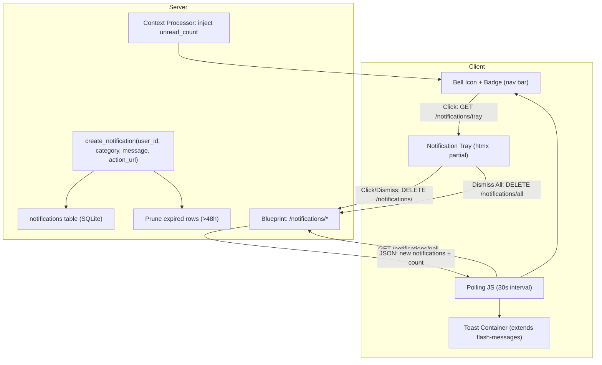
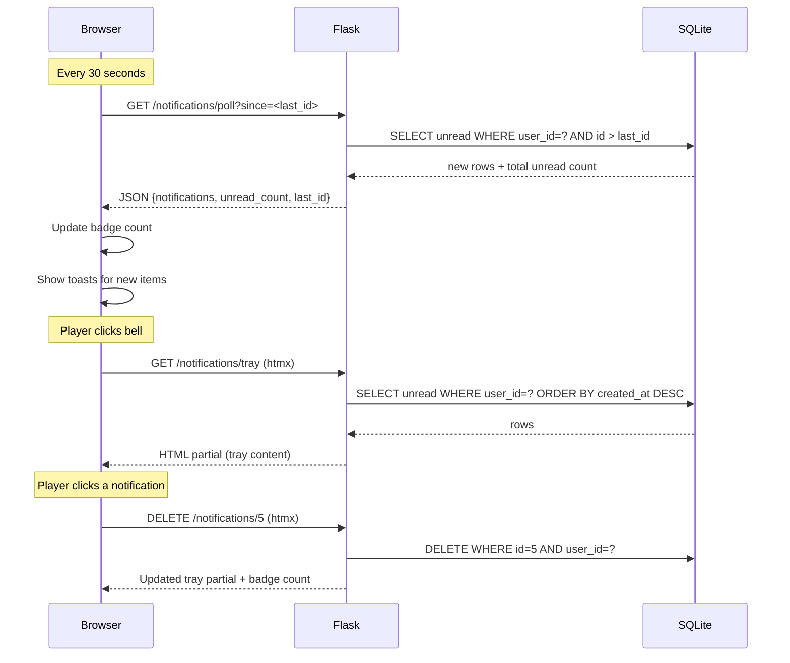

# Design Document: Notification System

## Overview

The Notification System is shared infrastructure for OreX that provides a single entry point (`create_notification`) for any game feature to emit in-app notifications. It manages the full lifecycle: storage in SQLite, a nav bar bell icon with unread badge, a dropdown tray of unread notifications, category-aware toast popups via htmx polling, and automatic pruning of stale records.

The system extends the existing flash/toast infrastructure rather than building a parallel mechanism. Flash messages (success/error) remain for synchronous user actions; notifications handle asynchronous, persistent events generated by other game systems (achievements, liquidations, market events, daily bonuses, etc.).

### Design Decisions

| Decision | Rationale |
|----------|-----------|
| Delete-on-acknowledge (no `is_read` column) | Keeps the table small; the tray only shows unread notifications anyway. Once a player clicks or dismisses, the row is gone. |
| Prune on `create_notification()` | Avoids a background scheduler; piggybacks cleanup on write operations. Only prunes the target user's expired rows, so cost is bounded. |
| 30-second htmx polling | Simpler than WebSockets for a game that already uses htmx. Matches the existing market tick interval (20s) in cadence. |
| Category as free-form TEXT | New features can emit any category string without schema migrations. Toast styling falls back to a default for unknown categories. |
| Extend existing toast CSS | Reuses `.flash-messages` container positioning, `.flash--toast` animations, and progress bar. Adds category-specific modifier classes. |

## Architecture



### Request Flow



## Components and Interfaces

### 1. Data Layer (`app/models.py` additions)

| Function | Signature | Description |
|----------|-----------|-------------|
| `create_notification` | `(user_id, category, message, action_url=None) -> int` | Validates inputs, prunes expired notifications for user, inserts new row, returns ID |
| `get_unread_notifications` | `(user_id) -> list[Row]` | Returns all unread notifications for user, newest first |
| `get_unread_count` | `(user_id) -> int` | Returns count of unread notifications |
| `get_new_notifications_since` | `(user_id, since_id) -> list[Row]` | Returns notifications with id > since_id (for polling) |
| `delete_notification` | `(notification_id, user_id) -> bool` | Deletes a single notification owned by user; returns success |
| `delete_all_notifications` | `(user_id) -> int` | Deletes all notifications for user; returns deleted count |
| `prune_expired_notifications` | `(user_id) -> int` | Deletes notifications older than 48h for user; returns deleted count |

### 2. Blueprint (`app/routes/notifications.py`)

| Endpoint | Method | Purpose | Response |
|----------|--------|---------|----------|
| `/notifications/poll` | GET | Polling endpoint; returns new notifications since watermark | JSON `{notifications: [...], unread_count: int, last_id: int}` |
| `/notifications/tray` | GET | Renders tray partial | HTML partial |
| `/notifications/<id>` | DELETE | Dismiss single notification | HTML partial (updated tray) or empty with HX-Trigger for badge update |
| `/notifications/all` | DELETE | Dismiss all notifications | HTML partial (empty tray) with HX-Trigger for badge update |

All endpoints require `@login_required`. The blueprint uses `url_prefix='/notifications'`.

### 3. Context Processor

Registered in `create_app()`, injects `notification_count` into all templates for authenticated users. Uses `get_unread_count(current_user.id)`.

### 4. Templates

| Template | Purpose |
|----------|---------|
| `partials/nav.html` (modification) | Add bell icon + badge before profile pill |
| `partials/notification_tray.html` (new) | Dropdown tray content loaded via htmx |
| `partials/notification_toast.html` (new) | Single toast template for JS injection |

### 5. Client-Side (`static/js/notifications.js` extension)

The existing `notifications.js` handles flash toasts on page load. The extension adds:
- **Polling loop**: `setInterval` at 30s, `fetch('/notifications/poll?since=<last_id>')`
- **Toast injection**: Creates toast DOM elements matching the existing `.flash--toast` structure, with category-specific modifiers
- **Badge update**: Updates `#notification-badge` inner text and visibility
- **Tray toggle**: Opens/closes the tray dropdown on bell click; closes on outside click or Escape

### 6. CSS (`static/css/global.css` additions)

New classes extending the flash toast system:
- `.flash--achievement` — yellow background, trophy icon
- `.flash--liquidation` — red background, warning icon
- `.notification-bell` — bell icon styling and positioning
- `.notification-badge` — circular badge on the bell
- `.notification-tray` — dropdown panel styles
- `.notification-item` — individual notification row in tray

## Data Models

### Notifications Table

```sql
CREATE TABLE IF NOT EXISTS notifications (
    id INTEGER PRIMARY KEY,
    user_id INTEGER NOT NULL,
    category TEXT NOT NULL,
    message TEXT NOT NULL,
    action_url TEXT,
    created_at TEXT NOT NULL DEFAULT (datetime('now', 'localtime')),
    FOREIGN KEY (user_id) REFERENCES users(id) ON DELETE CASCADE
);

CREATE INDEX IF NOT EXISTS idx_notifications_user_created
    ON notifications(user_id, created_at);
CREATE INDEX IF NOT EXISTS idx_notifications_user_id_desc
    ON notifications(user_id, id DESC);
```

**Notes:**
- No `is_read` column — acknowledged notifications are deleted immediately.
- `ON DELETE CASCADE` handles account deletion automatically.
- The `idx_notifications_user_id_desc` index supports efficient polling queries (`WHERE user_id = ? AND id > ?`).
- `datetime('now', 'localtime')` matches the existing timestamp convention in the codebase.

### Account Lifecycle Changes

In `reset_account()` (models.py), add:
```python
db.execute("DELETE FROM notifications WHERE user_id = ?", (user_id,))
```

In `delete_account()`, the CASCADE foreign key handles cleanup automatically.


## Correctness Properties

*A property is a characteristic or behavior that should hold true across all valid executions of a system — essentially, a formal statement about what the system should do. Properties serve as the bridge between human-readable specifications and machine-verifiable correctness guarantees.*

### Property 1: Notification creation round-trip

*For any* valid user ID, any non-empty category string, and any non-whitespace message string, calling `create_notification(user_id, category, message, action_url)` SHALL return a positive integer ID, and retrieving the notification by that ID SHALL yield a record with matching user_id, category, message, and action_url fields plus a non-null created_at timestamp.

**Validates: Requirements 2.1, 2.2, 1.5, 2.5**

### Property 2: Whitespace message rejection

*For any* string composed entirely of whitespace characters (including the empty string), calling `create_notification` with that string as the message SHALL raise a `ValueError`, and the total notification count for the user SHALL remain unchanged.

**Validates: Requirements 2.3**

### Property 3: Non-existent user rejection

*For any* integer user_id that does not correspond to an existing user in the database, calling `create_notification` with that user_id SHALL raise a `ValueError` and no notification record SHALL be inserted.

**Validates: Requirements 2.4**

### Property 4: Unread count accuracy

*For any* user with N unread notifications in the database, `get_unread_count(user_id)` SHALL return exactly N.

**Validates: Requirements 3.2**

### Property 5: Tray ordering is newest-first

*For any* user with multiple unread notifications created at different times, `get_unread_notifications(user_id)` SHALL return them in strictly descending order of `id` (newest first).

**Validates: Requirements 4.1**

### Property 6: Dismiss-all empties all notifications

*For any* user with one or more notifications, calling `delete_all_notifications(user_id)` SHALL result in `get_unread_count(user_id)` returning 0.

**Validates: Requirements 4.5, 8.2**

### Property 7: Category style mapping is deterministic and consistent

*For any* category string, the style mapping function SHALL return identical (css_class, icon, duration) values regardless of the notification's message, action_url, or creation time. Additionally, the tray icon for a given category SHALL equal the toast icon for that same category.

**Validates: Requirements 5.5, 9.3, 9.4, 9.5**

### Property 8: Watermark filtering returns only newer notifications

*For any* user with notifications and any valid `since_id`, calling `get_new_notifications_since(user_id, since_id)` SHALL return only notifications whose `id` is strictly greater than `since_id`, and SHALL return all such notifications for that user.

**Validates: Requirements 6.5**

### Property 9: Pruning deletes expired and preserves fresh

*For any* user, when `create_notification` is called (which triggers pruning), all notifications for that user with `created_at` older than 48 hours SHALL be deleted, and all notifications with `created_at` within the last 48 hours SHALL be preserved.

**Validates: Requirements 7.1, 7.3**

### Property 10: Single dismiss removes exactly one notification

*For any* notification belonging to a user, calling `delete_notification(notification_id, user_id)` SHALL delete that specific notification and leave all other notifications for that user unchanged (count decreases by exactly 1).

**Validates: Requirements 8.1**

### Property 11: Account reset removes all notifications

*For any* user with notifications, calling `reset_account(user_id)` SHALL result in zero notifications remaining for that user in the database.

**Validates: Requirements 10.1**

## Error Handling

| Scenario | Handling |
|----------|----------|
| `create_notification` with whitespace-only message | Raise `ValueError("Message cannot be empty or whitespace-only")` |
| `create_notification` with non-existent user_id | Raise `ValueError("User does not exist")` |
| `delete_notification` with ID not belonging to user | Return `False`; no deletion occurs (prevents cross-user manipulation) |
| `delete_notification` with non-existent ID | Return `False`; no-op |
| Poll endpoint called by unauthenticated user | Return 401 / redirect to login (Flask-Login handles this via `@login_required`) |
| Poll endpoint with invalid `since` parameter | Default to `since=0` (return all unread) |
| Database error during notification creation | Let exception propagate (Flask's 500 handler catches it); no partial state due to SQLite transaction |
| CSRF token missing on DELETE requests | Flask-WTF returns 400 (existing CSRF protection applies) |

## Testing Strategy

### Property-Based Tests (Hypothesis)

The project already uses Hypothesis (`.hypothesis/` directory present). Each correctness property maps to one property-based test with a minimum of 100 iterations.

**Library:** `hypothesis` (already installed)

**Tag format:** `# Feature: notification-system, Property {N}: {title}`

Tests to implement:
1. Creation round-trip — generate random (category, message, action_url) tuples
2. Whitespace rejection — generate whitespace-only strings via `st.text(alphabet=st.characters(whitelist_categories=('Zs', 'Cc')))` and empty strings
3. Non-existent user — generate integers not in the users table
4. Unread count — create random number of notifications, verify count
5. Ordering — create notifications with controlled ordering, verify descending IDs
6. Dismiss-all — create random set, dismiss all, verify empty
7. Style mapping — generate random category strings, verify deterministic output
8. Watermark filtering — create notifications, pick random split point, verify filter
9. Pruning — create notifications with timestamps spanning the 48h boundary, verify correct deletion
10. Single dismiss — create multiple notifications, dismiss one, verify others remain
11. Account reset — create notifications, reset, verify gone

### Unit Tests (pytest)

Example-based tests for specific scenarios:
- Badge displays "9+" when count is 10
- Badge is hidden when count is 0
- Tray shows empty state when no notifications
- Achievement category returns yellow class
- Liquidation category returns red class
- Poll endpoint returns 401 for unauthenticated users
- Tray partial has `role="menu"` and items have `role="menuitem"`
- Bell element has `aria-label` with count
- CASCADE delete removes notifications when user is deleted

### Integration Tests

- Full page render includes bell icon for authenticated user
- Polling endpoint returns correct JSON structure
- DELETE endpoint removes notification and returns updated partial
- htmx tray load returns partial (no `<!DOCTYPE>` in response)
- Account reset followed by tray request shows empty state
