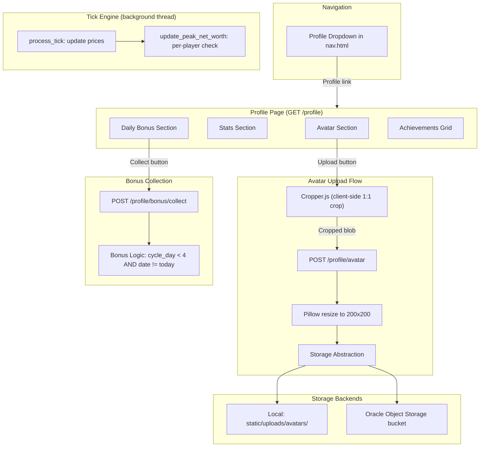
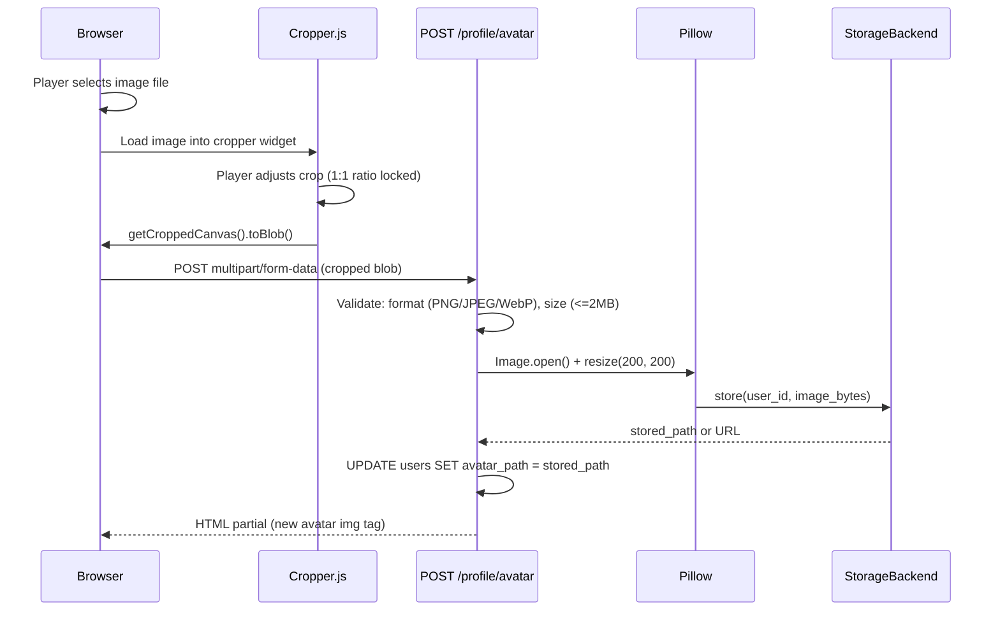
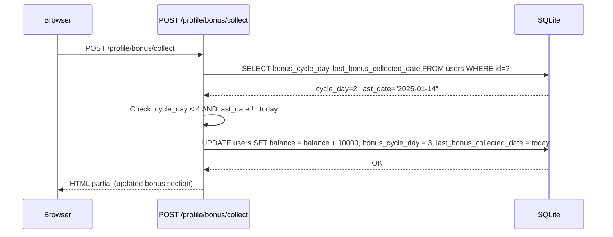

# Design Document: Profile Page

## Overview

The Profile Page introduces a dedicated player identity hub at `/profile` that consolidates avatar customization, gameplay statistics, the daily login bonus system, and achievement display into a single authenticated page. It integrates with the existing profile dropdown (no new nav tab), the achievements system, and the tick engine.

### Key Design Decisions

| Decision | Rationale |
|----------|-----------|
| Client-side cropping with Cropper.js before upload | Reduces server load — only a pre-cropped 1:1 image is sent. Avoids server-side aspect ratio logic. |
| Storage abstraction with two backends (local + OCI) | Local filesystem for dev simplicity; Oracle Object Storage for production scalability. Config-driven swap with no code changes. |
| Peak net worth updated in tick engine (not on page load) | Net worth changes with every price tick; evaluating passively ensures accuracy without request-path overhead. |
| Daily bonus as a one-time 3-day sequence (not recurring) | Simple state machine: bonus_cycle_day 1→2→3→4(done). No complex streak logic or recurring reward balancing. |
| Bonus section hidden permanently after completion | Clean UX — no dead UI for completed players. Reduces visual noise on the profile. |
| PFP stored as `{user_id}.png` (overwrite on re-upload) | One file per player. No orphaned files. Simple URL derivation from user ID. |
| Avatar URL stored on users table (`avatar_path` column) | Lets templates resolve the image without file-existence checks. NULL means use default avatar. |
| Profile page is static (no htmx polling) | Content changes rarely (stats from achievements tick, bonus once per day). No need for live updates. |
| Cropper.js loaded from CDN only on profile page | Avoids bundling a 90KB+ library site-wide for a single-page feature. |

## Architecture



### Avatar Upload Sequence



### Daily Bonus Collection Sequence



## Components and Interfaces

### 1. Profile Blueprint (`app/routes/profile.py`)

New blueprint registered in `app/routes/__init__.py`.

```python
from flask import Blueprint

profile_bp = Blueprint('profile', __name__)

@profile_bp.route('/profile')
@login_required
def overview():
    """Render the profile page with avatar, stats, bonus, and achievements."""
    db = get_db()
    user_row = db.execute(
        """SELECT username, balance, created_at, avatar_path,
                  bonus_cycle_day, last_bonus_collected_date,
                  play_time, login_streak, peak_net_worth
           FROM users WHERE id = ?""",
        (current_user.id,)
    ).fetchone()

    trade_count = db.execute(
        "SELECT COUNT(*) as cnt FROM transactions WHERE user_id = ?",
        (current_user.id,)
    ).fetchone()['cnt']

    achievements = get_user_achievements(db, current_user.id)

    bonus_available = is_bonus_available(user_row)
    bonus_amount = get_bonus_amount(user_row['bonus_cycle_day'])

    return render_template('pages/profile.html',
                           user=user_row,
                           trade_count=trade_count,
                           achievements=achievements,
                           bonus_available=bonus_available,
                           bonus_amount=bonus_amount)


@profile_bp.route('/profile/avatar', methods=['POST'])
@login_required
def upload_avatar():
    """Handle PFP upload: validate, resize, store, update DB."""
    # Returns htmx partial with new avatar image tag


@profile_bp.route('/profile/bonus/collect', methods=['POST'])
@login_required
def collect_bonus():
    """Collect the daily login bonus if eligible."""
    # Returns htmx partial with updated bonus section
```

### 2. Storage Abstraction (`app/storage.py`)

A simple interface with two implementations, selected via config.

```python
import abc

class StorageBackend(abc.ABC):
    @abc.abstractmethod
    def store(self, filename: str, data: bytes, content_type: str) -> str:
        """Store file data. Returns the path/URL to access the file."""

    @abc.abstractmethod
    def delete(self, filename: str) -> bool:
        """Delete a stored file. Returns True if deleted, False if not found."""

    @abc.abstractmethod
    def get_url(self, filename: str) -> str:
        """Get the public URL or path for a stored file."""


class LocalStorage(StorageBackend):
    """Store files in static/uploads/avatars/ for development."""

    def __init__(self, upload_dir: str):
        self.upload_dir = upload_dir  # absolute path to static/uploads/avatars/

    def store(self, filename: str, data: bytes, content_type: str) -> str:
        path = os.path.join(self.upload_dir, filename)
        os.makedirs(os.path.dirname(path), exist_ok=True)
        with open(path, 'wb') as f:
            f.write(data)
        return f"static/uploads/avatars/{filename}"

    def delete(self, filename: str) -> bool:
        path = os.path.join(self.upload_dir, filename)
        if os.path.exists(path):
            os.remove(path)
            return True
        return False

    def get_url(self, filename: str) -> str:
        return url_for('static', filename=f'uploads/avatars/{filename}')


class OCIStorage(StorageBackend):
    """Store files in Oracle Cloud Infrastructure Object Storage."""

    def __init__(self, namespace: str, bucket: str, config_path: str):
        import oci
        self.config = oci.config.from_file(config_path)
        self.client = oci.object_storage.ObjectStorageClient(self.config)
        self.namespace = namespace
        self.bucket = bucket

    def store(self, filename: str, data: bytes, content_type: str) -> str:
        self.client.put_object(self.namespace, self.bucket, filename, data,
                               content_type=content_type)
        return self.get_url(filename)

    def delete(self, filename: str) -> bool:
        try:
            self.client.delete_object(self.namespace, self.bucket, filename)
            return True
        except Exception:
            return False

    def get_url(self, filename: str) -> str:
        return f"https://objectstorage.{self.config['region']}.oraclecloud.com/n/{self.namespace}/b/{self.bucket}/o/{filename}"


def get_storage_backend(app) -> StorageBackend:
    """Factory: return the configured storage backend."""
    backend = app.config.get('STORAGE_BACKEND', 'local')
    if backend == 'oci':
        return OCIStorage(
            namespace=app.config['OCI_NAMESPACE'],
            bucket=app.config['OCI_BUCKET'],
            config_path=app.config.get('OCI_CONFIG_PATH', '~/.oci/config')
        )
    else:
        upload_dir = os.path.join(app.static_folder, 'uploads', 'avatars')
        return LocalStorage(upload_dir)
```

### 3. Avatar Processing (`app/avatar.py`)

Validation and resizing using Pillow.

```python
from PIL import Image
import io

ALLOWED_FORMATS = {'PNG', 'JPEG', 'WEBP'}
MAX_FILE_SIZE = 2 * 1024 * 1024  # 2 MB
OUTPUT_SIZE = (300, 300)


def validate_avatar(file_data: bytes) -> tuple[bool, str]:
    """Validate uploaded avatar data.
    Returns (is_valid, error_message).
    """
    if len(file_data) > MAX_FILE_SIZE:
        return False, "File size exceeds 2 MB limit."

    try:
        img = Image.open(io.BytesIO(file_data))
        if img.format not in ALLOWED_FORMATS:
            return False, f"Unsupported format. Accepted: PNG, JPEG, WebP."
    except Exception:
        return False, "Invalid image file."

    return True, ""


def process_avatar(file_data: bytes, output_size: int = 300) -> bytes:
    """Resize the validated image to output_size x output_size WebP.
    Returns WebP bytes ready for storage.
    """
    img = Image.open(io.BytesIO(file_data))
    img = img.convert('RGBA')
    img = img.resize((output_size, output_size), Image.LANCZOS)

    output = io.BytesIO()
    img.save(output, format='WEBP', quality=85, method=6)
    return output.getvalue()
```

### 4. Daily Bonus Logic (`app/bonus.py`)

Pure functions for bonus state evaluation and collection.

```python
from datetime import date

BONUS_AMOUNTS = {1: 1000, 2: 10000, 3: 100000}


def is_bonus_available(user_row) -> bool:
    """Check if the player can collect a bonus today.
    Returns True if bonus_cycle_day < 4 AND last_bonus_collected_date != today.
    """
    cycle_day = user_row['bonus_cycle_day']
    last_collected = user_row['last_bonus_collected_date']

    if cycle_day >= 4:
        return False

    if last_collected is None:
        return True

    return last_collected != date.today().isoformat()


def get_bonus_amount(cycle_day: int) -> int:
    """Get the reward amount for the given cycle day. Returns 0 if cycle is complete."""
    return BONUS_AMOUNTS.get(cycle_day, 0)


def is_bonus_complete(cycle_day: int) -> bool:
    """Check if the entire bonus cycle is permanently complete."""
    return cycle_day >= 4


def collect_bonus(db, user_id: int) -> tuple[bool, int]:
    """Attempt to collect the daily bonus.
    Returns (success, amount_awarded).
    """
    today = date.today().isoformat()
    row = db.execute(
        "SELECT bonus_cycle_day, last_bonus_collected_date FROM users WHERE id = ?",
        (user_id,)
    ).fetchone()

    cycle_day = row['bonus_cycle_day']
    last_collected = row['last_bonus_collected_date']

    # Guard: cycle already complete
    if cycle_day >= 4:
        return False, 0

    # Guard: already collected today
    if last_collected == today:
        return False, 0

    amount = BONUS_AMOUNTS[cycle_day]
    new_cycle_day = cycle_day + 1

    db.execute(
        """UPDATE users
           SET balance = balance + ?,
               bonus_cycle_day = ?,
               last_bonus_collected_date = ?
           WHERE id = ?""",
        (amount, new_cycle_day, today, user_id)
    )
    db.commit()

    return True, amount
```

### 5. Peak Net Worth Tracking (Tick Engine Integration)

Added after `process_tick(db)` in the tick loop (same location as achievement evaluation).

```python
def update_peak_net_worths(db):
    """Update peak_net_worth for all players whose current net worth exceeds their stored peak.
    Called once per tick after price updates.
    """
    db.execute("""
        UPDATE users
        SET peak_net_worth = (
            SELECT u.balance + COALESCE(
                (SELECT SUM(h.quantity * o.current_price)
                 FROM holdings h JOIN ores o ON h.ore_id = o.id
                 WHERE h.user_id = u.id), 0
            )
            FROM users u2
            WHERE u2.id = users.id
        )
        WHERE (
            SELECT u3.balance + COALESCE(
                (SELECT SUM(h2.quantity * o2.current_price)
                 FROM holdings h2 JOIN ores o2 ON h2.ore_id = o2.id
                 WHERE h2.user_id = u3.id), 0
            )
            FROM users u3
            WHERE u3.id = users.id
        ) > peak_net_worth
    """)
    db.commit()
```

A simpler implementation (iterating per-user) may be preferred for clarity:

```python
def update_peak_net_worths(db):
    """Update peak_net_worth for players whose current net worth exceeds their stored peak."""
    rows = db.execute("""
        SELECT u.id,
               u.balance + COALESCE(SUM(h.quantity * o.current_price), 0) AS net_worth,
               u.peak_net_worth
        FROM users u
        LEFT JOIN holdings h ON h.user_id = u.id
        LEFT JOIN ores o ON h.ore_id = o.id
        GROUP BY u.id
        HAVING net_worth > u.peak_net_worth
    """).fetchall()

    for row in rows:
        db.execute("UPDATE users SET peak_net_worth = ? WHERE id = ?",
                   (row['net_worth'], row['id']))

    if rows:
        db.commit()
```

### 6. Navigation Updates (`partials/nav.html`)

Add "Profile" and "Help" links to the existing dropdown:

```html
<div class="nav__dropdown" id="nav-dropdown" aria-label="User menu">
    <a href="{{ url_for('profile.overview') }}" class="nav__dropdown-item">Profile</a>
    <a href="{{ url_for('portfolio.overview') }}" class="nav__dropdown-item">Portfolio</a>
    <a href="{{ url_for('history.overview') }}" class="nav__dropdown-item">History</a>
    <a href="{{ url_for('settings.overview') }}" class="nav__dropdown-item">Settings</a>
    <a href="{{ url_for('pages.help') }}" class="nav__dropdown-item">Help</a>
    <hr class="nav__dropdown-divider">
    <a href="{{ url_for('auth.logout') }}" class="nav__dropdown-item nav__dropdown-item--danger">Logout</a>
</div>
```

### 7. Leaderboard PFP Integration

Update `partials/leaderboard_table.html` to show avatars:

```html
<td class="leaderboard-table__username">
    
        
    
        
    
        
    
    {{ user['username'] }}
</td>
```

### 8. Profile Template (`templates/pages/profile.html`)

Layout sections:
1. **Header**: Username + avatar (with upload button overlay). If no PFP, show first 2 letters of username in a circle.
2. **Stats Grid**: 4 stat boxes arranged around the PFP circle
   - Box 1: Account creation date + Play time (merged into one card)
   - Box 2: Peak net worth
   - Box 3: Trade count
   - Box 4: Login streak (when bonus is active, this box also shows the bonus collection UI)
3. **Daily Bonus** (integrated into Login Streak stat box when active, hidden entirely when cycle_day = 4)
4. **Achievements Ring**: 9 achievement badges arranged in a circle around the PFP, with expand/collapse toggle

### 9. Layout Wireframe Reference

The profile page uses a circular layout design:

```
┌──────────┐               ┌──────────┐
│  stat 1  │   ○  ○  ○     │  stat 2  │
│(creation │  ○         ○  │(peak nw) │
│+ playtime)│              │          │
└──────────┘ ○   PFP    ○  └──────────┘
             ○  (first  ○
┌──────────┐ ○  2 chars ○  ┌──────────┐
│  stat 3  │  ○  if no  ○  │  stat 4  │
│(trade    │   ○ image) ○  │(streak + │
│ count)   │     ○  ○      │  bonus)  │
└──────────┘       ◉       └──────────┘
              (expand btn)
```

- Grey circles (○) = achievement badges arranged around PFP ring edge
- Yellow circle (◉) = expand/collapse toggle for achievements
- Achievements slide in and out following the circle edge (Alpine.js animated)
- When collapsed, achievements are hidden inside the PFP ring
- When expanded, they spread out around the circumference
- Stat boxes are positioned at the 4 corners around the circle

### 9. Config Additions (`app/config.py`)

```python
# Profile / Avatar
STORAGE_BACKEND = os.environ.get('STORAGE_BACKEND', 'local')  # 'local' or 'oci'
MAX_AVATAR_SIZE = 2 * 1024 * 1024  # 2 MB
AVATAR_OUTPUT_SIZE = 300  # pixels (square), configurable
AVATAR_FORMAT = 'WEBP'   # output format (WebP for smaller file sizes)

# Oracle Object Storage (production only)
OCI_NAMESPACE = os.environ.get('OCI_NAMESPACE', '')
OCI_BUCKET = os.environ.get('OCI_BUCKET', 'orex-avatars')
OCI_CONFIG_PATH = os.environ.get('OCI_CONFIG_PATH', '~/.oci/config')

# Daily Bonus
BONUS_AMOUNTS = {1: 1000, 2: 10000, 3: 100000}
```

### 10. Account Lifecycle Integration

In `reset_account()` (models.py), add:
```python
db.execute("""UPDATE users
              SET peak_net_worth = ?,
                  bonus_cycle_day = 1,
                  last_bonus_collected_date = NULL
              WHERE id = ?""", (default_balance, user_id))
# Note: avatar_path is NOT cleared — PFP persists across resets
# Note: created_at is NOT cleared — account creation date persists
```

In `delete_account()`, add avatar cleanup:
```python
from app.storage import get_storage_backend
storage = get_storage_backend(current_app)
user_row = db.execute("SELECT avatar_path FROM users WHERE id = ?", (user_id,)).fetchone()
if user_row and user_row['avatar_path']:
    storage.delete(f"{user_id}.webp")
```

## Data Models

### Users Table Additions

```sql
ALTER TABLE users ADD COLUMN avatar_path TEXT DEFAULT NULL;
ALTER TABLE users ADD COLUMN peak_net_worth REAL NOT NULL DEFAULT 10000;
ALTER TABLE users ADD COLUMN bonus_cycle_day INTEGER NOT NULL DEFAULT 1;
ALTER TABLE users ADD COLUMN last_bonus_collected_date TEXT DEFAULT NULL;
```

| Column | Type | Default | Description |
|--------|------|---------|-------------|
| `avatar_path` | TEXT | NULL | Relative path or URL to the stored avatar image. NULL means use default avatar. |
| `peak_net_worth` | REAL | 10000 | Highest net worth ever achieved, updated per tick. Initialized to starting balance. |
| `bonus_cycle_day` | INTEGER | 1 | Current position in the 3-day bonus cycle (1-3 = active, 4 = completed permanently). |
| `last_bonus_collected_date` | TEXT | NULL | ISO 8601 date (YYYY-MM-DD) of last bonus collection. NULL means never collected. |

### Schema Additions (to `schema.sql`)

```sql
-- Profile Page columns (added via ALTER in migration, included in schema for new installs)
-- avatar_path TEXT DEFAULT NULL
-- peak_net_worth REAL NOT NULL DEFAULT 10000
-- bonus_cycle_day INTEGER NOT NULL DEFAULT 1
-- last_bonus_collected_date TEXT DEFAULT NULL
```

### Leaderboard Query Update

The `get_leaderboard()` function in `models.py` needs to also select `avatar_path` and a bot indicator:

```sql
SELECT u.id, u.username, u.avatar_path,
       u.balance,
       COALESCE(SUM(h.quantity * o.current_price), 0) as holdings_value,
       u.balance + COALESCE(SUM(h.quantity * o.current_price), 0) as total_value
FROM users u
LEFT JOIN holdings h ON h.user_id = u.id
LEFT JOIN ores o ON h.ore_id = o.id
GROUP BY u.id
ORDER BY total_value DESC
```

### File Storage Layout

```
static/
├── uploads/
│   └── avatars/
│       ├── 1.webp
│       ├── 2.webp
│       └── ...
├── images/
│   ├── default-avatar.png   (new: generic avatar fallback)
│   └── bot-icon.png          (new: bot indicator for leaderboard)
```

### Account Lifecycle Summary

| Event | avatar_path | peak_net_worth | bonus_cycle_day | last_bonus_collected_date | created_at |
|-------|-------------|----------------|-----------------|--------------------------|------------|
| Account Create | NULL | 10000 | 1 | NULL | now |
| Account Reset | **unchanged** | 10000 (reset) | 1 (reset) | NULL (reset) | **unchanged** |
| Account Delete | file deleted from storage | row deleted | row deleted | row deleted | row deleted |


## Correctness Properties

*A property is a characteristic or behavior that should hold true across all valid executions of a system — essentially, a formal statement about what the system should do. Properties serve as the bridge between human-readable specifications and machine-verifiable correctness guarantees.*

### Property 1: Avatar URL Resolution

*For any* user row, if `avatar_path` is non-null and non-empty, the resolved avatar URL SHALL return a path derived from `avatar_path`. If `avatar_path` is NULL or empty, the resolved URL SHALL return the default avatar path (`static/images/default-avatar.png`).

**Validates: Requirements 2.1**

### Property 2: Avatar Validation Correctness

*For any* byte sequence of length greater than 2 MB, `validate_avatar` SHALL return `(False, size_error)` regardless of content. *For any* valid image with format in {PNG, JPEG, WEBP} and size ≤ 2 MB, `validate_avatar` SHALL return `(True, "")`. *For any* image with format NOT in {PNG, JPEG, WEBP} and size ≤ 2 MB, `validate_avatar` SHALL return `(False, format_error)`.

**Validates: Requirements 2.4, 2.5, 2.6**

### Property 3: Avatar Processing Produces Fixed Dimensions

*For any* valid image of arbitrary width W and height H (where W ≥ 1 and H ≥ 1), `process_avatar` SHALL produce a WebP image of exactly AVATAR_OUTPUT_SIZE × AVATAR_OUTPUT_SIZE pixels (default 300×300).

**Validates: Requirements 2.7**

### Property 4: Peak Net Worth is Monotonically Non-Decreasing

*For any* player with stored `peak_net_worth` value P and current net worth N, after `update_peak_net_worths` executes: if N > P, the stored peak SHALL equal N; if N ≤ P, the stored peak SHALL remain P. Equivalently, the new peak = max(N, P).

**Validates: Requirements 4.1, 4.2**

### Property 5: Bonus Amount Mapping

*For any* `bonus_cycle_day` value D in {1, 2, 3}, `get_bonus_amount(D)` SHALL return the value from the mapping {1: 1000, 2: 10000, 3: 100000}. *For any* D ≥ 4 or D ≤ 0, `get_bonus_amount(D)` SHALL return 0.

**Validates: Requirements 6.1**

### Property 6: Bonus Collection State Machine

*For any* player state with `bonus_cycle_day` D and `last_bonus_collected_date` L, and current date T:
- If D ≥ 4 (cycle complete), `collect_bonus` SHALL return `(False, 0)` and balance SHALL not change.
- If D < 4 AND L == T (already collected today), `collect_bonus` SHALL return `(False, 0)` and balance SHALL not change.
- If D < 4 AND (L is NULL OR L != T), `collect_bonus` SHALL return `(True, BONUS_AMOUNTS[D])`, balance SHALL increase by BONUS_AMOUNTS[D], `bonus_cycle_day` SHALL become D + 1, and `last_bonus_collected_date` SHALL become T.

**Validates: Requirements 6.2, 6.3, 6.4, 7.5, 7.6**

### Property 7: Avatar Filename Derivation

*For any* positive integer `user_id`, the stored avatar filename SHALL equal `f"{user_id}.webp"`, ensuring uniqueness across all players and deterministic URL resolution.

**Validates: Requirements 9.2**

## Error Handling

| Scenario | Response | User Feedback |
|----------|----------|---------------|
| Upload file exceeds 2 MB | Reject before processing | Flash: "File size exceeds 2 MB limit." |
| Upload file is not PNG/JPEG/WebP | Reject after format detection | Flash: "Unsupported format. Accepted: PNG, JPEG, WebP." |
| Upload file is corrupted/unreadable | Pillow raises exception, caught | Flash: "Invalid image file." |
| No file in upload request | Request validation fails | Flash: "No file selected." |
| Bonus collection when cycle_day = 4 | Return (False, 0); no DB change | Flash: "Bonus cycle already completed." |
| Bonus collection when already collected today | Return (False, 0); no DB change | Flash: "Already collected today. Come back tomorrow!" |
| Storage backend write fails (disk full / OCI error) | Exception propagated, caught in route | Flash: "Failed to save avatar. Please try again." |
| Storage backend delete fails (file not found) | Return False; no-op | None (silent — file may already be gone) |
| OCI SDK not installed when backend='oci' | ImportError at startup | Server fails to start with clear error |
| Peak net worth update fails for one user | Skip that user, continue others | None (background process, logged server-side) |
| Concurrent bonus collection (race condition) | SQLite serialization prevents double-award; second request sees updated last_date | Second request gets "Already collected today" |
| Avatar upload during account deletion (race) | Foreign key constraint or missing user row | Route returns 404/redirect (user no longer exists) |

### Defensive Measures

- CSRF protection on all POST endpoints (Flask-WTF `@csrf.exempt` NOT used)
- File size checked BEFORE opening with Pillow (avoids decompression bombs)
- Pillow's `Image.open()` does format detection (cannot be spoofed by extension)
- Bonus collection uses server-local date (not client-submitted) to prevent manipulation
- SQLite WAL mode provides isolation for concurrent tick engine + bonus collection
- Avatar filename derived from user_id (not user-supplied) — prevents path traversal
- `content_type` parameter on OCI upload set from Pillow's detected format, not user-supplied MIME

## Testing Strategy

### Property-Based Tests (Hypothesis)

The project already uses Hypothesis (`.hypothesis/` directory and `hypothesis==6.155.7` in requirements.txt). Each correctness property maps to one property-based test with a minimum of 100 iterations.

**Library:** [Hypothesis](https://hypothesis.readthedocs.io/) (already installed)

**Configuration:**
- `@settings(max_examples=100)` minimum per test
- Tag format: `# Feature: profile-page, Property N: <property_text>`

**Test file:** `tests/test_profile_properties.py`

| Property | Test Description | Key Generators |
|----------|-----------------|----------------|
| 1 | Avatar URL resolution | `st.one_of(st.none(), st.text(min_size=1))` for avatar_path |
| 2 | Avatar validation | `st.binary(min_size=0, max_size=4*1024*1024)` for raw data; generate valid images with `st.sampled_from(['PNG', 'JPEG', 'WEBP', 'GIF', 'BMP'])` formats and `st.integers(1, 3*1024*1024)` sizes |
| 3 | Avatar processing dimensions | Generate valid images with `st.integers(1, 2000)` width/height, `st.sampled_from(['RGB', 'RGBA', 'L'])` modes |
| 4 | Peak net worth monotonic max | `st.floats(0, 100_000_000)` current_net_worth, `st.floats(0, 100_000_000)` stored_peak |
| 5 | Bonus amount mapping | `st.integers(-1, 10)` cycle_day |
| 6 | Bonus collection state machine | `st.integers(1, 5)` cycle_day, `st.one_of(st.none(), st.dates())` last_collected, `st.dates()` today |
| 7 | Avatar filename derivation | `st.integers(1, 1_000_000)` user_id |

### Unit Tests (pytest)

Example-based tests for specific scenarios:

- New user has peak_net_worth = 10000
- New user has bonus_cycle_day = 1 and last_bonus_collected_date = NULL
- Account reset preserves avatar_path and created_at
- Account reset resets peak_net_worth to 10000
- Account reset resets bonus_cycle_day to 1
- Account delete removes avatar file from storage
- GET /profile returns 302 for unauthenticated user
- GET /profile returns 200 for authenticated user
- POST /profile/avatar with no file returns error
- POST /profile/bonus/collect with cycle_day=4 returns error message
- Leaderboard query includes avatar_path column
- Bot users show bot-icon, not avatar
- Profile dropdown contains "Profile" and "Help" links
- Bonus section hidden when cycle_day = 4 (template conditional)
- All 9 achievement badges rendered on profile

### Integration Tests

- **Full avatar upload lifecycle:** Select image → crop → upload → verify DB updated + file stored → re-upload → verify file overwritten
- **Bonus collection full cycle:** Collect day 1 → verify balance + 1000 → advance date → collect day 2 → verify balance + 10000 → advance date → collect day 3 → verify balance + 100000 → verify cycle_day = 4 → attempt collect → verify rejected
- **Peak net worth tracking:** Create user → buy ores → run tick with price increase → verify peak updated → run tick with price decrease → verify peak unchanged
- **Account reset preservation:** Upload avatar → collect bonus → reset → verify avatar intact, bonus reset, peak reset
- **Account delete cleanup:** Upload avatar → delete account → verify file removed from storage
- **Storage backend swap:** Configure local → upload → verify file in static/uploads/avatars/. Configure OCI mock → upload → verify OCI put_object called.

### Manual Testing

- Cropper.js opens with 1:1 aspect ratio constraint
- Cropper allows pan, zoom, rotation
- Avatar updates visually without full page reload (htmx swap)
- Bonus progress indicator shows correct states (completed/current/upcoming)
- Bonus collection animates/updates without page reload
- Achievement badges show correct earned/locked visual states
- Profile page responsive on mobile viewports
- Default avatar displays correctly for new users
- Bot icon displays on leaderboard instead of avatar for bot accounts
- Cache headers prevent stale avatar images after re-upload
