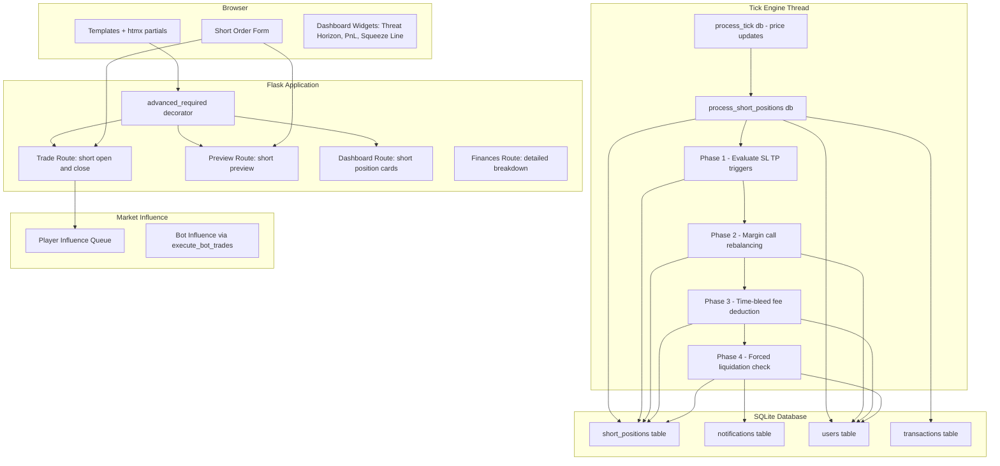
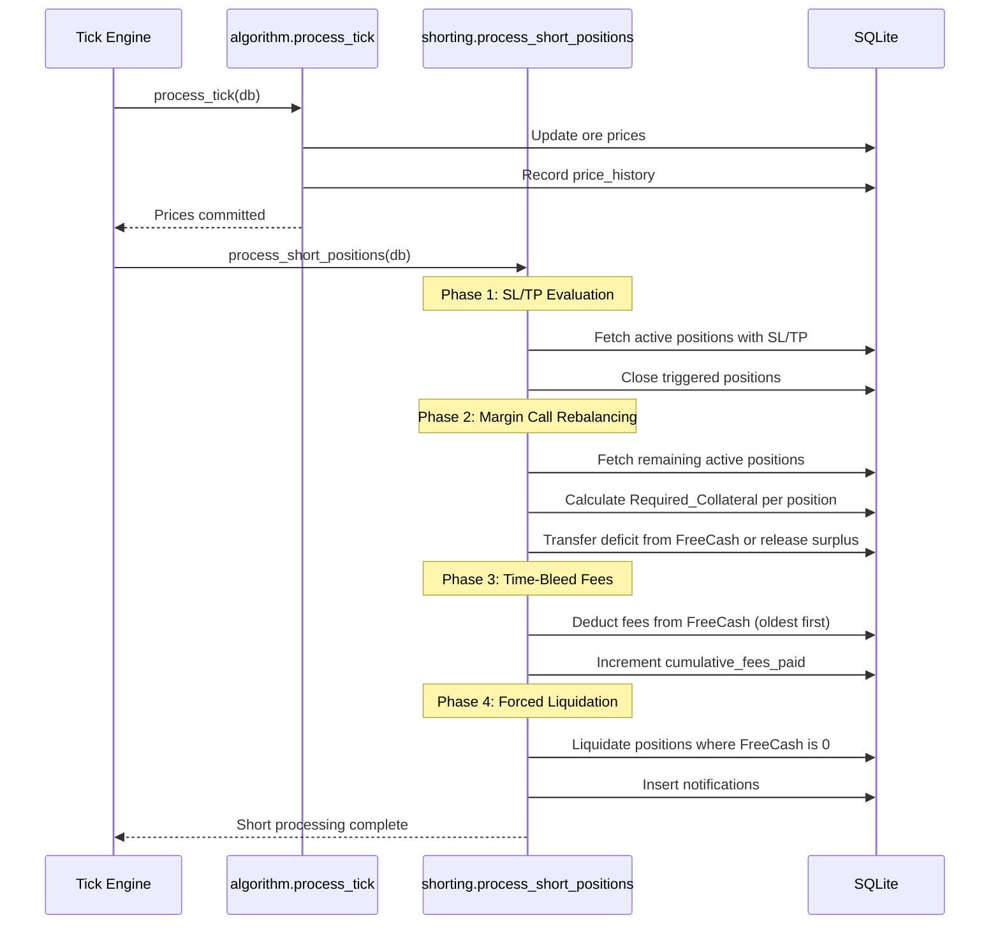

# Design Document: Shorting System

## Overview

The Shorting System extends OreX with a "reverse long position with a fuse" mechanic, allowing Advanced Mode players to profit from declining ore prices. Players lock collateral, pay continuous time-bleed fees from their FreeCash (the existing `balance` field), and face forced liquidation when FreeCash is exhausted.

The system integrates directly into the existing tick engine loop. After `process_tick()` updates ore prices, a new `process_short_positions()` function runs within the same tick cycle, handling SL/TP evaluation, margin call rebalancing, time-bleed fees, and forced liquidation checks — in that strict order.

### Key Design Decisions

| Decision | Rationale |
|----------|-----------|
| Shorting engine runs inside the tick loop (not a separate thread) | Single DB connection avoids SQLite locking contention; guarantees atomic price + short processing |
| Short_Ratio is a GLOBAL metric per ore | Crowding penalty reflects system-wide risk, not individual exposure |
| Processing order: SL/TP → Margin calls → Fees → Liquidation | SL/TP override prevents players with proper risk controls from being liquidated; fees follow collateral adjustments so fee calculations use accurate Short_Value |
| Margin calls process largest Required_Collateral first | Protects the system from underwater positions by prioritizing the highest-risk positions |
| Fees process oldest-first | Fair FIFO ordering; players who entered first pay first |
| Surplus collateral released back to FreeCash | Prevents over-collateralization from trapping capital unnecessarily |
| Shorts use the existing player influence queue | No separate queue needed; `record_player_trade()` already handles sell/buy pressure registration |
| Collateral_Multiplier formula uses cubic exponent | Creates a "hockey stick" penalty curve — negligible for lightly-shorted ores, punishing for crowded ones |
| Ticks_Per_Hour derived from Config.TICK_INTERVAL | Future-proofs fee calculations if tick speed is tuned |
| Notification system uses a DB table | Persistent notifications survive page refreshes and can be batch-queried per user |

## Architecture



### Tick Processing Sequence



## Components and Interfaces

### 1. Shorting Engine Module (`app/market/shorting.py`)

The core tick-processing logic for all short positions.

```python
def process_short_positions(db):
    """Main entry point called after process_tick(). Handles all active short positions."""

def _evaluate_sltp_triggers(db, ores_map: dict) -> set:
    """Phase 1: Check SL/TP triggers. Returns set of position IDs closed this phase."""

def _rebalance_margin(db, ores_map: dict, closed_ids: set):
    """Phase 2: Recalculate required collateral, transfer deficits or release surpluses.
    Processes positions grouped by user, largest Required_Collateral first."""

def _apply_time_bleed_fees(db, ores_map: dict, closed_ids: set):
    """Phase 3: Deduct per-tick fees from FreeCash. Oldest position first per user."""

def _check_forced_liquidation(db, ores_map: dict, closed_ids: set):
    """Phase 4: Liquidate positions for users whose FreeCash is 0."""

def _close_position(db, position, close_type: str, current_price: float):
    """Shared close logic: calculate P/L, update status, record transaction, release collateral."""

def _calculate_short_ratio(db, ore_id: int) -> float:
    """Compute global Short_Ratio for an ore. Returns 0.0 if no positions exist."""

def _calculate_collateral_multiplier(short_ratio: float) -> float:
    """Multiplier = 0.50 + 2.0 * short_ratio^3"""

def _calculate_tick_fee(short_value: float, volatility: float, ticks_per_hour: float) -> float:
    """Tick_Fee = Short_Value * ((0.005 + 0.10 * volatility^2) / ticks_per_hour), rounded to 2dp."""

def _calculate_squeeze_price(position, user_balance: float, volatility: float, ticks_per_hour: float) -> float:
    """Estimate the ore price at which FreeCash would be exhausted."""
```

### 2. Short Trade Routes (`app/routes/trade.py` — extension)

New endpoints gated by `@advanced_required`:

```python
@trade_bp.route('/trade/short/preview', methods=['POST'])
@login_required
@advanced_required
def short_preview():
    """htmx endpoint: returns partial HTML with position cost breakdown."""

@trade_bp.route('/trade/short/open/<int:ore_id>', methods=['POST'])
@login_required
@advanced_required
def short_open(ore_id):
    """Open a new short position after validation."""

@trade_bp.route('/trade/short/close/<int:position_id>', methods=['POST'])
@login_required
@advanced_required
def short_close(position_id):
    """Voluntarily close an active short position."""

@trade_bp.route('/trade/short/edit/<int:position_id>', methods=['POST'])
@login_required
@advanced_required
def short_edit_sltp(position_id):
    """Update SL/TP values on an existing position."""
```

### 3. Notification Integration (via notification-system spec)

The shorting system emits notifications using the shared Notification System's `create_notification()` API. Categories used:
- `"liquidation_fee"` — Forced liquidation caused by fee exhaustion
- `"liquidation_margin"` — Forced liquidation caused by margin call exhaustion
- `"short_triggered"` — SL/TP trigger fired on a position

See `.kiro/specs/notification-system/` for the full notification infrastructure (storage, tray, toasts, pruning).

### 4. Bot Shorting Extension (`app/market/bots.py` — extension)

```python
def _bot_short_decision(db, bot_id: int, ore: dict) -> bool:
    """Evaluate whether a bot should open a short. Requires:
    - 4/5 recent trend_log entries are 'fall'
    - Bot FreeCash after collateral lockup can sustain >= 30 ticks of fees
    - Bot total short capital < 30% of total balance
    Returns True if bot should short."""

def _bot_open_short(db, bot_id: int, ore_id: int, quantity: int, price: float):
    """Open a bot short position with mandatory SL at 5% above entry price."""

def _bot_close_short(db, bot_id: int, position_id: int, price: float):
    """Close a bot short position (triggered by SL/TP or voluntary)."""
```

### 5. Dashboard Extensions (`app/routes/dashboard.py`)

```python
def _get_short_position_cards(user_id: int) -> list:
    """Build display data for each active short position including P/L, squeeze price, fee rate."""

def _get_threat_horizon_data(user_id: int) -> dict:
    """Calculate FreeCash runway: color code, tick countdown, aggregate fee rate."""
```

### 6. Net Worth Calculation Update (`app/models.py`)

```python
def get_net_worth(user_id: int) -> float:
    """Net_Worth = FreeCash + SUM(holdings.qty * ore.price) + SUM(locked_collateral - short_value)
    for all active short positions."""

def get_portfolio_value(user_id):
    """Unchanged — still returns long holdings value only. Net worth logic moved to get_net_worth."""
```

### 7. Engine Integration (`app/market/engine.py`)

The tick loop is extended to call `process_short_positions(db)` after `process_tick(db)`:

```python
# In tick_loop():
from app.market.algorithm import process_tick
from app.market.shorting import process_short_positions

try:
    process_tick(db)
    process_short_positions(db)  # Added: shorting engine runs after price update
except Exception as e:
    ...
```

## Data Models

### New Table: `short_positions`

```sql
CREATE TABLE IF NOT EXISTS short_positions (
    id INTEGER PRIMARY KEY,
    user_id INTEGER NOT NULL,
    ore_id INTEGER NOT NULL,
    share_quantity INTEGER NOT NULL CHECK (share_quantity >= 1 AND share_quantity <= 10000),
    entry_price REAL NOT NULL CHECK (entry_price > 0),
    locked_collateral REAL NOT NULL CHECK (locked_collateral > 0),
    stop_loss_price REAL DEFAULT NULL,
    take_profit_price REAL DEFAULT NULL,
    cumulative_fees_paid REAL NOT NULL DEFAULT 0.0,
    opened_at TEXT NOT NULL DEFAULT (datetime('now')),
    closed_at TEXT DEFAULT NULL,
    status TEXT NOT NULL DEFAULT 'active' CHECK (status IN ('active', 'closed')),
    FOREIGN KEY (user_id) REFERENCES users(id) ON DELETE RESTRICT,
    FOREIGN KEY (ore_id) REFERENCES ores(id) ON DELETE RESTRICT
);

CREATE INDEX IF NOT EXISTS idx_short_positions_user ON short_positions(user_id);
CREATE INDEX IF NOT EXISTS idx_short_positions_status ON short_positions(status);
CREATE INDEX IF NOT EXISTS idx_short_positions_ore_status ON short_positions(ore_id, status);
```

### Notifications Table

Defined in the notification-system spec. The shorting system depends on this table existing but does not own its schema.

### Config Additions (`app/config.py`)

```python
# Shorting System Configuration
SHORT_BASE_REQUIREMENT = 0.50        # Base collateral multiplier (50%)
SHORT_MAX_PENALTY = 2.0              # Maximum crowding penalty
SHORT_STEEPNESS = 3                  # Cubic exponent for penalty curve
SHORT_BASE_HOURLY_RATE = 0.005       # 0.5% base fee per hour
SHORT_MAX_HOURLY_FEE = 0.10          # 10% max fee per hour at peak volatility
SHORT_MAX_QUANTITY = 10000           # Max shares per short order
SHORT_MIN_QUANTITY = 1               # Min shares per short order

# Bot Shorting Configuration
BOT_SHORT_TREND_THRESHOLD = 4        # 4/5 trend entries must be "fall"
BOT_SHORT_SUSTAIN_TICKS = 30         # Must sustain 30 ticks of fees
BOT_SHORT_CAPITAL_CAP = 0.30         # 30% of bot balance max in shorts
BOT_SHORT_SL_PERCENT = 0.05          # 5% above entry for mandatory SL
```

### Updated Net Worth Query

```sql
-- Full net worth calculation including short position equity
SELECT
    u.balance +
    COALESCE((SELECT SUM(h.quantity * o2.current_price)
              FROM holdings h JOIN ores o2 ON h.ore_id = o2.id
              WHERE h.user_id = u.id), 0) +
    COALESCE((SELECT SUM(sp.locked_collateral - (sp.share_quantity * o3.current_price))
              FROM short_positions sp JOIN ores o3 ON sp.ore_id = o3.id
              WHERE sp.user_id = u.id AND sp.status = 'active'), 0)
    AS net_worth
FROM users u
WHERE u.id = ?
```

### Transaction Type Extensions

The existing `transactions` table gains three new type values:
- `"short_open"` — recorded when a short position is opened
- `"short_close"` — recorded when a position is voluntarily closed or closed by SL/TP
- `"short_liquidated"` — recorded when forced liquidation occurs

The `total_value` field stores the locked collateral amount for opens, and the P/L amount for closes/liquidations.

### Account Reset Impact

`reset_account(user_id)` is extended to:
1. Delete all `short_positions` WHERE `user_id = ?` (before holdings cleanup)
2. Archive short-related transactions (`SET archived = 1 WHERE type IN ('short_open', 'short_close', 'short_liquidated')`)
3. Reset Advanced Mode state (handled by advanced-mode feature)
4. Restore default balance

`delete_account(user_id)` is extended to:
1. Delete all `short_positions` WHERE `user_id = ?`
2. Delete all `notifications` WHERE `user_id = ?`
3. (Existing) Delete holdings, transactions, user record


## Correctness Properties

*A property is a characteristic or behavior that should hold true across all valid executions of a system — essentially, a formal statement about what the system should do. Properties serve as the bridge between human-readable specifications and machine-verifiable correctness guarantees.*

### Property 1: Collateral Calculation Pipeline

*For any* valid share quantity (1–10,000), ore price (> 0), count of global short positions, and count of global long positions: the computed Short_Ratio SHALL equal shorts / (shorts + longs) (or 0.0 when both are zero), the Collateral_Multiplier SHALL equal 0.50 + 2.0 × Short_Ratio³, and the Total_Locked_Collateral SHALL equal (shares × price) × Collateral_Multiplier.

**Validates: Requirements 2.1, 2.2, 2.3**

### Property 2: Order Rejection When FreeCash Insufficient

*For any* short order where the player's FreeCash is less than the calculated Total_Locked_Collateral, the order SHALL be rejected AND the player's FreeCash SHALL remain unchanged.

**Validates: Requirements 2.4**

### Property 3: Balance Deduction on Valid Short Open

*For any* valid short order where FreeCash >= Total_Locked_Collateral, after opening the position the player's new FreeCash SHALL equal their previous FreeCash minus exactly Total_Locked_Collateral.

**Validates: Requirements 2.5**

### Property 4: Collateral Rebalancing Conservation of Money

*For any* active short position where the tick recalculates Required_Collateral: if Required_Collateral > current Locked_Collateral (deficit), then FreeCash SHALL decrease by (Required - Locked) and Locked SHALL become Required; if Required_Collateral < current Locked_Collateral (surplus), then FreeCash SHALL increase by (Locked - Required) and Locked SHALL become Required. In both cases, FreeCash + Locked_Collateral remains constant (money is neither created nor destroyed).

**Validates: Requirements 3.3, 3.4**

### Property 5: Margin Call Liquidation Trigger

*For any* active short position where the margin call deficit exceeds the player's remaining FreeCash, the engine SHALL transfer all remaining FreeCash into Locked_Collateral (FreeCash becomes 0) and immediately trigger forced liquidation for that position.

**Validates: Requirements 3.5**

### Property 6: Margin Call Processing Order

*For any* player with multiple active short positions requiring margin calls in a single tick, the positions SHALL be processed in order of descending Required_Collateral (largest first).

**Validates: Requirements 3.6**

### Property 7: Tick Fee Calculation

*For any* Short_Value (> 0), Volatility (0.0–1.5), and Ticks_Per_Hour (derived as 3600 / TICK_INTERVAL, where TICK_INTERVAL > 0): the Tick_Fee_Cost SHALL equal round(Short_Value × ((0.005 + 0.10 × Volatility²) / Ticks_Per_Hour), 2).

**Validates: Requirements 4.1, 8.1**

### Property 8: Fee Processing Order and Liquidation on Exhaustion

*For any* player with multiple active short positions: fees SHALL be deducted in order of ascending opened_at (oldest first), and IF a fee deduction would reduce FreeCash below zero, THEN only the amount that brings FreeCash to exactly zero SHALL be deducted and forced liquidation SHALL trigger, skipping remaining positions.

**Validates: Requirements 4.2, 4.3**

### Property 9: Voluntary Close Settlement

*For any* active short position with Locked_Collateral L and current Short_Value SV (where SV = shares × current_price): after voluntary close, the player's FreeCash SHALL increase by (L − SV), which may be negative (reducing FreeCash) when SV > L.

**Validates: Requirements 5.2, 5.3**

### Property 10: No Negative FreeCash After Forced Liquidation

*For any* combination of active short positions, ore prices, and player FreeCash states: after the complete tick processing cycle (margin calls, fees, and all forced liquidations), the player's FreeCash SHALL be greater than or equal to zero.

**Validates: Requirements 6.4**

### Property 11: Forced Liquidation Mechanics

*For any* forced liquidation of a short position with Locked_Collateral L and current Short_Value SV: the buyback cost SHALL equal SV, the remainder (L − SV) SHALL be credited to the player's FreeCash, and since the margin call system ensures L ≥ SV at all times, the remainder SHALL be non-negative.

**Validates: Requirements 6.2, 6.3**

### Property 12: SL/TP Validation

*For any* short position with current ore price P: a Stop_Loss value SL SHALL be rejected if SL ≤ P, and a Take_Profit value TP SHALL be rejected if TP ≥ P. Valid triggers require SL > P and TP < P.

**Validates: Requirements 7.2, 7.3**

### Property 13: SL/TP Trigger Execution

*For any* active short position with Stop_Loss SL and/or Take_Profit TP: when the ore's new price P satisfies P ≥ SL or P ≤ TP, the position SHALL be closed via the voluntary close procedure without applying any Time_Bleed_Fee for that tick.

**Validates: Requirements 7.4, 7.5**

### Property 14: SL/TP Priority Over Forced Liquidation

*For any* tick where both a Stop_Loss trigger and a FreeCash exhaustion condition would apply to the same position: the Stop_Loss close SHALL execute and the forced liquidation SHALL be suppressed.

**Validates: Requirements 7.7**

### Property 15: Net Worth Formula with Shorts

*For any* player with FreeCash B, long holdings with quantities q_i and prices p_i, and active short positions with Locked_Collateral Lj and Short_Values SVj: Net_Worth SHALL equal B + Σ(q_i × p_i) + Σ(Lj − SVj).

**Validates: Requirements 12.1, 12.2**

### Property 16: Short Position Market Influence Registration

*For any* short position opened with quantity Q, a sell-type trade with quantity Q SHALL be registered in the player influence queue. *For any* short position closed with quantity Q, a buy-type trade with quantity Q SHALL be registered in the player influence queue.

**Validates: Requirements 13.1, 13.2**

### Property 17: Bot Short Decision Constraints

*For any* bot evaluating whether to short an ore: the bot SHALL only open a short position when at least 4 out of 5 recent trend_log entries are "fall" AND the bot's FreeCash after collateral lockup can sustain at least 30 ticks of estimated fees.

**Validates: Requirements 13.5**

### Property 18: Bot Short Safety Invariants

*For any* bot short position: the Stop_Loss SHALL be set at exactly entry_price × 1.05, AND the total capital committed to all bot short positions SHALL not exceed 30% of the bot's total balance.

**Validates: Requirements 13.6, 13.7**

### Property 19: Account Reset Cleans All Short State

*For any* player with any combination of active/closed short positions: after account reset, zero short_positions records SHALL exist for that player, no buying pressure SHALL be registered in the influence queue from the reset, and the player's FreeCash SHALL be set to the default balance (not increased by freed collateral).

**Validates: Requirements 14.1, 14.5**

## Error Handling

| Scenario | Response | User Feedback |
|----------|----------|---------------|
| Short order with FreeCash < required collateral | Reject order, no balance change | Flash "Insufficient funds. You need ${required:,.2f} collateral but only have ${balance:,.2f} available." |
| Short order with quantity < 1 or > 10,000 | Reject order | Form validation error "Share quantity must be between 1 and 10,000." |
| Short order with non-integer quantity | Reject order | Form validation error "Share quantity must be a whole number." |
| SL price ≤ current ore price | Reject SL value | Form validation error "Stop loss must be above current price (${current_price:,.2f})." |
| TP price ≥ current ore price | Reject TP value | Form validation error "Take profit must be below current price (${current_price:,.2f})." |
| Voluntary close on non-active position | Reject, 400 Bad Request | Flash "This position is not active and cannot be closed." |
| Voluntary close on position owned by another user | 403 Forbidden | Abort with 403 |
| Short route accessed without Advanced Mode | 403 via `@advanced_required` | Redirect to dashboard with flash "Advanced Mode required." |
| Margin call exceeds FreeCash during tick | Transfer all remaining FreeCash, trigger liquidation | Notification: "Your short was forcefully squeezed! Rising price exhausted your backup capital." |
| Fee deduction exhausts FreeCash during tick | Deduct to zero, trigger liquidation | Notification: "Forced liquidation. Fee costs depleted your free cash reserves." |
| SL trigger during tick | Close position cleanly via SL | Notification: "Stop Loss triggered on {ore_name}. Position closed at ${price:,.2f}." |
| TP trigger during tick | Close position cleanly via TP | Notification: "Take Profit hit on {ore_name}. Position closed with ${profit:,.2f} profit." |
| DB error during tick processing of one position | Rollback that position's changes, continue processing others | Log error server-side; position remains active for retry next tick |
| Division by zero in Short_Ratio (0 total positions) | Return 0.0 | No user-facing impact; collateral uses base multiplier only |
| Player opens short on ore with 0 price (should never happen) | Reject order (price validation) | Flash "Cannot short an ore with zero market price." |
| Preview calculation with quantity = 0 | Return zeroed preview, disable submit | Preview shows $0.00 values, submit button disabled |
| Account reset while short positions are processing in tick | Short cleanup runs first (before balance restore) | No user-facing issue; clean state after reset completes |

### Defensive Measures

- All short position DB writes use explicit transactions with rollback on failure
- The tick engine wraps each user's position processing in try/except so one player's error doesn't block others
- Forced liquidation uses `max(0, locked - buyback)` to prevent negative credit even in floating-point edge cases
- Collateral multiplier is clamped to `[0.50, 2.50]` as an additional safety bound
- FreeCash checks use `<=` comparisons (not `<`) to prevent off-by-one on zero boundaries
- SL/TP evaluation runs BEFORE margin calls, ensuring players with risk controls are never accidentally liquidated
- Bot shorting uses conservative parameters (5% SL, 30% capital cap) to prevent bot bankruptcy cascading into market instability

## Testing Strategy

### Property-Based Tests (Hypothesis)

The project already uses Hypothesis (`.hypothesis/` directory present). Each correctness property maps to one property-based test with a minimum of 100 iterations.

**Library**: [Hypothesis](https://hypothesis.readthedocs.io/) (already in use)

**Configuration**:
- `@settings(max_examples=100)` minimum per test
- Tag format: `# Feature: shorting-system, Property N: <property_text>`

**Test file**: `tests/test_shorting_properties.py`

| Property | Test Description | Key Generators |
|----------|-----------------|----------------|
| 1 | Collateral pipeline correctness | `st.integers(1, 10000)` shares, `st.floats(0.01, 50000)` price, `st.integers(0, 500)` shorts/longs |
| 2 | Order rejection when FreeCash insufficient | `st.floats(0, 100000)` FreeCash, pre-calculated collateral > FreeCash |
| 3 | Balance deduction on valid open | `st.floats(50000, 1000000)` FreeCash with collateral < FreeCash |
| 4 | Rebalancing conservation of money | `st.floats(1, 500000)` locked, `st.floats(1, 500000)` required, `st.floats(0, 1000000)` FreeCash |
| 5 | Margin call triggers liquidation | `st.floats(0.01, 10000)` FreeCash with deficit > FreeCash |
| 6 | Margin call processing order | `st.lists(st.floats(100, 100000), min_size=2, max_size=10)` required_collateral values |
| 7 | Tick fee formula | `st.floats(100, 1000000)` short_value, `st.floats(0, 1.5)` volatility, `st.integers(5, 120)` tick_interval |
| 8 | Fee processing order + exhaustion | `st.lists(st.tuples(st.floats(10, 1000), st.datetimes()), min_size=2)` fees with timestamps, `st.floats(0, 500)` FreeCash |
| 9 | Voluntary close settlement | `st.floats(1000, 500000)` locked, `st.floats(100, 600000)` short_value |
| 10 | No negative FreeCash after liquidation | Complex composite strategy generating multi-position scenarios |
| 11 | Forced liquidation mechanics | `st.floats(1000, 500000)` locked (>= short_value), `st.floats(100, 500000)` short_value |
| 12 | SL/TP validation | `st.floats(1, 50000)` current_price, `st.floats(0.01, 100000)` SL/TP values |
| 13 | SL/TP trigger execution | `st.floats(1, 50000)` SL/TP, `st.floats(0.01, 100000)` new_price crossing thresholds |
| 14 | SL/TP priority over liquidation | Composite: position with SL trigger + FreeCash exhaustion in same tick |
| 15 | Net worth formula | `st.floats(0, 1e6)` balance, `st.lists(st.tuples(st.integers(1, 1000), st.floats(0.01, 10000)))` holdings, `st.lists(st.tuples(st.floats(100, 100000), st.floats(100, 100000)))` short (locked, sv) pairs |
| 16 | Influence registration | `st.integers(1, 10000)` quantity, `st.sampled_from(['open', 'close'])` action |
| 17 | Bot decision constraints | `st.lists(st.sampled_from(['rise','hold','fall']), min_size=5, max_size=5)` trend_log, `st.floats(0, 100000)` bot_balance |
| 18 | Bot safety invariants | `st.floats(1, 10000)` entry_price, `st.floats(1000, 100000)` bot_balance, `st.lists(st.floats(100, 50000))` existing_short_capitals |
| 19 | Account reset cleans shorts | `st.integers(0, 5)` active positions, `st.integers(0, 3)` closed positions |

### Unit Tests (pytest)

Example-based tests for UI rendering, routes, and integration scenarios:

- Short order form renders only when Advanced Mode active
- Short preview endpoint returns correct partial HTML with all cost fields
- Transaction records created correctly for short_open, short_close, short_liquidated
- Notification creation and retrieval
- Dashboard threat horizon meter color coding (green/amber/red thresholds)
- Squeeze price line data endpoint
- Position status transitions (active → closed)
- Double-close rejection
- Close of another user's position returns 403
- Account reset with active shorts cleans up correctly
- Bot short decision with various trend_log combinations

### Integration Tests

- **Full short lifecycle**: Open short → tick runs → price drops → voluntary close → verify profit credited
- **Margin call cascade**: Open short → price rises → verify margin calls transfer FreeCash → eventually liquidation
- **Fee bleed to liquidation**: Open short → many ticks → FreeCash exhausted by fees → liquidation
- **SL/TP trigger**: Open short with SL → price rises past SL → verify auto-close in tick
- **Multi-position tick**: Player has 3 shorts → tick processes all in correct order → verify final state
- **Bot shorting**: Set up bearish trend → verify bot opens short with SL → price reverses → SL fires
- **Net worth on leaderboard**: Player with shorts appears with correct net worth ranking
- **Account reset mid-short**: Player has active shorts → reset → verify clean state, no orphans
- **Surplus release**: Price drops → required collateral decreases → surplus released to FreeCash

### Manual Testing

- Visual verification of Threat Horizon Meter color transitions
- Squeeze Zone line rendering on ore price chart (crimson dashed)
- htmx partial update responsiveness on short preview form (< 500ms)
- Notification badge/pill visibility and dismissal
- Mobile-responsive layout of short position cards on dashboard
- Green money pill → finances page navigation when Advanced Mode active
