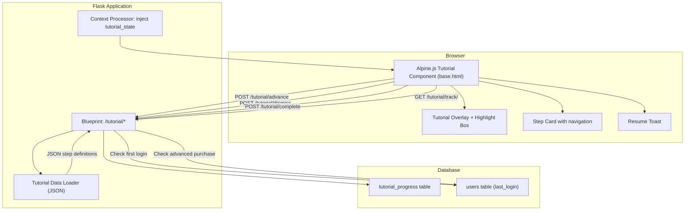
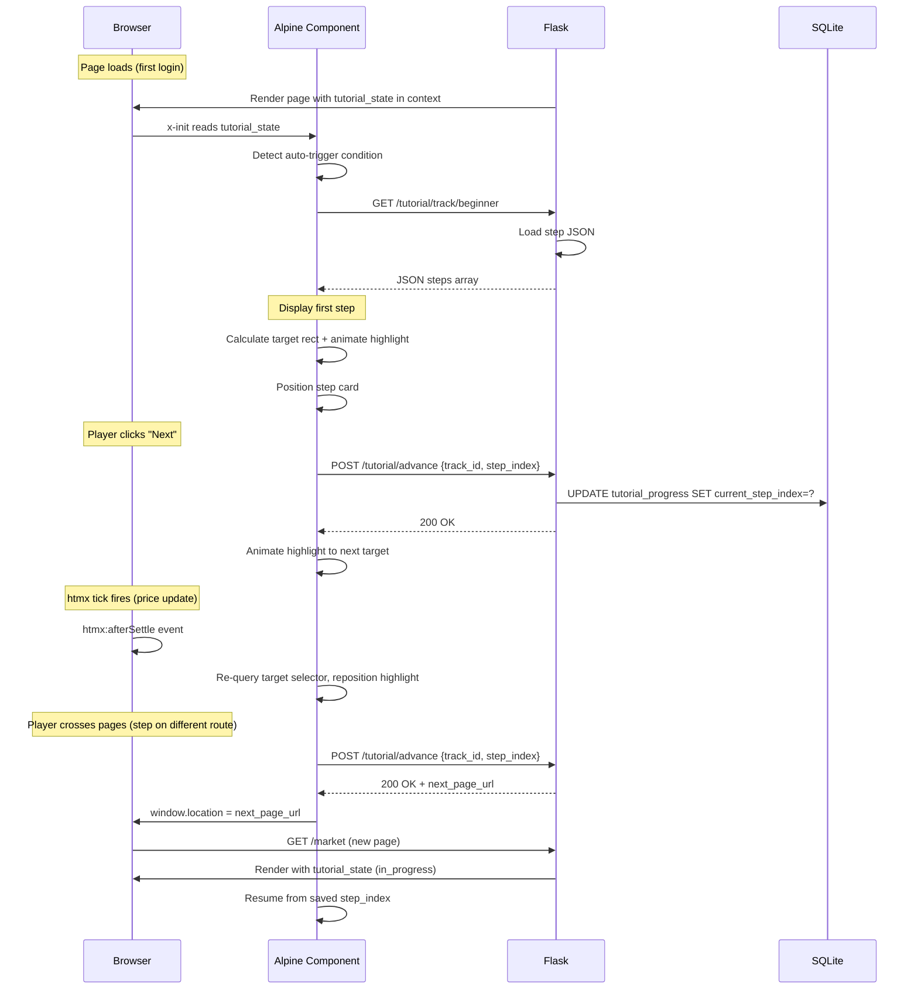

# Design Document: Tutorial System

## Overview

The Tutorial System is a guided walkthrough overlay that onboards new OreX players and introduces advanced players to expanded mechanics. It renders an animated highlight box and instructional step card on top of existing game pages, targeting specific DOM elements via CSS selectors. Two tutorial tracks exist — Beginner (triggered on first login) and Advanced (triggered on first Advanced Mode activation) — each consisting of ordered steps that can span multiple pages.

The system introduces Alpine.js as the client-side reactive framework (first usage in OreX) to orchestrate overlay state, CSS-transition-driven animations, and step progression. Tutorial step definitions are stored server-side as JSON, allowing content changes without client code deploys. Player progress is persisted in SQLite so tutorials survive page navigations, browser closures, and htmx partial re-renders.

### Key Design Decisions

| Decision | Rationale |
|----------|-----------|
| Alpine.js for overlay state management | Provides React-like reactivity (x-data, x-show, x-transition) without a build step or virtual DOM; pairs naturally with htmx |
| Global Alpine component in base.html | Overlay must persist across page navigations; mounting in base.html avoids re-initialization on each route |
| CSS transitions (not JS animation frames) | Hardware-accelerated, declarative, and simpler to maintain; Alpine x-bind:style updates trigger GPU-composited transforms |
| Server-defined step JSON served via endpoint | Content team can update tutorial text/selectors without touching JS; endpoint allows per-user track filtering |
| htmx:afterSettle listener for DOM re-acquisition | afterSettle fires after all htmx swaps and settling complete, ensuring selectors match stable DOM state |
| Resume as toast (not full overlay auto-restore) | Non-intrusive; respects player agency; avoids confusing overlay pop-in on unrelated page visits |
| pointer-events: none on backdrop, auto on cutout | Allows clicking the highlighted element (e.g., Buy button) while blocking everything else |
| Step index reset to 0 on completion/dismissal | Enables clean replay from Help page without stale progress |

## Architecture



### Request Flow



## Components and Interfaces

### 1. Tutorial Data Module (`app/tutorial/data.py`)

Loads and validates tutorial track/step definitions from a JSON file.

```python
def load_track(track_id: str) -> dict | None:
    """Load a tutorial track by ID. Returns dict with keys:
    {id, name, trigger, steps: [{index, selector, route, title, description, position, action}]}
    Returns None if track_id is unknown."""

def load_all_tracks() -> list[dict]:
    """Return list of all available tutorial track metadata (id, name, trigger)."""

def get_step(track_id: str, step_index: int) -> dict | None:
    """Return a single step from a track, or None if index out of bounds."""

def get_track_length(track_id: str) -> int:
    """Return total number of steps in a track."""
```

**Data file location:** `src/static/data/tutorials.json`

### 2. Tutorial State Model (`app/tutorial/models.py`)

Database access functions for tutorial progress.

```python
def get_tutorial_state(user_id: int, track_id: str) -> dict | None:
    """Return tutorial_progress row as dict, or None if no record exists."""

def get_all_tutorial_states(user_id: int) -> list[dict]:
    """Return all tutorial_progress rows for a user."""

def create_or_update_tutorial_state(user_id: int, track_id: str,
                                     status: str, step_index: int) -> int:
    """Upsert tutorial_progress. Returns row ID."""

def advance_step(user_id: int, track_id: str, new_index: int) -> bool:
    """Update current_step_index. Returns True on success."""

def complete_tutorial(user_id: int, track_id: str) -> bool:
    """Set status='completed', reset step_index=0. Returns True on success."""

def dismiss_tutorial(user_id: int, track_id: str) -> bool:
    """Set status='dismissed', reset step_index=0. Returns True on success."""

def replay_tutorial(user_id: int, track_id: str) -> bool:
    """Set status='in_progress', step_index=0. Returns True on success."""

def delete_tutorial_progress(user_id: int) -> int:
    """Delete all tutorial_progress for a user (account reset/delete). Returns count deleted."""

def should_auto_trigger(user_id: int, track_id: str) -> bool:
    """Return True if the track should auto-start for this user.
    Checks: no existing record OR status='not_started'."""
```

### 3. Tutorial Blueprint (`app/routes/tutorial.py`)

| Endpoint | Method | Purpose | Response |
|----------|--------|---------|----------|
| `/tutorial/track/<track_id>` | GET | Fetch full step definitions for a track | JSON `{id, name, steps: [...]}` |
| `/tutorial/advance` | POST | Advance step index | JSON `{ok: true, next_page: str or null}` |
| `/tutorial/complete` | POST | Mark track completed | JSON `{ok: true}` |
| `/tutorial/dismiss` | POST | Mark track dismissed | JSON `{ok: true}` |
| `/tutorial/replay` | POST | Reset and restart a track | JSON `{ok: true, redirect: str}` |
| `/tutorial/state` | GET | Fetch current tutorial state for client init | JSON `{track_id, step_index, status}` or `null` |

All endpoints require `@login_required`. The blueprint uses `url_prefix='/tutorial'`.

POST body format (JSON):
```json
{
    "track_id": "beginner",
    "step_index": 3
}
```

### 4. Context Processor (in `app/__init__.py`)

Injects tutorial state into all templates for authenticated users:

```python
@app.context_processor
def inject_tutorial_state():
    if current_user.is_authenticated:
        from app.tutorial.models import get_all_tutorial_states
        states = get_all_tutorial_states(current_user.id)
        active = next((s for s in states if s['status'] == 'in_progress'), None)
        return {
            'tutorial_active': active,
            'tutorial_should_load_alpine': active is not None or _should_trigger_any(current_user),
        }
    return {'tutorial_active': None, 'tutorial_should_load_alpine': False}
```

This determines whether Alpine.js needs to be loaded on the current page.

### 5. Alpine.js Tutorial Component (`static/js/tutorial.js`)

Global Alpine component registered via `Alpine.data('tutorial', ...)`:

```javascript
Alpine.data('tutorial', () => ({
    // Reactive state
    active: false,
    trackId: null,
    steps: [],
    currentIndex: 0,
    showOverlay: false,
    showConfirmSkip: false,
    showResumeToast: false,

    // Highlight box position (CSS transform targets)
    highlightTop: 0,
    highlightLeft: 0,
    highlightWidth: 0,
    highlightHeight: 0,
    padding: 8,

    // Step card position
    cardTop: 0,
    cardLeft: 0,

    // Lifecycle
    init() { /* Check tutorial_state from server, decide auto-trigger or resume toast */ },
    async startTrack(trackId) { /* Fetch steps, begin overlay */ },
    next() { /* Advance step, POST to server, handle cross-page nav */ },
    back() { /* Go to previous step, handle cross-page nav */ },
    skip() { /* Show confirmation prompt */ },
    confirmSkip() { /* POST dismiss, close overlay */ },
    finish() { /* POST complete, close overlay */ },
    resumeTutorial() { /* Hide toast, show overlay from saved step */ },
    dismissResume() { /* Hide toast, leave tutorial paused */ },

    // Positioning
    positionHighlight() { /* getBoundingClientRect + padding */ },
    positionCard() { /* Place adjacent to highlight, avoid viewport overflow */ },
    scrollToTarget() { /* scrollIntoView if target not in viewport */ },

    // htmx integration
    onHtmxSettle() { /* Re-query selector, reposition if element changed */ },
}));
```

### 6. Template Integration (`base.html` additions)

```html

<script defer src="https://cdn.jsdelivr.net/npm/alpinejs@3.x.x/dist/cdn.min.js"></script>
<script defer src="{{ url_for('static', filename='js/tutorial.js') }}"></script>


<!-- Tutorial overlay (rendered when Alpine component is active) -->



```

### 7. Tutorial Overlay Partial (`templates/partials/tutorial_overlay.html`)

Contains the Alpine-powered overlay DOM structure:
- Full-screen backdrop with `pointer-events: none`
- Highlight box div with CSS transition on transform, width, height, opacity
- Step card with title, description, counter, navigation buttons
- Skip confirmation modal
- Resume toast banner

### 8. Tutorial CSS (`static/css/tutorial.css`)

New stylesheet for tutorial-specific styles:
- `.tutorial-backdrop` — fixed position, z-index above all content
- `.tutorial-highlight` — animated border, box-shadow glow, CSS transitions
- `.tutorial-card` — card styling matching OreX design system
- `.tutorial-toast` — small banner for resume prompt
- Theme-aware custom properties for colors
- `@keyframes tutorial-pulse` — subtle border glow animation

### 9. Help Page Extension (`templates/pages/help.html`)

New "Tutorials" section added above the FAQ:
- Lists available tracks with status badge (completed/not started/in progress)
- "Replay" button for completed/dismissed tracks
- Conditional display of Advanced Tutorial based on `has_advanced_purchased`

## Data Models

### New Table: `tutorial_progress`

```sql
CREATE TABLE IF NOT EXISTS tutorial_progress (
    id INTEGER PRIMARY KEY,
    user_id INTEGER NOT NULL,
    track_id TEXT NOT NULL,
    current_step_index INTEGER NOT NULL DEFAULT 0,
    status TEXT NOT NULL DEFAULT 'not_started'
        CHECK (status IN ('not_started', 'in_progress', 'completed', 'dismissed')),
    last_updated TEXT NOT NULL DEFAULT (datetime('now', 'localtime')),
    FOREIGN KEY (user_id) REFERENCES users(id) ON DELETE CASCADE,
    UNIQUE (user_id, track_id)
);

CREATE INDEX IF NOT EXISTS idx_tutorial_progress_user
    ON tutorial_progress(user_id);
CREATE INDEX IF NOT EXISTS idx_tutorial_progress_user_status
    ON tutorial_progress(user_id, status);
```

**Notes:**
- `ON DELETE CASCADE` handles account deletion automatically.
- The `UNIQUE(user_id, track_id)` constraint prevents duplicate records per player per track.
- `datetime('now', 'localtime')` matches the existing timestamp convention.
- `status` is constrained to four valid values via CHECK.

### Tutorial Step JSON Schema

File: `src/static/data/tutorials.json`

```json
{
    "tracks": [
        {
            "id": "beginner",
            "name": "Getting Started",
            "trigger": "first_login",
            "steps": [
                {
                    "index": 0,
                    "selector": "#main-content",
                    "route": "/dashboard",
                    "title": "Welcome to OreX",
                    "description": "Welcome! This tutorial will walk you through...",
                    "position": "center",
                    "action": null
                },
                {
                    "index": 1,
                    "selector": "#nav-balance",
                    "route": "/dashboard",
                    "title": "Your Balance",
                    "description": "This shows your current cash balance...",
                    "position": "bottom",
                    "action": null
                }
            ]
        },
        {
            "id": "advanced",
            "name": "Advanced Mode",
            "trigger": "first_advanced_activation",
            "steps": []
        }
    ]
}
```

### Step Position Values

| Value | Meaning |
|-------|---------|
| `"top"` | Step card appears above the highlight box |
| `"bottom"` | Step card appears below the highlight box |
| `"left"` | Step card appears to the left |
| `"right"` | Step card appears to the right |
| `"center"` | Step card appears centered over a large highlight (e.g., welcome step) |

### Account Lifecycle Changes

In `reset_account()` (`app/models.py`), add:
```python
db.execute("DELETE FROM tutorial_progress WHERE user_id = ?", (user_id,))
```

In `delete_account()`, the `ON DELETE CASCADE` foreign key handles cleanup automatically.

### Config Additions (`app/config.py`)

```python
# Tutorial System Configuration
TUTORIAL_HIGHLIGHT_PADDING = 8       # pixels around target element
TUTORIAL_TRANSITION_DURATION = 400   # ms for highlight animation
TUTORIAL_BACKDROP_OPACITY = 0.5      # backdrop darkness (0.4-0.6)
TUTORIAL_DATA_PATH = 'static/data/tutorials.json'
```

### CSP Header Update

The Content-Security-Policy in `app/__init__.py` already allows `https://cdn.jsdelivr.net` in `script-src`, so Alpine.js from CDN is permitted without changes.

## Correctness Properties

*A property is a characteristic or behavior that should hold true across all valid executions of a system — essentially, a formal statement about what the system should do. Properties serve as the bridge between human-readable specifications and machine-verifiable correctness guarantees.*

### Property 1: Tutorial Data Serialization Round-Trip

*For any* valid Tutorial_Track containing an ordered array of Tutorial_Steps (each with index, selector, route, title, description, position, and optional action fields), serializing the track to JSON and deserializing it back SHALL produce an identical data structure with all fields preserved.

**Validates: Requirements 1.1, 1.2**

### Property 2: Auto-Trigger Correctness

*For any* player and any Tutorial_Track, the auto-trigger function SHALL return True if and only if the player has no existing tutorial_progress record for that track OR the record has status "not_started". For any player with status "completed", "dismissed", or "in_progress" on a track, the auto-trigger function SHALL return False.

**Validates: Requirements 2.1, 2.2, 2.3, 2.4**

### Property 3: Step Card Contains Required Information

*For any* Tutorial_Step with a title string T, description string D, step index I, and total steps N (where 0 <= I < N), the rendered step card output SHALL contain T, D, and a progress indicator equivalent to "Step {I+1} of {N}".

**Validates: Requirements 4.1**

### Property 4: Step Card Positioning Within Viewport

*For any* highlight box position (top, left, width, height) and viewport dimensions (viewportWidth, viewportHeight), the computed step card position SHALL place the card entirely within the viewport bounds (card.left >= 0, card.top >= 0, card.right <= viewportWidth, card.bottom <= viewportHeight).

**Validates: Requirements 4.2**

### Property 5: Navigation Button State Matches Step Position

*For any* Tutorial_Track with N steps and current step index I: the "Back" button SHALL be disabled if and only if I == 0, and the primary forward button SHALL display "Finish" if and only if I == N-1 (otherwise it SHALL display "Next").

**Validates: Requirements 4.4, 4.6**

### Property 6: Cross-Page Navigation Triggers on Route Mismatch

*For any* two consecutive Tutorial_Steps where step[I].route differs from step[I+1].route, advancing from step I to step I+1 SHALL trigger a page navigation to step[I+1].route. Similarly, going back from step I to step I-1 where routes differ SHALL trigger navigation to step[I-1].route.

**Validates: Requirements 5.1, 5.5**

### Property 7: Tutorial State Persistence Round-Trip

*For any* valid (user_id, track_id, status, step_index) tuple where status is one of the four valid values and step_index >= 0, writing the state to the database and reading it back SHALL return the same track_id, status, and step_index values.

**Validates: Requirements 5.2, 6.1, 6.2**

### Property 8: Resume Prompt Triggers Only for In-Progress State

*For any* player with a tutorial_progress record, the resume prompt SHALL be offered on page load if and only if the record's status is "in_progress". For statuses "not_started", "completed", or "dismissed", no resume prompt SHALL appear.

**Validates: Requirements 5.4, 6.5, 6.6**

### Property 9: Help Page Track Visibility Rules

*For any* player: the Beginner_Tutorial SHALL always appear in the tutorials list. The Advanced_Tutorial SHALL appear if and only if the player has `advanced_purchased = 1`. A "Replay" button SHALL appear next to a track if and only if its status is "completed" or "dismissed".

**Validates: Requirements 7.1, 7.2, 7.4, 7.5, 7.6**

### Property 10: Replay Resets Tutorial State to Beginning

*For any* Tutorial_Track with status "completed" or "dismissed" and any prior current_step_index value, invoking replay SHALL set status to "in_progress" and current_step_index to 0. Similarly, when a track reaches "completed" or "dismissed" status, current_step_index SHALL be reset to 0.

**Validates: Requirements 7.3, 11.6**

### Property 11: Highlight Box Dimensions from Target Rect Plus Padding

*For any* target element with bounding rectangle (top, left, width, height) and any padding value P >= 0, the computed highlight box SHALL have dimensions: (top - P, left - P, width + 2P, height + 2P).

**Validates: Requirements 9.6**

### Property 12: UNIQUE Constraint on User-Track Pair

*For any* (user_id, track_id) pair that already exists in tutorial_progress, attempting to insert a second record with the same (user_id, track_id) SHALL raise an integrity error (the existing record must be updated instead).

**Validates: Requirements 11.2**

### Property 13: Account Lifecycle Clears All Tutorial Records

*For any* player with N tutorial_progress records (N >= 0), after account reset or account deletion, zero tutorial_progress records SHALL exist for that player.

**Validates: Requirements 11.3, 11.4**

### Property 14: Tutorial State Upsert Behavior

*For any* (user_id, track_id) pair: if no tutorial_progress record exists, `create_or_update_tutorial_state` SHALL create a new record; if a record already exists, it SHALL update the existing record's status and step_index without creating a duplicate.

**Validates: Requirements 11.5**

## Error Handling

| Scenario | Response | User Feedback |
|----------|----------|---------------|
| Tutorial track JSON file missing or malformed | Log error, disable tutorial system gracefully | No tutorial offered; no crash |
| Step targets a CSS selector that matches no element | Auto-advance to next step, log warning | Player sees next step without interruption |
| Step targets an element on a page the player cannot access (e.g., Advanced-only route) | Skip step, advance to next | Seamless progression |
| POST /tutorial/advance with invalid step_index | Return 400 with error message | No client-side change; step stays |
| POST /tutorial/advance for a track the user has no record for | Return 404 | No client-side change |
| Replay attempted on a track with status "in_progress" | No-op, return current state | Client shows current step |
| Replay attempted on Advanced_Tutorial by player without purchase | Return 403 | Button not shown (defense-in-depth) |
| UNIQUE constraint violation on tutorial_progress insert | Catch IntegrityError, perform UPDATE instead | Transparent to user |
| Alpine.js CDN fails to load | Tutorial system unavailable; no overlay shown | Page functions normally without tutorial |
| htmx:afterSettle fires but selector still matches | Reposition highlight silently | No visible disruption |
| Player's browser does not support getBoundingClientRect | Extremely unlikely (IE5+ support); fallback to hidden overlay | Tutorial disabled gracefully |
| Player navigates via browser back button during tutorial | Tutorial detects route mismatch on next page load, shows resume toast | Non-intrusive recovery |
| Tutorial JSON defines 0 steps for a track | Track is treated as non-existent | Not offered for auto-trigger or replay |

### Defensive Measures

- All tutorial DB writes use transactions for atomicity
- The Alpine component wraps `querySelector` in null checks before reading `getBoundingClientRect`
- The step card positioning function clamps coordinates to viewport bounds (never negative, never beyond edge)
- The `htmx:afterSettle` handler debounces repositioning to avoid rapid-fire recalculations during multi-swap updates
- Cross-page navigation stores state BEFORE triggering `window.location` change, ensuring no data loss
- The resume toast has a 2-second delay before appearing to avoid flashing on fast page transitions
- Tutorial endpoints validate that `track_id` is a known track before any DB operations

## Testing Strategy

### Property-Based Tests (Hypothesis)

The project already uses Hypothesis (`.hypothesis/` directory present). Each correctness property maps to one property-based test with a minimum of 100 iterations.

**Library**: [Hypothesis](https://hypothesis.readthedocs.io/) (already in use)

**Configuration**:
- `@settings(max_examples=100)` minimum per test
- Tag format: `# Feature: tutorial-system, Property N: <property_text>`

**Test file**: `tests/test_tutorial_properties.py`

| Property | Test Description | Key Generators |
|----------|-----------------|----------------|
| 1 | Track/step JSON round-trip | `st.text(min_size=1)` for titles/descriptions, `st.sampled_from(['top','bottom','left','right','center'])` for position, `st.integers(0, 20)` for index |
| 2 | Auto-trigger logic | `st.sampled_from(['not_started','in_progress','completed','dismissed', None])` for status (None = no record) |
| 3 | Step card rendering | `st.text(min_size=1, max_size=100)` for title/desc, `st.integers(0, 20)` for index, `st.integers(1, 21)` for total |
| 4 | Card positioning within viewport | `st.floats(0, 2000)` for highlight position/dimensions, `st.floats(300, 3000)` for viewport width/height |
| 5 | Button state matches position | `st.integers(1, 20)` for track length, `st.integers(0, 19)` for current index (clamped to length-1) |
| 6 | Cross-page nav on route mismatch | `st.lists(st.sampled_from(['/dashboard','/market','/portfolio','/leaderboard']), min_size=2, max_size=10)` for step routes |
| 7 | State persistence round-trip | `st.integers(1, 1000)` user_id, `st.sampled_from(['beginner','advanced'])` track_id, `st.sampled_from(statuses)` status, `st.integers(0, 20)` step_index |
| 8 | Resume prompt logic | `st.sampled_from(['not_started','in_progress','completed','dismissed'])` for status |
| 9 | Help page visibility | `st.booleans()` for advanced_purchased, `st.sampled_from(statuses)` for each track status |
| 10 | Replay resets state | `st.sampled_from(['completed','dismissed'])` for pre-replay status, `st.integers(0, 20)` for pre-replay step_index |
| 11 | Highlight box dimensions | `st.floats(0, 2000)` for rect values, `st.floats(0, 50)` for padding |
| 12 | UNIQUE constraint | `st.integers(1, 100)` user_id, `st.sampled_from(['beginner','advanced'])` track_id |
| 13 | Account lifecycle cleanup | `st.integers(0, 5)` number of tutorial_progress records per user |
| 14 | Upsert behavior | `st.booleans()` for record_exists, `st.sampled_from(statuses)` for new status |

### Unit Tests (pytest)

Example-based tests for specific scenarios:
- Beginner_Tutorial contains all required topic steps (welcome, dashboard, market, ore detail, trade, portfolio, leaderboard)
- Advanced_Tutorial contains all required topic steps (welcome, finances, short, collateral, SL/TP, chart overlays, risk)
- Context processor returns `tutorial_should_load_alpine=True` only when appropriate
- Tutorial endpoints return 401 for unauthenticated users
- Dismiss endpoint sets status to "dismissed" and step_index to 0
- Complete endpoint sets status to "completed" and step_index to 0
- Overlay HTML includes `role="dialog"` and `aria-modal="true"`
- Step card buttons have correct `tabindex` ordering
- Alpine.js script tag only present when `tutorial_should_load_alpine` is True
- htmx:afterSettle event listener is registered in tutorial.js
- Escape key triggers skip confirmation (not immediate dismiss)
- Resume toast appears with 2s delay for in_progress state
- CSRF token included in tutorial POST requests

### Integration Tests

- **First login flow**: Register → first login → verify Beginner_Tutorial auto-triggers → advance through steps → complete → verify DB state
- **Advanced trigger flow**: Activate Advanced Mode first time → verify Advanced_Tutorial triggers → dismiss → verify not re-triggered on second activation
- **Cross-page navigation**: Start Beginner → advance to market step → verify page navigation occurs → tutorial resumes on market page
- **Resume after abandon**: Start tutorial → navigate away manually → reload page → verify resume toast appears → click resume → overlay shows correct step
- **Replay from Help**: Complete tutorial → visit Help → click Replay → verify tutorial restarts at step 0
- **htmx survival**: Start tutorial on dashboard → trigger a tick (htmx update) → verify overlay persists and highlight repositions
- **Account reset**: Complete tutorials → reset account → verify all tutorial_progress deleted → first login triggers tutorial again
- **Theme compatibility**: Activate advanced theme → start tutorial → verify overlay uses advanced color palette

### Manual Testing

- Visual verification of highlight box animation smoothness (shrink-to-target transition)
- Highlight border pulse/glow animation appearance in both themes
- Step card readability and contrast ratio check (WCAG AA)
- Keyboard navigation: Tab through Back/Next/Skip, Escape to skip prompt
- Mobile viewport: step card doesn't overflow on small screens
- htmx partial update during active tutorial (wait for 20s tick, verify stability)
- Cross-page Back button navigation (step on market → Back → returns to dashboard)
- Browser refresh mid-tutorial → resume toast behavior
