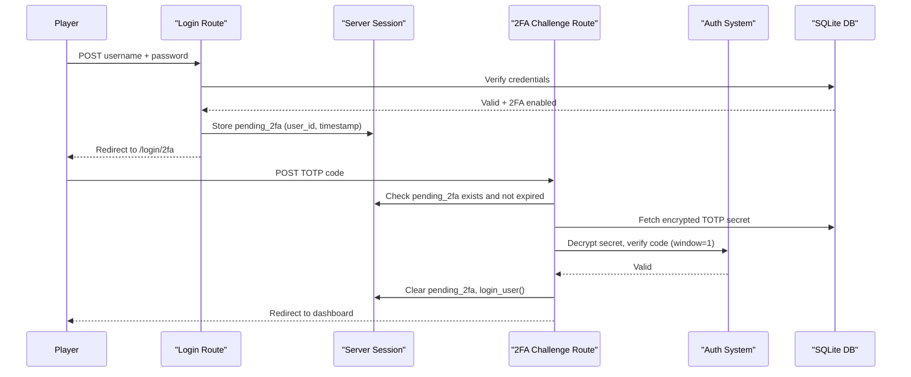

# Design Document: Two-Factor Authentication

## Overview

This design adds optional TOTP-based two-factor authentication to OreX. The feature is self-contained within the auth subsystem and settings page. Once enabled by a player, login becomes a two-step process: password verification followed by a time-based 6-digit code challenge on a dedicated page.

Key design decisions:
- **pyotp** handles TOTP secret generation and code verification
- **qrcode[pil]** renders scannable QR codes (Pillow already present)
- TOTP secrets are encrypted at rest using Fernet with a key derived from `SECRET_KEY`
- Backup codes are hashed with Werkzeug (same as passwords) — irreversible
- A pending 2FA session (stored server-side with 5-minute expiry) bridges the gap between password success and full authentication
- The existing rate limiter covers 2FA challenge attempts with no separate counter

## Architecture



The 2FA feature integrates at four points:

1. **Login route** — After password success, checks `totp_enabled`. If true, creates pending session and redirects.
2. **Challenge route** — New `/login/2fa` endpoint verifies TOTP or backup code.
3. **Settings route** — New endpoints for enable/disable 2FA flow.
4. **Database** — New columns on `users` table and a `backup_codes` table.

## Components and Interfaces

### New Module: `app/totp.py`

Core TOTP utility functions isolated from route logic.

```python
# app/totp.py

def generate_secret() -> str:
    """Generate a new base32-encoded TOTP secret using pyotp."""

def get_provisioning_uri(secret: str, username: str) -> str:
    """Build otpauth://totp/OreX:{username}?secret={secret}&issuer=OreX"""

def generate_qr_code(uri: str) -> bytes:
    """Render provisioning URI as a PNG QR code image (returns raw bytes)."""

def verify_totp(secret: str, code: str) -> bool:
    """Verify a 6-digit code with valid_window=1 (accepts +/- one period)."""

def encrypt_secret(plaintext: str, app_secret_key: str) -> str:
    """Encrypt TOTP secret using Fernet with key derived from app SECRET_KEY."""

def decrypt_secret(ciphertext: str, app_secret_key: str) -> str:
    """Decrypt stored TOTP secret. Returns plaintext base32 string."""

def derive_fernet_key(app_secret_key: str) -> bytes:
    """Derive a 32-byte Fernet key from SECRET_KEY using PBKDF2-HMAC-SHA256."""

def generate_backup_codes(count: int = 8) -> list[str]:
    """Generate `count` cryptographically random 8-char alphanumeric codes."""

def hash_backup_code(code: str) -> str:
    """Hash a backup code using Werkzeug generate_password_hash."""

def verify_backup_code(stored_hash: str, code: str) -> bool:
    """Check a plaintext backup code against its stored hash."""
```

### New Routes: `app/routes/two_factor.py`

```python
# Blueprint: two_factor_bp, url_prefix: none

GET  /login/2fa          -> render 2FA challenge page
POST /login/2fa          -> verify TOTP code, complete login
POST /login/2fa/backup   -> verify backup code, complete login

POST /settings/2fa/setup      -> generate secret, return QR + manual key
POST /settings/2fa/confirm    -> verify TOTP code, enable 2FA, show backup codes
POST /settings/2fa/disable    -> verify TOTP/backup code, disable 2FA
```

### Modified Routes

**`auth.py` login route** — After successful password verification, add:
```python
if user_has_2fa_enabled(row['id']):
    session['pending_2fa_user_id'] = row['id']
    session['pending_2fa_time'] = time.time()
    return redirect(url_for('two_factor.challenge'))
```

### New Model Functions: `app/models.py` additions

```python
# 2FA state management
def get_2fa_status(user_id: int) -> dict:
    """Return {enabled: bool, encrypted_secret: str|None}"""

def enable_2fa(user_id: int, encrypted_secret: str) -> None:
    """Set totp_enabled=1 and totp_secret_encrypted on users table."""

def disable_2fa(user_id: int) -> None:
    """Set totp_enabled=0, clear totp_secret_encrypted, delete backup_codes."""

def get_encrypted_totp_secret(user_id: int) -> str | None:
    """Fetch encrypted TOTP secret for verification."""

# Backup code management
def store_backup_codes(user_id: int, hashed_codes: list[str]) -> None:
    """Insert hashed backup codes into backup_codes table."""

def get_backup_codes(user_id: int) -> list[dict]:
    """Fetch all backup code rows for a user (id, code_hash, used)."""

def mark_backup_code_used(code_id: int) -> None:
    """Mark a specific backup code as used."""

def delete_backup_codes(user_id: int) -> None:
    """Remove all backup codes for a user."""

def get_remaining_backup_code_count(user_id: int) -> int:
    """Count unused backup codes for a user."""
```

## Data Models

### Schema Changes

```sql
-- Add 2FA columns to users table
ALTER TABLE users ADD COLUMN totp_enabled INTEGER NOT NULL DEFAULT 0;
ALTER TABLE users ADD COLUMN totp_secret_encrypted TEXT;

-- New backup_codes table
CREATE TABLE IF NOT EXISTS backup_codes (
    id INTEGER PRIMARY KEY,
    user_id INTEGER NOT NULL,
    code_hash TEXT NOT NULL,
    used INTEGER NOT NULL DEFAULT 0,
    created_at TEXT NOT NULL DEFAULT (datetime('now')),
    FOREIGN KEY (user_id) REFERENCES users(id) ON DELETE CASCADE
);

CREATE INDEX IF NOT EXISTS idx_backup_codes_user ON backup_codes(user_id);
```

### Encryption Approach

```
SECRET_KEY (string)
    │
    ▼ PBKDF2-HMAC-SHA256 (salt="orex-totp-key", iterations=100000)
    │
    ▼ base64url-encode to 32 bytes
    │
    ▼ Fernet(key)
    │
    ▼ encrypt(totp_secret_plaintext) → stored ciphertext
```

The static salt is acceptable here because the goal is to prevent offline secret recovery from a stolen DB dump — an attacker who also has `SECRET_KEY` already controls the app. The iteration count adds cost to brute-forcing `SECRET_KEY` from a known plaintext.

### Session State for Pending 2FA

Stored in Flask's server-side session (signed cookie):
```python
session['pending_2fa_user_id'] = int   # user ID who passed password
session['pending_2fa_time'] = float    # time.time() at creation
```

Validation: `time.time() - session['pending_2fa_time'] < 300` (5 minutes).


## Correctness Properties

*A property is a characteristic or behavior that should hold true across all valid executions of a system — essentially, a formal statement about what the system should do. Properties serve as the bridge between human-readable specifications and machine-verifiable correctness guarantees.*

### Property 1: Provisioning URI format

*For any* valid username and base32 TOTP secret, the provisioning URI produced by `get_provisioning_uri` SHALL match the format `otpauth://totp/OreX:{username}?secret={secret}&issuer=OreX`.

**Validates: Requirements 1.4**

### Property 2: TOTP verification with clock skew

*For any* valid TOTP secret, `verify_totp` SHALL accept the code generated for the current 30-second period, the immediately preceding period, and the immediately following period, and SHALL reject any code from periods outside this window.

**Validates: Requirements 2.1, 2.4, 4.6**

### Property 3: Backup code generation format

*For any* invocation of `generate_backup_codes(8)`, the result SHALL contain exactly 8 elements, each element SHALL be exactly 8 characters long matching `^[A-Za-z0-9]{8}$`, and all 8 elements SHALL be distinct from each other.

**Validates: Requirements 3.1, 3.4**

### Property 4: Backup code hashing is non-reversible

*For any* generated backup code, `hash_backup_code(code)` SHALL produce a string that is not equal to the original plaintext code, and `verify_backup_code(hash_backup_code(code), code)` SHALL return True.

**Validates: Requirements 3.3, 9.4**

### Property 5: Backup code single-use semantics

*For any* backup code that has been marked as used, subsequent verification attempts with that same code SHALL fail (return False or be rejected).

**Validates: Requirements 5.2**

### Property 6: TOTP secret encryption round-trip

*For any* valid base32 TOTP secret and any application SECRET_KEY, `decrypt_secret(encrypt_secret(secret, key), key)` SHALL equal the original secret, and `encrypt_secret(secret, key)` SHALL NOT equal the plaintext secret.

**Validates: Requirements 9.1**

### Property 7: Pending session expiry boundary

*For any* pending 2FA session created at time T, verification attempts at time T + t WHERE t < 300 seconds SHALL be accepted (session valid), and attempts at time T + t WHERE t >= 300 seconds SHALL be rejected (session expired).

**Validates: Requirements 7.1**

### Property 8: Pending session does not grant authenticated access

*For any* request with only a pending 2FA session (user_id stored but login_user not called), access to any `@login_required` route SHALL be denied with a redirect to the login page.

**Validates: Requirements 4.2**

### Property 9: Disabling 2FA removes all 2FA data

*For any* user with 2FA enabled, after calling `disable_2fa(user_id)`, the user's `totp_enabled` SHALL be 0, `totp_secret_encrypted` SHALL be NULL, and the count of rows in `backup_codes` for that user SHALL be 0.

**Validates: Requirements 8.3**

### Property 10: Account reset preserves 2FA configuration

*For any* user with 2FA enabled, after calling `reset_account(user_id)`, the user's `totp_enabled`, `totp_secret_encrypted`, and all `backup_codes` rows SHALL remain unchanged from their pre-reset state.

**Validates: Requirements 10.1**

### Property 11: Account delete removes all 2FA data

*For any* user with 2FA enabled, after calling `delete_account(user_id)`, no row SHALL exist in `users` for that user_id, and no rows SHALL exist in `backup_codes` for that user_id.

**Validates: Requirements 10.3**

## Error Handling

| Scenario | Behavior |
|----------|----------|
| Invalid TOTP code during setup | Flash error, re-render setup page with same QR/secret (no regeneration) |
| Invalid TOTP code during login challenge | Flash error, re-render challenge page, record attempt in rate limiter |
| Invalid backup code during login | Flash error, re-render challenge page, record attempt in rate limiter |
| Rate limit exceeded on challenge page | Render error with retry time in minutes, block further attempts |
| Pending session expired | Clear session data, flash error, redirect to `/login` |
| No pending session when accessing `/login/2fa` | Redirect to `/login` (prevents direct access) |
| Invalid TOTP/backup code when disabling 2FA | Flash error, re-render settings page |
| Database error during 2FA enable/disable | Roll back transaction, flash generic error, re-render settings |
| Fernet decryption failure (corrupted secret) | Log error, flash "2FA configuration error — contact support", deny login |
| Missing `SECRET_KEY` or empty string | App startup should fail (existing behavior) |

## Testing Strategy

### Unit Tests (example-based)

- Settings page renders 2FA section with correct status (enabled/disabled)
- Enable button visible when disabled; Disable button visible when enabled
- Setup endpoint returns QR code image and manual key
- Confirm endpoint rejects invalid TOTP code with error message
- Challenge page renders input field and backup code link
- Session contains only `pending_2fa_user_id` and `pending_2fa_time` after password success
- Rate limiter blocks after 5 failed attempts across password + 2FA attempts
- Disable endpoint rejects request without valid code
- Backup codes displayed exactly once after setup confirmation

### Property-Based Tests (Hypothesis)

Library: **Hypothesis** (already in `requirements.txt`)

Each property test runs a minimum of 100 iterations. Tests reference the design property they validate.

| Property | Test Description |
|----------|-----------------|
| Property 1 | Generate random usernames (alphanum 3-20 chars) and secrets, verify URI format |
| Property 2 | Generate random secrets, compute codes at T-1, T, T+1 periods — verify acceptance; compute codes at T-2, T+2 — verify rejection |
| Property 3 | Call `generate_backup_codes(8)` repeatedly, verify count, uniqueness, and format regex |
| Property 4 | Generate random 8-char alphanumeric codes, hash them, verify hash != plaintext and verify_backup_code(hash, code) is True |
| Property 5 | Generate a code, store its hash, mark as used, attempt verify again — should fail |
| Property 6 | Generate random base32 secrets and random SECRET_KEYs, verify encrypt/decrypt round-trip and ciphertext != plaintext |
| Property 7 | Generate random timestamps, verify session validity at boundary (299s valid, 300s invalid) |
| Property 8 | Tested via integration tests (requires Flask request context with @login_required decorator) |
| Property 9 | Create user with 2FA, call disable_2fa, verify all 2FA columns/tables cleared |
| Property 10 | Create user with 2FA and backup codes, call reset_account, verify 2FA state unchanged |
| Property 11 | Create user with 2FA, call delete_account, verify no rows remain |

Tag format for each test: `# Feature: two-factor-auth, Property {N}: {title}`

### Integration Tests

- Full login flow: password → redirect to /login/2fa → TOTP code → dashboard
- Full login flow with backup code instead of TOTP
- Enable 2FA end-to-end: setup → confirm → backup codes displayed
- Disable 2FA end-to-end: enter code → 2FA removed → login without challenge
- Rate limit shared counter: mix of password failures and 2FA failures
- Account reset preserves 2FA (login after reset still requires challenge)
- Account delete removes all 2FA data (no orphaned backup_codes rows)

### New Dependencies

Add to `requirements.txt`:
```
pyotp==2.9.0
qrcode==8.0
```

(`qrcode` uses Pillow for PNG rendering, which is already present.)
