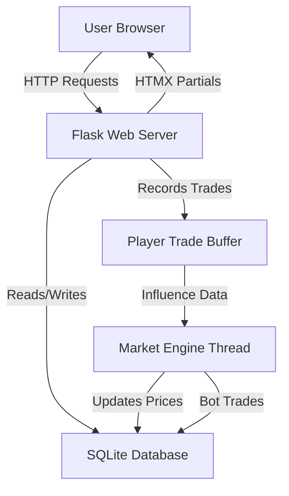
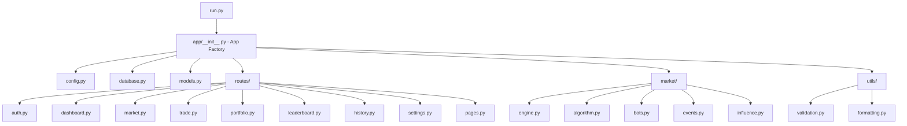
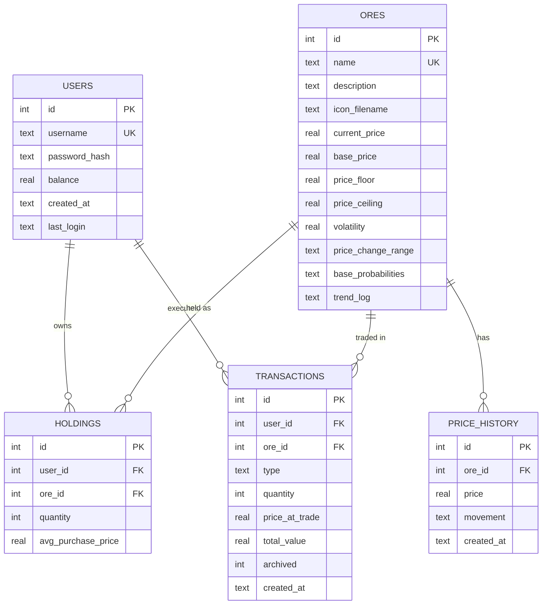
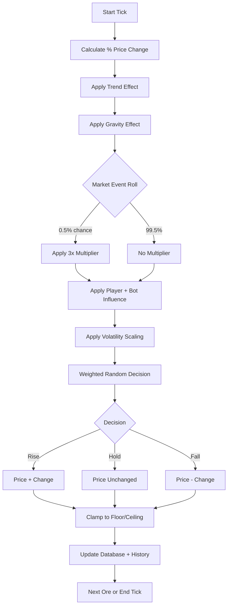

# Project Proposal — OreX

## 1. Project Overview

**Project Title:** OreX — Minecraft-Themed Stock Market Simulation

**Developer:** Zechariah Guo

**Date:** June 2026

**Version:** 1.0

---

## 2. Problem Statement

Financial literacy is a critical life skill, yet traditional share market education is often dry, abstract, and inaccessible to younger audiences. Students frequently disengage from economic concepts because the material lacks interactivity and relatable context. There is a need for an engaging, low-risk environment where users can learn the mechanics of trading — buying, selling, portfolio management, and market analysis — without real financial consequences.

This project was initiated in response to interest from an EdTech client stakeholder (a curriculum advisory panel) seeking an interactive classroom tool that could supplement financial literacy units for secondary students. The client identified a gap in available resources: existing market simulators were either too complex for the target age group or lacked the gamified engagement needed to sustain student participation across a teaching unit.

---

## 3. Proposed Solution

OreX is a web-based stock market simulation that uses a Minecraft ore theme to gamify the experience of trading commodities. Users register an account, receive a virtual starting balance, and trade nine fictional ores whose prices fluctuate in real time. The application is multiplayer by design — all participants share the same live market, compete on a common leaderboard, and collectively influence prices through their trading activity. The system simulates a realistic market through an algorithmic pricing engine, AI bot traders, trend-based probability adjustments, and random market events.

The system provides:

- A live market with prices that update every 20 seconds
- Nine tradeable ores with distinct volatility and price profiles
- AI bot traders that compete alongside human players
- Portfolio tracking with profit/loss calculations
- A competitive leaderboard ranking all participants
- Transaction history with pagination and archiving

---

## 4. Target Audience

| Audience | Description |
|----------|-------------|
| Primary | Secondary school students (Years 9–12) learning financial literacy or economics |
| Secondary | Hobbyist gamers interested in trading simulations |
| Tertiary | Educators seeking an interactive classroom tool for market concepts |

---

## 5. Functional Requirements

| ID | Requirement | Priority |
|----|-------------|----------|
| FR-01 | Users can register an account with a username and password | Must Have |
| FR-02 | Users can log in and log out securely | Must Have |
| FR-03 | Users receive a default virtual balance of $10,000 upon registration | Must Have |
| FR-04 | Users can browse a market view displaying all nine ores and their current prices | Must Have |
| FR-05 | Users can view detailed information for a single ore including price history chart | Must Have |
| FR-06 | Users can buy ores with a confirmation step | Must Have |
| FR-07 | Users can sell ores they hold with a confirmation step | Must Have |
| FR-08 | The system updates ore prices every 20 seconds via a background engine | Must Have |
| FR-09 | AI bot traders execute trades each tick, appearing on the leaderboard | Should Have |
| FR-10 | Users can view their portfolio with per-holding profit/loss | Must Have |
| FR-11 | A leaderboard ranks all users (human and bot) by total portfolio value | Should Have |
| FR-12 | Users can view paginated transaction history | Should Have |
| FR-13 | Users can change their password from account settings | Should Have |
| FR-14 | Users can reset their account (restore balance, clear holdings) | Could Have |
| FR-15 | Player trades influence ore price probability on the next tick | Should Have |
| FR-16 | Rare market events (0.5% chance) cause a 3× price shock | Could Have |

---

## 6. Non-Functional Requirements

| ID | Requirement |
|----|-------------|
| NFR-01 | The application must run locally without requiring an external database server or cloud services |
| NFR-02 | Passwords must be securely hashed (Werkzeug PBKDF2) |
| NFR-03 | Login attempts must be rate-limited (5 attempts per 15-minute window) |
| NFR-04 | CSRF protection must be applied to all POST forms |
| NFR-05 | The market engine must be thread-safe and not block the main web server |
| NFR-06 | The UI must be responsive and accessible on modern browsers |
| NFR-07 | The system must support concurrent users without data corruption (SQLite WAL mode) |

---

## 7. Technology Stack

| Layer | Technology | Justification |
|-------|-----------|---------------|
| Backend | Python 3.9+, Flask 3.0 | Lightweight, well-documented framework suitable for educational projects |
| Database | SQLite3 (WAL mode) | Zero-configuration, file-based; ideal for single-server deployments |
| Templating | Jinja2 | Integrated with Flask; supports template inheritance and partials |
| Authentication | Flask-Login + Werkzeug | Industry-standard session management and password hashing |
| CSRF Protection | Flask-WTF (CSRFProtect) | Prevents cross-site request forgery on all form submissions |
| Frontend | HTML, CSS (custom properties), JavaScript | No heavy framework dependency; fast load times |
| Real-time Updates | HTMX | Lightweight library for partial page updates without a full SPA framework |
| Charting | JavaScript (client-side) | Renders price history graphs from JSON API endpoints |

---

## 8. System Architecture

### 8.1 High-Level Architecture

### 8.2 Application Module Structure

---

## 9. Data Model

### 9.1 Entity-Relationship Diagram

---

## 10. Market Algorithm Overview

The pricing engine runs as a background daemon thread and processes one "tick" every 20 seconds. Each tick follows an eight-step pipeline per ore:

1. **Calculate price change amount** — A random percentage within the ore's configured range is applied to the current price.
2. **Apply trend effect** — The last five price movements (trend log) shift probabilities toward mean reversion.
3. **Apply gravity effect** — Prices that drift far from their base are pulled back proportionally.
4. **Roll for market event** — A 0.5% chance triggers a 3× multiplier on the price change.
5. **Apply player and bot influence** — Recent trades shift rise/fall probabilities based on net buy/sell pressure.
6. **Apply volatility scaling** — High-volatility ores have larger moves and reduced "hold" probability.
7. **Make market decision** — A weighted random selection determines rise, hold, or fall.
8. **Apply and clamp** — The new price is clamped within the ore's floor and ceiling, then persisted.

### 10.1 Tick Pipeline Flowchart

---

## 11. User Interface Pages

| Page | Description |
|------|-------------|
| Landing | Marketing page for unauthenticated visitors with login/register calls to action |
| Register | Account creation form with validation feedback |
| Login | Authentication form with rate limiting |
| Dashboard | At-a-glance portfolio summary, top movers, and recent activity |
| Market Overview | Card grid of all nine ores with live prices and trend indicators |
| Ore Detail | Individual ore page with price chart, trade forms, and statistics |
| Trade Confirmation | Review page before executing a buy or sell |
| Portfolio | Holdings list with per-ore and total profit/loss |
| Leaderboard | Ranked table of all users by total value |
| Transaction History | Paginated log of all past trades |
| Settings | Password change, account reset, and more |
| About | Explanation of how OreX works |
| Help | Frequently asked questions |

---

## 12. Security Considerations

| Threat | Mitigation |
|--------|-----------|
| Password exposure | Werkzeug PBKDF2 hashing; passwords never stored in plaintext |
| Brute force login | IP-based rate limiting (5 attempts per 15 minutes) |
| Cross-site request forgery | Flask-WTF CSRFProtect applied globally to all POST endpoints |
| SQL injection | Parameterised queries used exclusively throughout models.py |
| Session hijacking | Flask secure session cookies with a configurable secret key |
| Concurrent data corruption | SQLite WAL mode with foreign key enforcement |

---

## 13. Development Methodology

The project follows an iterative development approach:

1. **Phase 1 — Core Structure:** Flask app factory, database schema, user authentication
2. **Phase 2 — Market Engine:** Background tick loop, pricing algorithm, bot traders
3. **Phase 3 — Trading:** Buy/sell flows with confirmation, portfolio tracking, transaction history
4. **Phase 4 — Polish:** Leaderboard, HTMX live updates, responsive UI, settings page

---

## 14. Success Criteria

| Criterion | Measure |
|-----------|---------|
| Functional trading | Users can register, buy, sell, and view portfolio without errors |
| Live market | Prices update automatically every 20 seconds |
| Data integrity | No balance discrepancies or orphaned records under concurrent use |
| Security | No critical vulnerabilities in authentication or data access |
| Usability | A new user can complete a trade within 2 minutes of registering |
| Performance | Pages load within 2 seconds on a local machine |

---

## 15. Constraints and Assumptions

- The application is designed for local or single-server deployment; it is not intended for high-availability production environments.
- SQLite is sufficient for the expected user load (classroom of approximately 30 concurrent users).
- Bot accounts use a non-loginable password hash (`BOT_NO_LOGIN`) and cannot be authenticated as by real users.
- The market engine runs in a single background thread; horizontal scaling is out of scope.
- All monetary values are virtual and carry no real-world financial implications.

---

## 16. Glossary

| Term | Definition |
|------|-----------|
| Ore | A fictional commodity (based on Minecraft ores) that can be traded on the OreX market |
| Tick | A single 20-second cycle in which the market engine updates all ore prices |
| Trend Log | A FIFO list of the last five price movements (rise, hold, fall) for an ore |
| Gravity Effect | A mechanism that pulls prices back toward their base price when they drift too far |
| Holdings | The quantity of a particular ore that a user currently owns |
| Bot | An automated trader account that participates in the market alongside human players |
| WAL Mode | SQLite Write-Ahead Logging; allows concurrent reads while a write is in progress |
