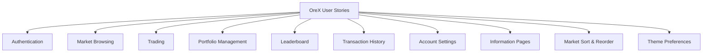
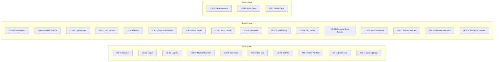

# User Stories — OreX

## 1. Overview

This document defines the user stories for OreX, a Minecraft-themed stock market simulation. Stories are grouped by feature area and prioritised using MoSCoW (Must Have, Should Have, Could Have). Each story follows the format:

> **As a** [role], **I want to** [action], **so that** [benefit].

Acceptance criteria are provided for each story to clarify completion conditions.

---

## 2. Epics

---

## 3. Authentication

### US-01: Register an Account

**Priority:** Must Have

**As a** new visitor, **I want to** create an account with a username and password, **so that** I can save my progress and compete on the leaderboard.

**Acceptance Criteria:**

- The registration form accepts a username (3–20 alphanumeric/underscore characters) and a password (minimum 8 characters, including at least one uppercase letter, one lowercase letter, one number, and one symbol).
- A confirmation password field must match the password.
- If the username is already taken, a clear error message is displayed.
- Upon successful registration, the user is automatically logged in and redirected to the dashboard.
- The user receives a starting balance of $10,000.

---

### US-02: Log In

**Priority:** Must Have

**As a** registered user, **I want to** log in with my credentials, **so that** I can access my portfolio and trade ores.

**Acceptance Criteria:**

- The login form accepts a username and password.
- If credentials are invalid, a generic error message is shown (does not reveal which field is incorrect).
- After 5 failed attempts within 15 minutes from the same IP, further attempts are blocked with an appropriate message.
- On success, the user is redirected to the dashboard or the page they were previously trying to access.

---

### US-03: Log Out

**Priority:** Must Have

**As a** logged-in user, **I want to** log out, **so that** my session is ended and my account is protected on shared devices.

**Acceptance Criteria:**

- Clicking "Log Out" ends the session immediately.
- The user is redirected to the landing page with a confirmation flash message.
- Protected pages are no longer accessible without logging in again.

---

## 4. Market Browsing

### US-04: View Market Overview

**Priority:** Must Have

**As a** logged-in user, **I want to** see all available ores and their current prices at a glance, **so that** I can identify trading opportunities.

**Acceptance Criteria:**

- The market page displays a card grid of all nine ores.
- Each card shows the ore name, icon, current price, and last movement direction (rise/hold/fall).
- The page refreshes prices automatically via HTMX without a full page reload.

---

### US-05: View Ore Detail

**Priority:** Must Have

**As a** logged-in user, **I want to** view detailed information about a specific ore, **so that** I can make informed trading decisions.

**Acceptance Criteria:**

- Clicking an ore card navigates to its detail page.
- The detail page shows: current price, base price, volatility rating, and a price history chart.
- The chart supports multiple time ranges (5 min, 15 min, 1 hour, 1 day, 7 days, max).
- Buy and sell forms are accessible from this page.

---

### US-06: View Live Price Updates

**Priority:** Should Have

**As a** logged-in user, **I want to** see prices update in real time without refreshing the page, **so that** I can react quickly to market changes.

**Acceptance Criteria:**

- The market overview, ore detail stats, dashboard, and portfolio pages poll for updates using HTMX.
- Updated prices and movement indicators appear without disrupting the user's current scroll position or form state.

---

## 5. Trading

### US-07: Buy Ore

**Priority:** Must Have

**As a** logged-in user, **I want to** purchase a quantity of ore at the current market price, **so that** I can add it to my portfolio.

**Acceptance Criteria:**

- The user enters a positive whole number quantity on the ore detail page.
- A confirmation page displays the ore name, quantity, unit price, total cost, and balance after trade.
- If the user's balance is insufficient, an error message is displayed and the trade is not executed.
- On confirmation, the balance is deducted, the holding is created or updated (with weighted average price), and a transaction record is saved.
- The trade is atomic — if any step fails, no data is changed.

---

### US-08: Sell Ore

**Priority:** Must Have

**As a** logged-in user, **I want to** sell a quantity of ore I hold at the current market price, **so that** I can realise profit or cut losses.

**Acceptance Criteria:**

- The user enters a positive whole number quantity on the ore detail page.
- A confirmation page displays the ore name, quantity, unit price, total proceeds, and balance after trade.
- If the user does not hold enough of the ore, an error message is displayed.
- On confirmation, the balance is credited, the holding is reduced or removed, and a transaction record is saved.
- The trade is atomic.

---

### US-09: Trade Influences Market

**Priority:** Should Have

**As a** player, **I want** my trades to have a small effect on ore prices, **so that** the market feels responsive and interactive.

**Acceptance Criteria:**

- When a player executes a buy, the ore's rise probability is slightly increased on the next tick.
- When a player executes a sell, the ore's fall probability is slightly increased on the next tick.
- The influence is proportional to the quantity traded.
- Influence is consumed after one tick and does not accumulate indefinitely.

---

## 6. Portfolio Management

### US-10: View Portfolio

**Priority:** Must Have

**As a** logged-in user, **I want to** see all my current holdings with profit/loss calculations, **so that** I can assess my investment performance.

**Acceptance Criteria:**

- The portfolio page lists each held ore with: quantity, average purchase price, current price, invested amount, current value, and profit/loss (dollar and percentage).
- Totals are shown for invested amount, current value, total profit/loss, and overall portfolio value (cash + holdings).
- Holdings with a loss are visually distinguished from those in profit.

---

### US-11: View Dashboard Summary

**Priority:** Must Have

**As a** logged-in user, **I want to** see an at-a-glance summary when I log in, **so that** I can quickly understand my portfolio status and market activity.

**Acceptance Criteria:**

- The dashboard displays: cash balance, portfolio market value, total value, and overall profit/loss.
- Top 5 market movers (largest absolute change from base) are shown.
- The 5 most recent transactions are listed.
- Data refreshes automatically via HTMX.

---

## 7. Leaderboard

### US-12: View Leaderboard

**Priority:** Should Have

**As a** logged-in user, **I want to** see a ranked list of all players by total portfolio value, **so that** I can compare my performance against others.

**Acceptance Criteria:**

- The leaderboard ranks all users (humans and bots) by total value (cash balance + holdings market value).
- Each row shows: rank, username, cash balance, holdings value, and total value.
- The current user's row is visually highlighted.
- The leaderboard updates automatically via HTMX.

---

### US-13: Compete Against Bots

**Priority:** Should Have

**As a** player, **I want to** compete against AI bot traders on the leaderboard, **so that** the market feels active even with few human players.

**Acceptance Criteria:**

- Nine bot accounts exist with distinct usernames (e.g. SteveBot, AlexBot).
- Bots execute buy/sell/hold decisions each tick based on price vs base price.
- Bot trades follow the same rules as human trades (balance checks, holdings, transactions).
- Bots appear on the leaderboard ranked alongside human players.

---

## 8. Transaction History

### US-14: View Transaction History

**Priority:** Should Have

**As a** logged-in user, **I want to** review my past trades in a paginated list, **so that** I can analyse my trading patterns.

**Acceptance Criteria:**

- The history page shows all transactions (most recent first) with: date, ore name, type (buy/sell), quantity, price at trade, and total value.
- Results are paginated at 20 per page with next/previous navigation.
- Archived transactions (from account resets) are hidden by default but can be shown with a toggle.

---

## 9. Account Settings

### US-15: Change Password

**Priority:** Should Have

**As a** logged-in user, **I want to** change my password, **so that** I can maintain account security.

**Acceptance Criteria:**

- The user must enter their current password for verification.
- The new password must meet the minimum length requirement (8 characters).
- A confirmation field must match the new password.
- On success, a confirmation message is shown and the user remains logged in.

---

### US-16: Reset Account

**Priority:** Could Have

**As a** logged-in user, **I want to** reset my account to its starting state, **so that** I can start fresh if I make poor trades.

**Acceptance Criteria:**

- The user must type their username as confirmation before the reset proceeds.
- On reset: balance is restored to $10,000, all holdings are deleted, and existing transactions are archived (not deleted).
- The user is redirected to the dashboard with a confirmation message.

---

## 10. Information Pages

### US-17: View Landing Page

**Priority:** Must Have

**As a** new visitor, **I want to** understand what OreX is and how to get started, **so that** I can decide whether to register.

**Acceptance Criteria:**

- The landing page explains the concept of OreX in plain language.
- Clear calls to action for "Register" and "Log In" are visible.
- If the user is already authenticated, they are redirected to the dashboard.

---

### US-18: View About Page

**Priority:** Could Have

**As a** user, **I want to** read about how OreX works, **so that** I understand the market mechanics before trading.

**Acceptance Criteria:**

- The about page explains the tick system, how prices move, the role of bots, and the influence of player trades.
- The page is accessible without authentication.

---

### US-19: View Help Page

**Priority:** Could Have

**As a** user, **I want to** find answers to common questions, **so that** I can resolve issues without external support.

**Acceptance Criteria:**

- The help page provides FAQ-style answers covering registration, trading, portfolio, leaderboard, and account reset.
- The page is accessible without authentication.

---

## 11. Error Handling

### US-20: Friendly Error Pages

**Priority:** Should Have

**As a** user, **I want to** see a helpful message when something goes wrong, **so that** I know the error is not my fault and can navigate back to the application.

**Acceptance Criteria:**

- A custom 404 page is shown when a URL is not found, with a link back to the dashboard or landing page.
- A custom 500 page is shown for unexpected server errors, advising the user to try again.

---

## 12. Market Sort & Reorder

### US-21: Sort Control Display

**Priority:** Should Have

**As a** trader, **I want to** have a sort control on the market page, **so that** I can quickly change how ore cards are ordered.

**Acceptance Criteria:**

- The market page displays a sort control icon-button in the top-right area of the page header.
- When the user activates the sort control, a list of sort options is revealed: Default, Rising, Falling, and Custom.
- The sort control visually indicates which sort order is currently active.

---

### US-22: Sort by Trend — Rising

**Priority:** Should Have

**As a** trader, **I want to** sort ores by rising trend first, **so that** I can quickly spot profitable opportunities.

**Acceptance Criteria:**

- When the user selects the Rising sort option, ore cards are reordered so that ores with a "rise" trend appear first, ores with a "hold" trend appear second, and ores with a "fall" trend appear last.
- When the Rising sort is active and the ore grid refreshes via HTMX polling, the Rising sort order is re-applied to the updated data.

---

### US-23: Sort by Trend — Falling

**Priority:** Should Have

**As a** trader, **I want to** sort ores by falling trend first, **so that** I can find bargain buying opportunities.

**Acceptance Criteria:**

- When the user selects the Falling sort option, ore cards are reordered so that ores with a "fall" trend appear first, ores with a "hold" trend appear second, and ores with a "rise" trend appear last.
- When the Falling sort is active and the ore grid refreshes via HTMX polling, the Falling sort order is re-applied to the updated data.

---

### US-24: Sort by Default

**Priority:** Should Have

**As a** trader, **I want to** reset the sort to the server-defined order, **so that** I can return to the standard view.

**Acceptance Criteria:**

- When the user selects the Default sort option, ore cards are displayed in the order returned by the server.
- When Default sort is active and the ore grid refreshes via HTMX polling, the server-returned order is preserved without client-side reordering.

---

### US-25: Custom Drag-and-Drop Reorder

**Priority:** Should Have

**As a** trader, **I want to** drag and drop ore cards to create my own custom order, **so that** I can prioritise the ores I care about most.

**Acceptance Criteria:**

- The user can click and drag an ore card to a new position within the ore grid.
- When the user drags an ore card over a target position, the dragged card is inserted at that position and the remaining cards shift to fill the vacated slot (insertion reorder, not swap).
- When the user completes a drag-and-drop reorder, the sort control automatically switches the sort order to Custom.
- When Custom sort is active and the ore grid refreshes via HTMX polling, the custom order is re-applied to the updated data.
- A visual tip reading "Tip: Click and drag cards to reorder" is displayed near the ore grid.

---

### US-26: Sort Preference Persistence

**Priority:** Should Have

**As a** trader, **I want** my sort preference to persist between sessions, **so that** I do not need to re-select it every time I visit the market.

**Acceptance Criteria:**

- When the user changes the sort order, the selected sort order is saved to localStorage.
- When the user has a custom order, the custom ore-card sequence is saved to localStorage.
- When the market page loads and a saved sort order exists in localStorage, the saved sort order is applied on initial render.

---

## 13. Theme Preferences

### US-27: Theme Switcher Display

**Priority:** Should Have

**As a** user, **I want** a theme toggle on the settings page, **so that** I can choose between dark, light, or system colour modes.

**Acceptance Criteria:**

- The settings page displays a theme switcher control within a dedicated "Appearance" section.
- The theme switcher presents three options: Light, Dark, and System.
- The theme switcher visually indicates which theme mode is currently active.

---

### US-28: Theme Application

**Priority:** Should Have

**As a** user, **I want** the selected theme to apply globally and immediately, **so that** I see the colour change without reloading.

**Acceptance Criteria:**

- When the user selects the Light theme, the light colour palette is applied via CSS custom properties on the document root.
- When the user selects the Dark theme, the dark colour palette is applied via CSS custom properties on the document root.
- When the user selects the System theme, the colour palette matching the operating system's preferred colour scheme is applied.
- When the theme mode is System and the operating system preference changes, the active colour palette updates to match the new system preference.

---

### US-29: Theme Preference Persistence

**Priority:** Should Have

**As a** user, **I want** my theme choice to persist between sessions, **so that** the application always loads with my preferred appearance.

**Acceptance Criteria:**

- When the user changes the theme mode, the selected theme mode is saved to localStorage.
- When the application loads and a saved theme mode exists in localStorage, the saved theme mode is applied before first paint to prevent a flash of unstyled content.

---

## 14. User Story Map

---

## 15. Traceability Matrix

| User Story | Functional Requirement(s) |
|-----------|--------------------------|
| US-01 | FR-01, FR-03 |
| US-02 | FR-02 |
| US-03 | FR-02 |
| US-04 | FR-04 |
| US-05 | FR-05 |
| US-06 | FR-04, FR-05 |
| US-07 | FR-06 |
| US-08 | FR-07 |
| US-09 | FR-15 |
| US-10 | FR-10 |
| US-11 | FR-04, FR-10 |
| US-12 | FR-11 |
| US-13 | FR-09 |
| US-14 | FR-12 |
| US-15 | FR-13 |
| US-16 | FR-14 |
| US-17 | — |
| US-18 | — |
| US-19 | — |
| US-20 | — |
| US-21 | FR-04 |
| US-22 | FR-04 |
| US-23 | FR-04 |
| US-24 | FR-04 |
| US-25 | FR-04 |
| US-26 | FR-04 |
| US-27 | FR-13 |
| US-28 | FR-13 |
| US-29 | FR-13 |
