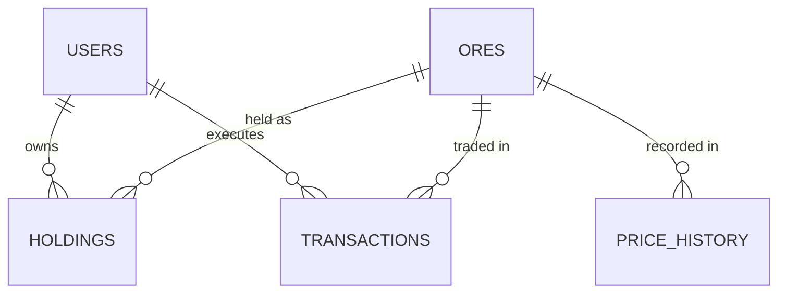
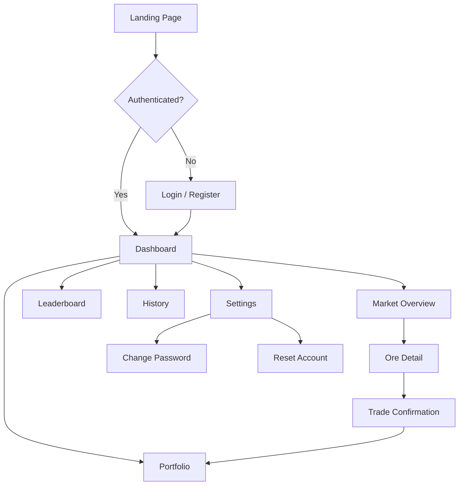
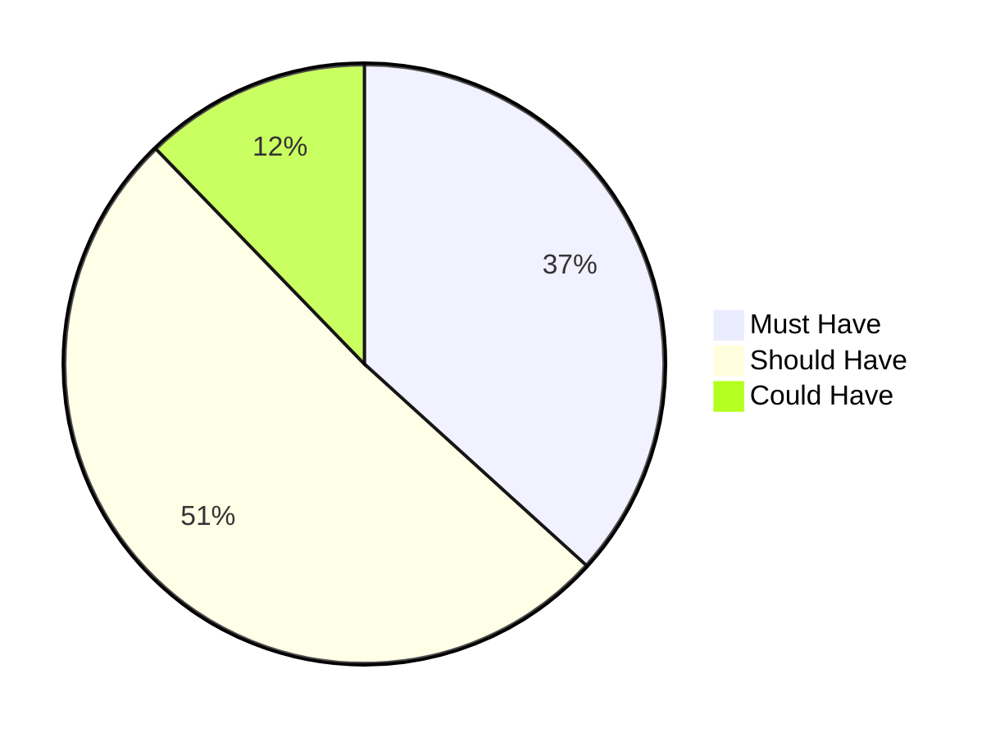

# Requirements Summary — OreX

## 1. Document Purpose

This document consolidates all functional, non-functional, and technical requirements for OreX — a Minecraft-themed stock market simulation. It serves as the authoritative reference for what the system must do, how it must behave, and the constraints under which it operates.

---

## 2. Scope

OreX is a web-based application that allows users to trade fictional ores in a simulated market. The scope includes:

- User registration and authentication
- A real-time market engine with algorithmic price fluctuation
- Buy/sell trading with confirmation workflows
- Portfolio, leaderboard, and transaction history views
- AI bot traders that participate alongside human users
- Account management (password change, account reset)

Out of scope:

- Real monetary transactions or payment integration
- Multi-server / distributed deployment
- Mobile native applications
- External API integrations or third-party data feeds
- Advanced portfolio management tools (e.g. stop losses)

---

## 3. Functional Requirements

### 3.1 Authentication and Accounts

| ID | Requirement | Priority | Status |
|----|-------------|----------|--------|
| FR-01 | Users can register with a unique username (3–20 alphanumeric/underscore characters) and a password (minimum 8 characters, including uppercase, lowercase, number, and symbol) | Must Have | Implemented |
| FR-02 | Users can log in and log out; sessions persist via secure cookies | Must Have | Implemented |
| FR-03 | New users receive a default virtual balance of $10,000 | Must Have | Implemented |
| FR-04 | Login is rate-limited to 5 attempts per 15-minute window per IP address | Must Have | Implemented |
| FR-05 | Users can change their password (requires current password verification and password complexity rules) | Should Have | Implemented |
| FR-06 | Users can reset their account (restore balance, clear holdings, archive transactions) with username confirmation | Could Have | Implemented |

### 3.2 Market and Pricing

| ID | Requirement | Priority | Status |
|----|-------------|----------|--------|
| FR-07 | The system provides nine tradeable ores: Coal, Iron, Copper, Gold, Lapis Lazuli, Redstone, Emerald, Diamond, Netherite | Must Have | Implemented |
| FR-08 | Ore prices update every 20 seconds via a background market engine | Must Have | Implemented |
| FR-09 | Each ore has configurable attributes: base price, floor, ceiling, volatility, change range, and base probabilities | Must Have | Implemented |
| FR-10 | The pricing algorithm applies trend effect, gravity effect, volatility scaling, and weighted random decision each tick | Must Have | Implemented |
| FR-11 | Rare market events (0.5% chance per ore per tick) apply a 3× multiplier to price changes | Could Have | Implemented |
| FR-12 | Price history is recorded each tick for charting purposes | Must Have | Implemented |

### 3.3 Bot Traders

| ID | Requirement | Priority | Status |
|----|-------------|----------|--------|
| FR-13 | Nine AI bot accounts are created automatically on engine start | Should Have | Implemented |
| FR-14 | Bots execute buy/sell/hold decisions each tick based on price relative to base price | Should Have | Implemented |
| FR-15 | Bot trades follow the same rules as human trades (balance checks, holdings, transactions) | Should Have | Implemented |
| FR-16 | Bot trading volume influences ore price probabilities on the same tick | Should Have | Implemented |

### 3.4 Trading

| ID | Requirement | Priority | Status |
|----|-------------|----------|--------|
| FR-17 | Users can buy ore by specifying a positive integer quantity | Must Have | Implemented |
| FR-18 | Users can sell ore they hold by specifying a positive integer quantity | Must Have | Implemented |
| FR-19 | All trades display a confirmation page before execution (showing ore, quantity, price, total, balance after) | Must Have | Implemented |
| FR-20 | Trades are atomic — if any database operation fails, the entire trade is rolled back | Must Have | Implemented |
| FR-21 | Insufficient balance prevents a buy; insufficient holdings prevents a sell | Must Have | Implemented |
| FR-22 | Player trades influence ore price probabilities on the next tick (proportional to quantity) | Should Have | Implemented |

### 3.5 Portfolio and Dashboard

| ID | Requirement | Priority | Status |
|----|-------------|----------|--------|
| FR-23 | The dashboard displays: cash balance, portfolio market value, total value, profit/loss, top 5 movers, and 5 recent transactions | Must Have | Implemented |
| FR-24 | The portfolio page lists all holdings with per-ore profit/loss (dollar and percentage) and totals | Must Have | Implemented |
| FR-25 | Portfolio value is calculated as the sum of (quantity × current market price) for all holdings | Must Have | Implemented |

### 3.6 Leaderboard

| ID | Requirement | Priority | Status |
|----|-------------|----------|--------|
| FR-26 | A leaderboard ranks all users (human and bot) by total value (cash + holdings market value) | Should Have | Implemented |
| FR-27 | The current user's row is visually highlighted on the leaderboard | Should Have | Implemented |

### 3.7 Transaction History

| ID | Requirement | Priority | Status |
|----|-------------|----------|--------|
| FR-28 | Users can view a paginated list of their transactions (20 per page, most recent first) | Should Have | Implemented |
| FR-29 | Archived transactions (from account resets) are hidden by default but viewable via toggle | Should Have | Implemented |

### 3.8 User Interface

| ID | Requirement | Priority | Status |
|----|-------------|----------|--------|
| FR-30 | The market overview displays all ores in a card grid with price and trend indicator | Must Have | Implemented |
| FR-31 | The ore detail page shows a price history chart with selectable time ranges (5m, 15m, 30m, 1h, 6h, 12h, 1d, 3d, 5d, max) | Must Have | Implemented |
| FR-32 | Pages update dynamically via HTMX partial responses (dashboard, market, portfolio, leaderboard) | Should Have | Implemented |
| FR-33 | Custom error pages are shown for 404 and 500 responses | Should Have | Implemented |
| FR-34 | Users can permanently delete their account (requires username confirmation); all holdings and transactions are removed | Could Have | Implemented |
| FR-35 | Landing, About, and Help pages are accessible without authentication | Could Have | Implemented |
| FR-36 | The market page displays a sort control icon-button in the page header that reveals a dropdown with four sort options: Default, Rising, Falling, and Custom | Should Have | Implemented |
| FR-37 | The sort control visually indicates which sort mode is currently active | Should Have | Implemented |
| FR-38 | Selecting Rising sort reorders ore cards so rise-trend ores appear first, hold second, and fall last; the order re-applies after HTMX refresh | Should Have | Implemented |
| FR-39 | Selecting Falling sort reorders ore cards so fall-trend ores appear first, hold second, and rise last; the order re-applies after HTMX refresh | Should Have | Implemented |
| FR-40 | Selecting Default sort preserves the server-defined card order without client-side reordering | Should Have | Implemented |
| FR-41 | Users can drag and drop ore cards to reorder them using insertion reorder (not swap); completing a drag automatically switches the sort mode to Custom | Should Have | Implemented |
| FR-42 | Custom sort order re-applies after HTMX refresh to maintain the user-defined arrangement | Should Have | Implemented |
| FR-43 | The selected sort mode and custom order are saved to localStorage and restored on page load | Should Have | Implemented |
| FR-44 | The settings page displays a Theme Switcher in a dedicated "Appearance" section with three options: Light, Dark, and System | Should Have | Implemented |
| FR-45 | Selecting a theme immediately applies the corresponding colour palette via CSS custom properties on the document root | Should Have | Implemented |
| FR-46 | The System theme option follows the operating system's preferred colour scheme and updates live when the OS preference changes | Should Have | Implemented |
| FR-47 | The selected theme is saved to localStorage and applied before first paint on page load to prevent flash of unstyled content (FOUC) | Should Have | Implemented |

---

## 4. Non-Functional Requirements

### 4.1 Performance

| ID | Requirement | Target |
|----|-------------|--------|
| NFR-01 | Page load time (local deployment) | < 2 seconds |
| NFR-02 | Market tick processing time (all 9 ores + bot trades) | < 5 seconds |
| NFR-03 | Concurrent user capacity (classroom scenario) | ~30 users |
| NFR-04 | Price history chart data downsampled to max 100 points | Responsive rendering |

### 4.2 Security

| ID | Requirement | Implementation |
|----|-------------|----------------|
| NFR-05 | Passwords hashed with Werkzeug PBKDF2 (never stored in plaintext) | `generate_password_hash` / `check_password_hash` |
| NFR-06 | CSRF protection on all POST form submissions | Flask-WTF `CSRFProtect` |
| NFR-07 | Parameterised SQL queries throughout (no string interpolation) | All `db.execute()` calls use `?` placeholders |
| NFR-08 | Rate limiting on login endpoint | In-memory IP tracking (5 per 15 min) |
| NFR-09 | Bot accounts cannot be logged into by users | Password hash set to `BOT_NO_LOGIN` |
| NFR-10 | Session management via Flask-Login secure cookies | `login_user` / `logout_user` |

### 4.3 Reliability

| ID | Requirement | Implementation |
|----|-------------|----------------|
| NFR-11 | Database uses WAL mode for concurrent read/write safety | `PRAGMA journal_mode=WAL` |
| NFR-12 | Foreign key constraints enforced | `PRAGMA foreign_keys=ON` |
| NFR-13 | Market engine errors do not crash the application | Exception handling with rollback in tick loop |
| NFR-14 | Trade operations are atomic (all-or-nothing) | `try/except` with `db.rollback()` on failure |

### 4.4 Maintainability

| ID | Requirement | Implementation |
|----|-------------|----------------|
| NFR-15 | Application uses Flask app factory pattern | `create_app()` in `__init__.py` |
| NFR-16 | Routes separated into feature-based blueprints | 9 blueprints in `routes/` |
| NFR-17 | Data access centralised in `models.py` | All SQL queries in one module |
| NFR-18 | Market logic separated into dedicated modules | `market/` package (algorithm, bots, events, influence) |
| NFR-19 | Input validation extracted into reusable utilities | `utils/validation.py` |

### 4.5 Portability and Deployment

| ID | Requirement | Implementation |
|----|-------------|----------------|
| NFR-20 | No external database server required | SQLite3 (built-in to Python) |
| NFR-21 | No cloud services or Docker required to run | `python run.py` starts the application |
| NFR-22 | Database auto-created and seeded on first run | `init_db()` in `database.py` |
| NFR-23 | Python 3.9+ compatibility | Standard library + Flask ecosystem packages |

---

## 5. Technical Constraints

| Constraint | Detail |
|-----------|--------|
| Language | Python 3.9 or later |
| Framework | Flask 3.1 |
| Database | SQLite3 (file-based, single-server only) |
| Concurrency | Single background thread for market engine; no multi-process support |
| Deployment | Local machine or single-server; no load balancing |
| Browser Support | Modern browsers (Chrome, Firefox, Edge, Safari — latest two versions) |

---

## 6. Data Requirements

### 6.1 Entities and Relationships

### 6.2 Data Dictionary

#### Users

| Field | Type | Constraints | Description |
|-------|------|-------------|-------------|
| id | INTEGER | PK, auto-increment | Unique user identifier |
| username | TEXT | NOT NULL, UNIQUE | Display name (3–20 chars, alphanumeric + underscore) |
| password_hash | TEXT | NOT NULL | Werkzeug PBKDF2 hash |
| balance | REAL | NOT NULL, default 10000 | Current cash balance |
| created_at | TEXT | NOT NULL | ISO 8601 timestamp of registration |
| last_login | TEXT | nullable | ISO 8601 timestamp of most recent login |

#### Ores

| Field | Type | Constraints | Description |
|-------|------|-------------|-------------|
| id | INTEGER | PK, auto-increment | Unique ore identifier |
| name | TEXT | NOT NULL, UNIQUE | Ore display name |
| description | TEXT | nullable | Flavour text |
| icon_filename | TEXT | nullable | Image filename for the ore icon |
| current_price | REAL | NOT NULL | Live market price |
| base_price | REAL | NOT NULL | Reference/anchor price for gravity effect |
| price_floor | REAL | NOT NULL | Minimum price boundary |
| price_ceiling | REAL | NOT NULL | Maximum price boundary |
| volatility | REAL | NOT NULL | Scaling factor for price movement magnitude |
| price_change_range | TEXT | NOT NULL | JSON array [min%, max%] for tick change calculation |
| base_probabilities | TEXT | NOT NULL | JSON array [rise%, hold%, fall%] |
| trend_log | TEXT | NOT NULL | JSON array of last 5 movements |

#### Holdings

| Field | Type | Constraints | Description |
|-------|------|-------------|-------------|
| id | INTEGER | PK, auto-increment | Unique holding identifier |
| user_id | INTEGER | FK → users.id, NOT NULL | Owning user |
| ore_id | INTEGER | FK → ores.id, NOT NULL | Held ore |
| quantity | INTEGER | NOT NULL | Number of units held |
| avg_purchase_price | REAL | NOT NULL | Weighted average cost per unit |

#### Transactions

| Field | Type | Constraints | Description |
|-------|------|-------------|-------------|
| id | INTEGER | PK, auto-increment | Unique transaction identifier |
| user_id | INTEGER | FK → users.id, NOT NULL | Trading user |
| ore_id | INTEGER | FK → ores.id, NOT NULL | Traded ore |
| type | TEXT | NOT NULL | "buy" or "sell" |
| quantity | INTEGER | NOT NULL | Units traded |
| price_at_trade | REAL | NOT NULL | Unit price at time of trade |
| total_value | REAL | NOT NULL | quantity × price_at_trade |
| archived | INTEGER | NOT NULL, default 0 | 1 if archived by account reset |
| created_at | TEXT | NOT NULL | ISO 8601 timestamp |

#### Price History

| Field | Type | Constraints | Description |
|-------|------|-------------|-------------|
| id | INTEGER | PK, auto-increment | Unique record identifier |
| ore_id | INTEGER | FK → ores.id, NOT NULL | Associated ore |
| price | REAL | NOT NULL | Recorded price at this tick |
| movement | TEXT | NOT NULL | "rise", "hold", or "fall" |
| created_at | TEXT | NOT NULL | ISO 8601 timestamp |

---

## 7. Interface Requirements

### 7.1 User Interface Flow

### 7.2 API Endpoints (Internal)

| Method | Endpoint | Description | Auth Required |
|--------|----------|-------------|---------------|
| GET | `/` | Landing page (redirects if authenticated) | No |
| GET | `/about` | About page | No |
| GET | `/help` | Help page | No |
| GET/POST | `/register` | User registration | No |
| GET/POST | `/login` | User login | No |
| GET | `/logout` | User logout | Yes |
| GET | `/dashboard` | Dashboard (supports HTMX partial) | Yes |
| GET | `/market` | Market overview (supports HTMX partial) | Yes |
| GET | `/market/<ore_id>` | Ore detail page (supports HTMX partial) | Yes |
| GET | `/market/<ore_id>/history` | Price history JSON (query: `range`) | Yes |
| POST | `/trade/buy/<ore_id>` | Buy ore (confirmation + execution) | Yes |
| POST | `/trade/sell/<ore_id>` | Sell ore (confirmation + execution) | Yes |
| GET | `/portfolio` | Portfolio view (supports HTMX partial) | Yes |
| GET | `/leaderboard` | Leaderboard (supports HTMX partial) | Yes |
| GET | `/history` | Transaction history (query: `page`, `archived`) | Yes |
| GET | `/settings` | Account settings page | Yes |
| POST | `/settings/password` | Change password | Yes |
| GET/POST | `/settings/reset` | Account reset confirmation + execution | Yes |
| GET/POST | `/settings/delete` | Account deletion confirmation + execution | Yes |

---

## 8. Assumptions and Dependencies

### 8.1 Assumptions

- Users have access to a modern web browser with JavaScript enabled.
- The application runs on a single machine with Python 3.9+ installed.
- A classroom deployment will not exceed approximately 30 concurrent users.
- The SQLite database file remains on local storage (not network-mounted).
- The 20-second tick interval provides adequate market dynamism for educational purposes.

### 8.2 Dependencies

| Dependency | Version | Purpose |
|-----------|---------|---------|
| Flask | 3.1+ | Web framework |
| Flask-Login | 0.6+ | Session and authentication management |
| Flask-WTF | 1.3+ | CSRF protection |
| Werkzeug | 3.1+ | Password hashing, HTTP utilities |
| Jinja2 | 3.1+ (bundled with Flask) | HTML templating |
| SQLite3 | Built-in | Database engine |
| HTMX | 1.9.12 (client-side CDN) | Partial page updates |
| ApexCharts | Latest (client-side CDN) | Price history line charts |
| Hypothesis | 6.x | Property-based testing |
| pytest | 9.x | Test framework |

---

## 9. Requirement Priority Summary

| Priority | Count | Coverage |
|----------|-------|----------|
| Must Have | 18 | Core trading loop, authentication, market engine, portfolio, dashboard |
| Should Have | 25 | Bots, leaderboard, history, live updates, trade influence, error pages, market sort/reorder, theme switcher |
| Could Have | 6 | Account reset, account deletion, market events, about/help pages |

---

## 10. Acceptance Testing Overview

| Test Area | Key Verification |
|-----------|-----------------|
| Registration | Valid/invalid usernames, duplicate detection, password validation, auto-login |
| Login | Correct credentials, incorrect credentials, rate limiting triggers |
| Market Engine | Prices change every 20 seconds, stay within floor/ceiling, trend log updates |
| Trading | Balance deducted on buy, credited on sell, atomic rollback on failure |
| Portfolio | Values match current market prices, profit/loss calculations correct |
| Leaderboard | Rankings reflect real-time total value, bots included |
| Security | CSRF tokens required, parameterised queries, hashed passwords |
| Market Sort/Reorder | Sort modes reorder cards correctly, custom drag-and-drop works, preference persists via localStorage, sort re-applies after HTMX refresh |
| Theme Switcher | Light/Dark/System themes apply immediately, System follows OS preference, preference persists and applies before first paint |
