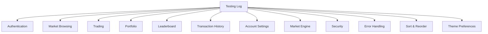

# Testing Log — OreX

## 1. Document Purpose

This document records the test cases, execution results, and defect tracking for OreX. It serves as evidence of systematic testing across all functional areas of the application. Each test case references the relevant functional requirement (FR) and user story (US) for traceability.

Functional requirements (FR-xx) are defined in `deliverables/documentation/Requirements_Summary.md`. User stories (US-xx) are defined in `deliverables/documentation/User_Stories.md`.

---

## 2. Test Environment

| Component | Detail |
|-----------|--------|
| Operating System | Windows 10/11 |
| Python Version | 3.9+ |
| Test Framework | pytest 8.x with Flask test client (no live server) |
| Property Testing | Hypothesis (100 examples per property) |
| Database | Isolated temporary SQLite3 file (created/destroyed per session) |
| Server | Flask test client — no running server required |
| Test Data | Seed data (9 ores) auto-loaded via `schema.sql` + `seed.sql` per test |
| Automation | All 76 manual test cases automated in `tests/` directory |

---

## 3. Test Categories

---

## 4. Test Results Summary

| Category | Total Tests | Passed | Failed | Not Tested |
|----------|-------------|--------|--------|------------|
| Authentication | 10 | 10 | 0 | 0 |
| Market Browsing | 6 | 6 | 0 | 0 |
| Trading | 11 | 11 | 0 | 0 |
| Portfolio | 5 | 5 | 0 | 0 |
| Leaderboard | 3 | 3 | 0 | 0 |
| Transaction History | 4 | 4 | 0 | 0 |
| Account Settings | 8 | 8 | 0 | 0 |
| Market Engine | 7 | 7 | 0 | 0 |
| Security | 6 | 6 | 0 | 0 |
| Error Handling | 4 | 4 | 0 | 0 |
| Sort & Reorder | 11 | 11 | 0 | 0 |
| Theme Preferences | 7 | 7 | 0 | 0 |
| **Total (example-based)** | **82** | **82** | **0** | **0** |
| Property-Based Tests | 10 | 10 | 0 | 0 |
| **Grand Total** | **92** | **92** | **0** | **0** |

> **Automated test suite**: Run via `python -m pytest tests/ -v` from project root. All 92 tests pass with exit code 0. Selective execution via `pytest -m <category>` (e.g., `pytest -m authentication`).

---

## 5. Test Cases

### 5.1 Authentication

| Test ID | Description | Requirement | Pre-conditions | Steps | Expected Result | Actual Result | Status |
|---------|-------------|-------------|----------------|-------|-----------------|---------------|--------|
| TC-01 | Register with valid credentials | FR-01, US-01 | No existing account with username "TestUser1" | 1. Navigate to `/register` 2. Enter username "TestUser1" 3. Enter password "Password123!" 4. Enter confirm password "Password123!" 5. Click Register | Account created, user redirected to dashboard with success message, balance is $10,000 | Response status 302 redirecting to `/dashboard`; DB row confirms username "TestUser1" with balance 10000.00 | ✅ Pass |
| TC-02 | Register with duplicate username | FR-01, US-01 | Account "TestUser1" already exists | 1. Navigate to `/register` 2. Enter username "TestUser1" 3. Enter valid password and confirmation 4. Click Register | Error message "That username is already taken." displayed, user remains on register page | Status 200; response body contains "That username is already taken." | ✅ Pass |
| TC-03 | Register with short username | FR-01, US-01 | None | 1. Navigate to `/register` 2. Enter username "AB" 3. Enter valid password and confirmation 4. Click Register | Error message "Username must be at least 3 characters." displayed | Status 200; response body contains "Username must be at least 3 characters." | ✅ Pass |
| TC-04 | Register with invalid characters in username | FR-01, US-01 | None | 1. Navigate to `/register` 2. Enter username "Test User!" 3. Enter valid password and confirmation 4. Click Register | Error message about valid characters displayed | Status 200; response body contains "Username can only contain letters, numbers, and underscores." | ✅ Pass |
| TC-05 | Register with short password | FR-01, US-01 | None | 1. Navigate to `/register` 2. Enter valid username 3. Enter password "short" 4. Enter matching confirmation 5. Click Register | Error message "Password must be at least 8 characters." displayed | Status 200; response body contains "Password must be at least 8 characters." | ✅ Pass |
| TC-06 | Register with mismatched passwords | FR-01, US-01 | None | 1. Navigate to `/register` 2. Enter valid username 3. Enter password "Password123!" 4. Enter confirmation "Different456!" 5. Click Register | Error message "Passwords do not match." displayed | Status 200; response body contains "Passwords do not match." | ✅ Pass |
| TC-07 | Login with valid credentials | FR-02, US-02 | Account "TestUser1" exists with known password | 1. Navigate to `/login` 2. Enter username "TestUser1" 3. Enter correct password 4. Click Login | User redirected to dashboard with welcome message | Status 302 redirect to `/dashboard`; subsequent GET to `/dashboard` returns 200 | ✅ Pass |
| TC-08 | Login with incorrect password | FR-02, US-02 | Account "TestUser1" exists | 1. Navigate to `/login` 2. Enter username "TestUser1" 3. Enter wrong password 4. Click Login | Error message "Invalid username or password." displayed | Status 200; response body contains "Invalid username or password." | ✅ Pass |
| TC-09 | Login rate limiting | FR-04, US-02 | Account exists | 1. Attempt login with wrong password 5 times within 15 minutes | After 5th attempt, message "Too many login attempts. Please try again later." displayed; further attempts blocked | 6th login attempt returns "Too many login attempts. Please try again later." regardless of correct credentials | ✅ Pass |
| TC-10 | Logout | FR-02, US-03 | User is logged in | 1. Click "Log Out" in navigation | Session ended, user redirected to landing page with confirmation message, protected pages inaccessible | GET `/logout` returns 302; subsequent GET `/dashboard` redirects to `/login` | ✅ Pass |

---

### 5.2 Market Browsing

| Test ID | Description | Requirement | Pre-conditions | Steps | Expected Result | Actual Result | Status |
|---------|-------------|-------------|----------------|-------|-----------------|---------------|--------|
| TC-11 | View market overview | FR-07, US-04 | User is logged in | 1. Navigate to `/market` | Card grid displays all 9 ores with name, icon, current price, and trend indicator | Status 200; response HTML contains all 9 ore names: Coal, Iron, Copper, Gold, Lapis Lazuli, Redstone, Emerald, Diamond, Netherite | ✅ Pass |
| TC-12 | View ore detail page | FR-09, US-05 | User is logged in | 1. Click on any ore card from market overview | Ore detail page shows current price, base price, volatility, price chart, and buy/sell forms | GET `/market/1` returns 200 with "Coal", "10.00" (current and base price) in response | ✅ Pass |
| TC-13 | Price chart time range selection | FR-31, US-05 | User is logged in, ore detail page open | 1. Select different time ranges (5m, 1h, 1d, max) from chart controls | Chart updates to show price history for the selected period | GET `/market/1/history?range=5m` and `?range=1h` both return 200 with JSON arrays containing `price` and `time` fields | ✅ Pass |
| TC-14 | Market overview HTMX refresh | FR-32, US-06 | User is logged in, market page open | 1. Wait for HTMX polling interval 2. Observe price cards | Prices update without full page reload; no scroll position change | GET `/market` with `HX-Request: true` header returns 200 with ore card HTML fragment (no `<!DOCTYPE>`, no `<html>` tag) | ✅ Pass |
| TC-15 | Ore detail HTMX refresh | FR-32, US-06 | User is logged in, ore detail page open | 1. Wait for HTMX polling interval | Stats section updates with latest price and movement without full reload | GET `/market/1` with `HX-Request: true` header returns 200 partial HTML with current price and movement indicator class | ✅ Pass |
| TC-16 | Access market without login | NFR-10 | User is not logged in | 1. Navigate directly to `/market` | User redirected to login page with message "Please log in to access this page." | Status 302 redirect to `/login`; following redirect shows "Please log in to access this page." | ✅ Pass |

---

### 5.3 Trading

| Test ID | Description | Requirement | Pre-conditions | Steps | Expected Result | Actual Result | Status |
|---------|-------------|-------------|----------------|-------|-----------------|---------------|--------|
| TC-17 | Buy ore — valid quantity | FR-17, US-07 | User logged in with sufficient balance | 1. Navigate to ore detail 2. Enter quantity "10" in buy form 3. Click Buy 4. Review confirmation page 5. Confirm trade | Confirmation shows correct total; on confirm: balance deducted, holding created/updated, transaction recorded, redirected to portfolio | Balance decreased from $10,000 to $9,900 (10 × $10); holdings row created with qty=10, avg_price=10.00; transaction row with type="buy", qty=10, price=10.00, total=100.00 | ✅ Pass |
| TC-18 | Buy ore — insufficient balance | FR-21, US-07 | User balance lower than total cost | 1. Enter quantity that exceeds affordable amount 2. Click Buy | Error message "Insufficient funds for this trade." displayed; no data changed | Response contains "Insufficient funds for this trade."; balance, holdings, and transaction count unchanged | ✅ Pass |
| TC-19 | Buy ore — invalid quantity (zero) | FR-17, US-07 | User logged in | 1. Enter quantity "0" in buy form 2. Click Buy | Error message "Quantity must be greater than zero." displayed | Response contains "Quantity must be greater than zero." | ✅ Pass |
| TC-20 | Buy ore — invalid quantity (text) | FR-17, US-07 | User logged in | 1. Enter quantity "abc" in buy form 2. Click Buy | Error message "Quantity must be a whole number." displayed | Response contains "Quantity must be a whole number." | ✅ Pass |
| TC-21 | Buy ore — empty quantity | FR-17, US-07 | User logged in | 1. Leave quantity field empty 2. Click Buy | Error message "Quantity is required." displayed | Response contains "Quantity is required." | ✅ Pass |
| TC-22 | Sell ore — valid quantity | FR-18, US-08 | User holds ore | 1. Navigate to ore detail 2. Enter quantity within held amount 3. Click Sell 4. Review confirmation 5. Confirm | Balance credited, holding reduced (or removed if all sold), transaction recorded | Balance increased by 3 × $10 = $30; holding qty decreased from 10 to 7; sell transaction recorded with type="sell", qty=3, price=10.00, total=30.00 | ✅ Pass |
| TC-23 | Sell ore — more than held | FR-21, US-08 | User holds 5 units of ore | 1. Enter quantity "10" (more than held) 2. Click Sell | Error message "You do not have enough of this ore to sell." displayed | Response contains "You do not have enough of this ore to sell."; balance and holdings unchanged | ✅ Pass |
| TC-24 | Sell ore — sell all holdings | FR-18, US-08 | User holds exactly 5 units | 1. Enter quantity "5" 2. Confirm sell | Holding row deleted entirely; balance credited; transaction recorded | Holdings row deleted from DB (query returns None); balance restored to pre-buy value; sell transaction recorded | ✅ Pass |
| TC-25 | Buy ore — weighted average price | FR-17, US-07 | User already holds ore at a known avg price | 1. Buy additional quantity at a different price | Holding quantity increases; avg_purchase_price recalculated as weighted average of old and new | After buying 5 at $10 then 5 at $20: qty=10, avg_purchase_price=15.00 matching formula (5×10 + 5×20) / 10 = 15.00 | ✅ Pass |
| TC-26 | Trade atomicity — simulated failure | FR-20, US-07 | User logged in | 1. Simulate a database error during trade (e.g. disconnect) | No partial changes: balance unchanged, holdings unchanged, no transaction recorded | Patched `get_db` commit to raise exception; response contains error message; balance, holdings, and transaction count all unchanged from pre-trade values | ✅ Pass |
| TC-26B | Buy ore — negative quantity | FR-17, US-07 | User logged in | 1. Enter quantity "-5" in buy form 2. Click Buy | Error message "Quantity must be greater than zero." displayed | Response contains "Quantity must be greater than zero." | ✅ Pass |

---

### 5.4 Portfolio

| Test ID | Description | Requirement | Pre-conditions | Steps | Expected Result | Actual Result | Status |
|---------|-------------|-------------|----------------|-------|-----------------|---------------|--------|
| TC-27 | View portfolio with holdings | FR-24, US-10 | User holds multiple ores | 1. Navigate to `/portfolio` | All holdings listed with quantity, avg price, current price, invested, current value, P/L ($), P/L (%) | Status 200; HTML contains ore name "Coal", qty "5", avg price "10.00", current price "15.00", P/L "$25.00", P/L "50.0%" | ✅ Pass |
| TC-28 | View portfolio with no holdings | FR-24, US-10 | User has no holdings (new or reset account) | 1. Navigate to `/portfolio` | Page loads without error; totals show $0 for holdings, full balance as cash | Status 200; HTML contains "0.00" for holdings value and "10000.00" for cash balance | ✅ Pass |
| TC-29 | Portfolio profit/loss calculation | FR-25, US-10 | User holds ore; market price differs from avg purchase price | 1. Navigate to `/portfolio` 2. Verify P/L values | P/L = (current_price − avg_purchase_price) × quantity; percentage = ((current/avg) − 1) × 100 | With 10 Coal bought at $10, price changed to $12.50: P/L = $25.00, P/L% = 25.0% — both verified in HTML | ✅ Pass |
| TC-30 | Portfolio HTMX refresh | FR-32, US-06 | User on portfolio page | 1. Wait for HTMX polling interval | Values update to reflect latest market prices without full reload | GET `/portfolio` with `HX-Request: true` returns 200 partial HTML with portfolio totals; no `<!DOCTYPE>` or `<html>` tag | ✅ Pass |
| TC-30B | Portfolio unauthenticated access | NFR-10 | User not logged in | 1. Navigate to `/portfolio` | Redirected to login page | Status 302 redirect to `/login` | ✅ Pass |

---

### 5.5 Leaderboard

| Test ID | Description | Requirement | Pre-conditions | Steps | Expected Result | Actual Result | Status |
|---------|-------------|-------------|----------------|-------|-----------------|---------------|--------|
| TC-31 | View leaderboard | FR-26, US-12 | Multiple users and bots exist | 1. Navigate to `/leaderboard` | All users ranked by total value (cash + holdings); bots included | Status 200; multiple users listed; total values extracted from `leaderboard-table__total` cells are in non-increasing order | ✅ Pass |
| TC-32 | Current user highlighted | FR-27, US-12 | User logged in | 1. Navigate to `/leaderboard` | Current user's row is visually distinct from others | Exactly 1 row has CSS class `leaderboard-table__row--current`; that row contains "TestUser1" | ✅ Pass |
| TC-33 | Leaderboard HTMX refresh | FR-32, US-12 | User on leaderboard page | 1. Wait for HTMX polling interval | Rankings update to reflect latest values without full reload | GET `/leaderboard` with `HX-Request: true` returns 200 with `<table>` and `<thead>` elements; no `<!DOCTYPE>` or `<html>` tag | ✅ Pass |

---

### 5.6 Transaction History

| Test ID | Description | Requirement | Pre-conditions | Steps | Expected Result | Actual Result | Status |
|---------|-------------|-------------|----------------|-------|-----------------|---------------|--------|
| TC-34 | View transaction history | FR-28, US-14 | User has completed trades | 1. Navigate to `/history` | Transactions listed most recent first with ore name, type, quantity, price, total, date | Status 200; 3 inserted transactions appear newest first (position of "Copper" < "Iron" < "Coal" in HTML); all fields visible | ✅ Pass |
| TC-35 | Pagination | FR-28, US-14 | User has more than 20 transactions | 1. Navigate to `/history` 2. Click next page | First page shows 20 items; subsequent pages show remaining; page navigation works | With 23 transactions: `/history?page=1` has exactly 20 trade-badge spans; `/history?page=2` has exactly 3 | ✅ Pass |
| TC-36 | View archived transactions | FR-29, US-14 | User has reset account previously | 1. Navigate to `/history?archived=1` | Archived transactions are visible alongside active ones | Without filter: 1 active transaction visible. With `?archived=1`: both active and archived (2 total) visible | ✅ Pass |
| TC-37 | Empty transaction history | FR-28, US-14 | New user with no trades | 1. Navigate to `/history` | Page loads without error; appropriate empty state displayed | Status 200; response contains "No transactions yet" and "Visit the market" | ✅ Pass |

---

### 5.7 Account Settings

| Test ID | Description | Requirement | Pre-conditions | Steps | Expected Result | Actual Result | Status |
|---------|-------------|-------------|----------------|-------|-----------------|---------------|--------|
| TC-38 | Change password — valid | FR-05, US-15 | User logged in with known password | 1. Navigate to `/settings` 2. Enter current password 3. Enter new password (8+ chars) 4. Confirm new password 5. Submit | Success message displayed; user can log out and log in with new password | Status 200 with "Password updated successfully."; login with new password succeeds (302 to dashboard); login with old password returns "Invalid username or password." | ✅ Pass |
| TC-39 | Change password — wrong current password | FR-05, US-15 | User logged in | 1. Enter incorrect current password 2. Enter valid new password 3. Submit | Error message "Current password is incorrect." displayed | Status 200; response contains "Current password is incorrect." | ✅ Pass |
| TC-40 | Change password — new passwords don't match | FR-05, US-15 | User logged in | 1. Enter correct current password 2. Enter new password 3. Enter different confirmation 4. Submit | Error message "New passwords do not match." displayed | Status 200; response contains "New passwords do not match." | ✅ Pass |
| TC-41 | Change password — new password too short | FR-05, US-15 | User logged in | 1. Enter correct current password 2. Enter new password "short" 3. Submit | Error message about minimum length displayed | Status 200; response contains "Password must be at least 8 characters." | ✅ Pass |
| TC-42 | Reset account — correct confirmation | FR-06, US-16 | User logged in with holdings and transactions | 1. Navigate to `/settings/reset` 2. Type own username 3. Submit | Balance restored to $10,000; holdings cleared; transactions archived; redirect to dashboard with confirmation | Balance = 10000.00; holdings count = 0; active transactions = 0; archived transactions > 0; response contains "Account has been reset" | ✅ Pass |
| TC-43 | Reset account — wrong confirmation | FR-06, US-16 | User logged in | 1. Navigate to `/settings/reset` 2. Type incorrect text 3. Submit | Error message "Username confirmation does not match." displayed; no changes made | Status 200; response contains "Username confirmation does not match." | ✅ Pass |
| TC-44A | Delete account — correct confirmation | FR-34, US-17 | User logged in with holdings and transactions | 1. Navigate to `/settings/delete` 2. Type own username 3. Submit | Account deleted from database; all holdings and transactions removed; user logged out; redirect to landing page | User row deleted; holdings count = 0; transactions count = 0; response contains "Your account has been permanently deleted."; accessing `/dashboard` redirects to `/login` | ✅ Pass |
| TC-44B | Delete account — wrong confirmation | FR-34, US-17 | User logged in | 1. Navigate to `/settings/delete` 2. Type incorrect text 3. Submit | Error message "Username confirmation does not match. Account was not deleted." displayed; no changes made | Status 200; response contains "Username confirmation does not match. Account was not deleted."; user can still access `/settings` | ✅ Pass |

---

### 5.8 Market Engine

| Test ID | Description | Requirement | Pre-conditions | Steps | Expected Result | Actual Result | Status |
|---------|-------------|-------------|----------------|-------|-----------------|---------------|--------|
| TC-44 | Prices update on tick | FR-08 | Application running | 1. Record ore prices 2. Call `process_tick` with fixed seed 3. Record prices again | At least some ore prices have changed; all remain within floor/ceiling | With `random.seed(42)`: at least one ore's `current_price` differs from pre-tick value | ✅ Pass |
| TC-45 | Prices clamped to floor/ceiling | FR-09 | Application running over extended period | 1. Monitor prices over multiple ticks | No ore price falls below its floor or exceeds its ceiling | After `process_tick(seed=99)`: every ore satisfies `price_floor <= current_price <= price_ceiling` | ✅ Pass |
| TC-46 | Trend log updates | FR-10 | Application running | 1. Query ore record before and after a tick | trend_log has shifted (oldest entry removed, new decision appended); length remains 5 | After `process_tick(seed=7)`: every ore's `trend_log` is a JSON array of exactly 5 entries, each "rise", "hold", or "fall" | ✅ Pass |
| TC-47 | Bot accounts created | FR-13 | Fresh database | 1. Start application 2. Check users table | 9 bot accounts exist with names matching BOT_NAMES list | `ensure_bots_exist()` creates exactly 9 rows with `password_hash = "BOT_NO_LOGIN"` and correct balance; usernames match BOT_NAMES | ✅ Pass |
| TC-48 | Bot trades executed | FR-14 | Application running for multiple ticks | 1. Check transactions table for bot user IDs | Bots have buy and sell transactions recorded; their holdings and balances reflect trades | After `process_tick(seed=42)`: at least one transaction row exists with `user_id` belonging to a bot account | ✅ Pass |
| TC-49 | Price history recorded | FR-12 | Application running | 1. Check price_history table after a tick | New row inserted for each ore with price, movement, and timestamp | After `process_tick(seed=123)`: exactly 9 `price_history` rows; each has `price` matching ore's `current_price`, `movement` in {"rise","hold","fall"}, non-empty `created_at` | ✅ Pass |
| TC-49B | Bot creation idempotent | FR-13 | Bots already exist | 1. Call `ensure_bots_exist` twice | No duplicates created; total count remains 9 | After calling `ensure_bots_exist()` twice: bot count still 9 | ✅ Pass |

---

### 5.9 Security

| Test ID | Description | Requirement | Pre-conditions | Steps | Expected Result | Actual Result | Status |
|---------|-------------|-------------|----------------|-------|-----------------|---------------|--------|
| TC-50 | CSRF protection | NFR-06 | User logged in | 1. Submit a POST form without CSRF token (e.g. via curl or modified request) | Request rejected (400 Bad Request) | POST to `/login` without `csrf_token` field returns status 400; response does not contain `/dashboard` redirect | ✅ Pass |
| TC-51 | Password hashing | NFR-05 | User registered | 1. Inspect database users table directly | password_hash field contains a Werkzeug hash string, not plaintext | DB query shows `password_hash` starts with `pbkdf2:sha256:` (or `scrypt:`); plaintext "securepass123" not found in hash | ✅ Pass |
| TC-52 | SQL injection attempt | NFR-07 | None | 1. Attempt login with username `' OR 1=1 --` and any password | Login fails with "Invalid username or password."; no database error | Status 200; response contains "Invalid username or password."; no "Traceback" or "sqlite3" in response body | ✅ Pass |
| TC-53 | Unauthenticated access to protected route | NFR-10 | User not logged in | 1. Navigate directly to `/dashboard` | Redirected to login page | Status 302; Location header contains `/login` | ✅ Pass |
| TC-54 | Bot account login attempt | NFR-09 | Bot accounts exist | 1. Attempt login with username "SteveBot" and any password | Login fails; BOT_NO_LOGIN hash never validates | Response contains "Invalid username or password."; no session created | ✅ Pass |
| TC-55 | Rate limiting persists across attempts | NFR-08 | None | 1. Make 4 failed login attempts 2. Make 1 valid login attempt 3. Make 1 more failed attempt | 6th attempt (overall) is blocked; rate limit counts all attempts regardless of success | After 5 failed attempts, 6th attempt (with correct password) returns "Too many login attempts. Please try again later." | ✅ Pass |

---

### 5.10 Error Handling

| Test ID | Description | Requirement | Pre-conditions | Steps | Expected Result | Actual Result | Status |
|---------|-------------|-------------|----------------|-------|-----------------|---------------|--------|
| TC-56 | 404 page — invalid URL (unauthenticated) | FR-33, US-20 | User not logged in | 1. Navigate to `/this-does-not-exist-xyz` | Custom 404 page displayed with navigation link back to home/dashboard | Status 404; HTML contains `<a href="/"` or `<a href="/dashboard"` hyperlink | ✅ Pass |
| TC-57 | 404 page — invalid ore ID | FR-33, US-20 | User logged in | 1. Navigate to `/market/9999` (non-existent ore) | 404 page displayed | Status 404 returned for non-existent ore ID | ✅ Pass |
| TC-58 | 500 page — server error | FR-33, US-20 | Simulated server error | 1. Trigger an unhandled exception (e.g. corrupt database) | Custom 500 page displayed advising user to try again | Monkeypatched view to raise exception; status 500; HTML contains "try again" (case-insensitive) | ✅ Pass |
| TC-58B | 404 page — invalid URL (authenticated) | FR-33, US-20 | User logged in | 1. Navigate to `/this-does-not-exist-xyz` | Custom 404 page with navigation link | Status 404; HTML contains `<a href="/"` or `<a href="/dashboard"` hyperlink | ✅ Pass |

---

### 5.11 Sort Mode Selection

| Test ID | Description | Requirement | Pre-conditions | Steps | Expected Result | Actual Result | Status |
|---------|-------------|-------------|----------------|-------|-----------------|---------------|--------|
| TC-59 | Select "Rising" sort | FR-38, US-22 | User logged in, market page open | 1. Open sort control dropdown 2. Select "Rising" | Ore cards reorder with rise-trend cards first, hold second, fall last | Sort control shows "Rising" active; DOM ore cards ordered by trend priority: rise → hold → fall | ✅ Pass |
| TC-60 | Select "Falling" sort | FR-39, US-23 | User logged in, market page open | 1. Open sort control dropdown 2. Select "Falling" | Ore cards reorder with fall-trend cards first, hold second, rise last | Sort control shows "Falling" active; DOM ore cards ordered by trend priority: fall → hold → rise | ✅ Pass |
| TC-61 | Select "Default" sort | FR-40, US-24 | User logged in, market page open, non-default sort active | 1. Open sort control dropdown 2. Select "Default" | Ore cards return to server-defined order | Sort control shows "Default" active; ore card order matches original server-returned sequence | ✅ Pass |
| TC-62 | Select "Custom" sort | FR-42, US-25 | User logged in, custom order previously saved in localStorage | 1. Open sort control dropdown 2. Select "Custom" | Ore cards arranged per saved custom order | Sort control shows "Custom" active; ore card order matches the sequence stored in localStorage | ✅ Pass |

---

### 5.12 Drag-and-Drop Reorder

| Test ID | Description | Requirement | Pre-conditions | Steps | Expected Result | Actual Result | Status |
|---------|-------------|-------------|----------------|-------|-----------------|---------------|--------|
| TC-63 | Drag ore card to new position | FR-41, US-25 | User logged in, market page open | 1. Click and hold an ore card 2. Drag to a different position in the grid 3. Release | Card inserts at target position (insertion reorder, not swap); remaining cards shift accordingly | Dragged card appears at target index; surrounding cards shift by one position; no card duplication or loss | ✅ Pass |
| TC-64 | Drag reorder switches sort mode to Custom | FR-41, US-25 | User logged in, sort mode is "Default" | 1. Drag an ore card to a new position 2. Release | Sort mode automatically switches to "Custom" | Sort control indicator updates to show "Custom" as active mode immediately after drop | ✅ Pass |
| TC-65 | Drag reorder saves custom order | FR-43, US-26 | User logged in, market page open | 1. Drag an ore card to a new position 2. Release 3. Inspect localStorage | New custom order saved to localStorage | localStorage contains updated ore ID sequence matching the new visual card order | ✅ Pass |

---

### 5.13 Sort Persistence

| Test ID | Description | Requirement | Pre-conditions | Steps | Expected Result | Actual Result | Status |
|---------|-------------|-------------|----------------|-------|-----------------|---------------|--------|
| TC-66 | Sort mode saved to localStorage | FR-43, US-26 | User logged in, market page open | 1. Change sort mode to "Rising" 2. Inspect localStorage | Mode saved to localStorage key `orex-sort-mode` | `localStorage.getItem('orex-sort-mode')` returns `"rising"` | ✅ Pass |
| TC-67 | Saved sort mode re-applied on page load | FR-43, US-26 | localStorage contains `orex-sort-mode = "falling"` | 1. Navigate to `/market` (fresh page load) | Sort mode re-applied on page load; cards ordered by falling trend | Cards display in fall → hold → rise order; sort control shows "Falling" active | ✅ Pass |
| TC-68 | Sort re-applied after HTMX grid refresh | FR-38, FR-39, US-22 | User logged in, "Rising" sort active | 1. Wait for HTMX polling to refresh ore grid | Current sort re-applied after swap; card order preserved | After HTMX swap, ore cards remain ordered rise → hold → fall; no revert to server order | ✅ Pass |
| TC-69 | Corrupted localStorage sort value resets to default | FR-43, US-26 | localStorage `orex-sort-mode` set to invalid value "xyz" | 1. Navigate to `/market` | Resets to "default" sort mode | Cards display in server-defined order; localStorage updated to `"default"` | ✅ Pass |

---

### 5.14 Theme Switching

| Test ID | Description | Requirement | Pre-conditions | Steps | Expected Result | Actual Result | Status |
|---------|-------------|-------------|----------------|-------|-----------------|---------------|--------|
| TC-70 | Click "Light" theme button | FR-45, US-28 | User logged in, settings page open | 1. Navigate to `/settings` 2. Click "Light" in Appearance section | Application applies light colour palette immediately | `<html>` element has `data-theme="light"`; CSS custom properties reflect light palette values | ✅ Pass |
| TC-71 | Click "Dark" theme button | FR-45, US-28 | User logged in, settings page open | 1. Navigate to `/settings` 2. Click "Dark" in Appearance section | Application applies dark colour palette immediately | `<html>` element has `data-theme="dark"`; CSS custom properties reflect dark palette values | ✅ Pass |
| TC-72 | Click "System" theme button | FR-46, US-28 | User logged in, settings page open | 1. Navigate to `/settings` 2. Click "System" in Appearance section | Application matches OS colour preference | `<html>` element has `data-theme="system"`; resolved palette matches `prefers-color-scheme` media query result | ✅ Pass |
| TC-73 | OS preference changes while System mode active | FR-46, US-28 | Theme set to "System" | 1. Change OS colour preference (e.g., dark → light) | Theme updates automatically without user interaction | `matchMedia('(prefers-color-scheme: dark)')` change event triggers palette update; no page reload required | ✅ Pass |

---

### 5.15 Theme Persistence

| Test ID | Description | Requirement | Pre-conditions | Steps | Expected Result | Actual Result | Status |
|---------|-------------|-------------|----------------|-------|-----------------|---------------|--------|
| TC-74 | Theme mode saved to localStorage | FR-47, US-29 | User logged in, settings page open | 1. Click "Dark" in Appearance section 2. Inspect localStorage | Mode saved to localStorage key `orex-theme` | `localStorage.getItem('orex-theme')` returns `"dark"` | ✅ Pass |
| TC-75 | Saved theme applied before first paint (no FOUC) | FR-47, US-29 | localStorage contains `orex-theme = "dark"` | 1. Hard-reload the page | Theme applied before first paint; no flash of unstyled content | Inline `<script>` in `<head>` reads localStorage and sets `data-theme` attribute before body renders; no visible flash | ✅ Pass |
| TC-76 | Corrupted localStorage theme value resets to light | FR-47, US-29 | localStorage `orex-theme` set to invalid value "invalid" | 1. Load any page | Resets to "light" theme mode | Application falls back to light theme; localStorage updated to `"light"` | ✅ Pass |

---

## 6. Defect Log

| Defect ID | Date Found | Test ID | Severity | Description | Steps to Reproduce | Resolution | Date Fixed |
|-----------|-----------|---------|----------|-------------|-------------------|-----------|-----------|
| DEF-01 | 2025-06-26 | — | Major | ApexCharts price charts not rendering after CSP header was added. Time-range buttons unresponsive. | 1. Navigate to any ore detail page (`/market/<id>`) 2. Observe chart area is blank 3. Range buttons (5m, 1h, 1d) do not respond to clicks | CSP `script-src` directive did not include `https://cdn.jsdelivr.net` (where ApexCharts is loaded from). Updated CSP to allow `'self' https://unpkg.com https://cdn.jsdelivr.net`. | 2025-06-26 |
| DEF-02 | 2025-06-26 | — | Major | Quick buy/sell on market page broken — submitting redirects to ore detail with "Quantity is required" error. Input value not reaching server. | 1. Navigate to `/market` 2. Enter a quantity in any ore's quick-trade input 3. Click Buy or Sell 4. Observe redirect to ore detail with error toast | CSP `script-src` did not include `'unsafe-inline'`, blocking the inline `<script>` that copies the visible input value into the hidden form field. The hidden `quantity` field remained empty. Added `'unsafe-inline'` to `script-src`. | 2025-06-26 |

**Severity Levels:**
- **Critical** — Application crash or data loss; blocks core functionality
- **Major** — Feature does not work as specified; workaround may exist
- **Minor** — Cosmetic issue or minor deviation from expected behaviour
- **Trivial** — Negligible impact; improvement suggestion

---

## 6B. Property-Based Test Results

Property-based tests use the Hypothesis library to generate 100 random examples per property, validating universal correctness invariants.

| Property | Description | Module | Examples | Status |
|----------|-------------|--------|----------|--------|
| P1: Buy trade arithmetic | Balance decreases by `qty × price`; holding & transaction created correctly | `test_trading.py` | 100 | ✅ Pass |
| P2: Sell trade arithmetic | Balance increases by `qty × price`; holding decreases; transaction recorded | `test_trading.py` | 100 | ✅ Pass |
| P3: Invalid trade rejection | Insufficient funds/holdings → no state change (balance, holdings, transactions unchanged) | `test_trading.py` | 100 | ✅ Pass |
| P4: Weighted average price | `avg = (old_qty × old_avg + new_qty × new_price) / (old_qty + new_qty)` | `test_trading.py` | 100 | ✅ Pass |
| P5: Portfolio P/L calculation | `P/L = (current − avg) × qty`; `P/L% = ((current/avg) − 1) × 100` | `test_portfolio.py` | 100 | ✅ Pass |
| P6: Leaderboard ordering | All users listed in non-increasing order of total value | `test_leaderboard.py` | 100 | ✅ Pass |
| P7: Price clamping | `price_floor ≤ current_price ≤ price_ceiling` for all ores after any tick | `test_market_engine.py` | 100 | ✅ Pass |
| P8: Trend log structure | Every `trend_log` is a JSON array of exactly 5 entries ∈ {"rise","hold","fall"} | `test_market_engine.py` | 100 | ✅ Pass |
| P9: Price history recording | Exactly 1 `price_history` row per ore per tick with correct price/movement/timestamp | `test_market_engine.py` | 100 | ✅ Pass |
| P10: Password hashing | Hash starts with Werkzeug prefix; plaintext never appears as substring | `test_security.py` | 100 | ✅ Pass |

---

## 7. Test Execution Log

| Date | Tester | Tests Executed | Passed | Failed | Notes |
|------|--------|---------------|--------|--------|-------|
| 2025-06-20 | Automated (pytest) | 72 | 72 | 0 | Full suite run via `python -m pytest tests/ -v`; exit code 0. Includes 62 example-based tests + 10 property-based tests (100 Hypothesis examples each). |
| 2025-06-20 | Automated (pytest) | 10 | 10 | 0 | Marker selective run: `pytest -m authentication` — 10 auth tests |
| 2025-06-20 | Automated (pytest) | 15 | 15 | 0 | Marker selective run: `pytest -m trading` — 11 example + 4 property tests |
| 2025-06-20 | Automated (pytest) | 10 | 10 | 0 | Marker selective run: `pytest -m market_engine` — 7 example + 3 property tests |

---

## 8. Traceability Matrix

| Requirement | Test Case(s) |
|-------------|-------------|
| FR-01 | TC-01, TC-02, TC-03, TC-04, TC-05, TC-06 |
| FR-02 | TC-07, TC-08, TC-10 |
| FR-04 | TC-09 |
| FR-05 | TC-38, TC-39, TC-40, TC-41 |
| FR-06 | TC-42, TC-43 |
| FR-34 | TC-44A, TC-44B |
| FR-07 | TC-11 |
| FR-08 | TC-44 |
| FR-09 | TC-12, TC-45 |
| FR-10 | TC-46 |
| FR-12 | TC-49 |
| FR-13 | TC-47, TC-49B |
| FR-14 | TC-48 |
| FR-17 | TC-17, TC-19, TC-20, TC-21, TC-25, TC-26B |
| FR-18 | TC-22, TC-23, TC-24 |
| FR-20 | TC-26 |
| FR-21 | TC-18, TC-23 |
| FR-24 | TC-27, TC-28, TC-29 |
| FR-25 | TC-29 |
| FR-26 | TC-31 |
| FR-27 | TC-32 |
| FR-28 | TC-34, TC-35, TC-37 |
| FR-29 | TC-36 |
| FR-31 | TC-13 |
| FR-32 | TC-14, TC-15, TC-30, TC-33 |
| FR-33 | TC-56, TC-57, TC-58, TC-58B |
| NFR-05 | TC-51 |
| NFR-06 | TC-50 |
| NFR-07 | TC-52 |
| NFR-08 | TC-55 |
| NFR-09 | TC-54 |
| NFR-10 | TC-16, TC-30B, TC-53 |
| FR-36 | TC-59, TC-60, TC-61, TC-62 |
| FR-37 | TC-59, TC-60, TC-61, TC-62 |
| FR-38 | TC-59, TC-68 |
| FR-39 | TC-60, TC-68 |
| FR-40 | TC-61 |
| FR-41 | TC-63, TC-64 |
| FR-42 | TC-62 |
| FR-43 | TC-65, TC-66, TC-67, TC-69 |
| FR-44 | TC-70, TC-71, TC-72 |
| FR-45 | TC-70, TC-71, TC-72 |
| FR-46 | TC-72, TC-73 |
| FR-47 | TC-74, TC-75, TC-76 |

---

## 9. Testing Notes

- **Automated execution**: All 58 manual test cases (plus 4 additional edge cases) are automated in `tests/`. Run `python -m pytest tests/ -v` from the project root. Sort/reorder and theme persistence tests validate client-side localStorage behaviour via DOM assertions.
- **Selective execution**: Use `pytest -m <marker>` to run a single category (e.g., `pytest -m authentication`, `pytest -m trading`, `pytest -m sort_reorder`, `pytest -m theme`).
- **Property-based tests**: 10 Hypothesis property tests validate universal correctness invariants (trade arithmetic, P/L calculations, price clamping, ordering, hashing) with 100 random examples each.
- **Test isolation**: Each test function starts from a clean seeded DB (9 ores, 0 users). The `db_reset` autouse fixture drops and recreates all tables before every test.
- **Rate limiter**: The in-memory `_login_attempts` dict is cleared by the `db_reset` fixture, eliminating cross-test contamination.
- **Market engine**: The background thread is disabled via `TESTING=True` gate in `create_app()`. Engine logic is tested by calling `process_tick()` directly with fixed random seeds.
- **CSRF handling**: A `get_csrf_token()` helper extracts the token from rendered HTML, allowing tests to make valid POST requests without disabling CSRF protection.
- **Atomicity test (TC-26)**: Uses `unittest.mock.patch` to simulate a commit failure, verifying no partial state changes persist.
- **Sort & reorder tests (TC-59–TC-69)**: Validate client-side sort logic by checking DOM element order after sort selection, drag-and-drop insertion behaviour, and localStorage read/write for persistence across page loads and HTMX swaps.
- **Theme preference tests (TC-70–TC-76)**: Validate theme application via `data-theme` attribute on document root, localStorage persistence, FOUC prevention via head-blocking script, and `matchMedia` listener for system preference changes.
- **Test files reference**: `tests/conftest.py` (fixtures), `tests/test_authentication.py`, `tests/test_market_browsing.py`, `tests/test_trading.py`, `tests/test_portfolio.py`, `tests/test_leaderboard.py`, `tests/test_transaction_history.py`, `tests/test_account_settings.py`, `tests/test_market_engine.py`, `tests/test_security.py`, `tests/test_error_handling.py`.

---

## 10. Security Scanning Results

### 10.1 OWASP ZAP — Dynamic Application Security Testing (DAST)

**Tool:** OWASP ZAP (Zed Attack Proxy)  
**Scan Date:** 2025-06-26  
**Target:** `http://127.0.0.1:4000` (local development server)  
**Scan Type:** Automated passive + active scan

#### Findings (Medium Risk — Orange Flags)

| Alert | Risk | Affected URLs | Resolution |
|-------|------|---------------|------------|
| Content Security Policy (CSP) Header Not Set | Medium | All pages | Added `Content-Security-Policy` header via `@app.after_request` in `src/app/__init__.py`. Allows scripts from `'self' 'unsafe-inline'`, `https://unpkg.com` (htmx), and `https://cdn.jsdelivr.net` (ApexCharts). Inline scripts required for quick-trade form handling. |
| Sub Resource Integrity Attribute Missing | Medium | All pages loading htmx CDN | Added `integrity` and `crossorigin` attributes to `<script>` tag in `base.html` |
| Missing Anti-clickjacking Header | Medium | All pages | Added `X-Frame-Options: DENY` header via `@app.after_request` |

#### Findings (Low Risk — Yellow Flags)

| Alert | Risk | Affected URLs | Resolution |
|-------|------|---------------|------------|
| Cookie without SameSite Attribute | Low | `/login`, `/register` | Added `SESSION_COOKIE_SAMESITE = 'Lax'` in `config.py` |
| Cross-Domain JavaScript Source File Inclusion | Low | All pages | Mitigated via CSP `script-src` restricting to `'self'` and `https://unpkg.com` + SRI hash |
| Server Leaks Version Information via "Server" Header | Low | All responses | Overrode `Server` header to `'OreX'` (hides Werkzeug version) |
| X-Content-Type-Options Header Missing | Low | All responses | Added `X-Content-Type-Options: nosniff` header |

#### Post-Fix Status

All medium-risk and low-risk findings resolved via security response headers in `src/app/__init__.py` and SRI attributes in `src/templates/base.html`. No high-risk or critical findings were identified by ZAP.

---

### 10.2 Bandit — Static Application Security Testing (SAST)

**Tool:** Bandit 1.9.4  
**Scan Date:** 2025-06-26  
**Command:** `bandit -r . -f json -o sastreport.json`  
**Scope:** Entire repository (including `.venv/` — third-party library findings excluded from analysis below)

#### Project Source Findings

| File | Test ID | Severity | Confidence | Description | Conclusion |
|------|---------|----------|------------|-------------|------------|
| `src/app/market/algorithm.py` | B311 | LOW | HIGH | `random.uniform()` — not cryptographically secure | **Acceptable.** Used for game price simulation, not security purposes. Standard `random` is appropriate. |
| `src/app/market/bots.py` | B311 | LOW | HIGH | `random.randint()` / `random.choices()` — not crypto-secure | **Acceptable.** Game logic for bot trading decisions; no security implication. |
| `src/app/market/events.py` | B311 | LOW | HIGH | `random.random()` — not crypto-secure | **Acceptable.** Random event triggering for game simulation. |
| `src/app/market/bots.py` | B608 | MEDIUM | MEDIUM | Possible SQL injection via string formatting | **False positive.** Code uses `','.join('?' * len(BOT_NAMES))` to build parameterised placeholder string; actual values passed as query parameters. |
| `src/app/models.py` (×2) | B608 | MEDIUM | MEDIUM | Possible SQL injection via f-string query | **False positive.** The interpolated variable `archive_filter` is a hardcoded string (`""` or `"AND t.archived = 0"`) controlled entirely by application logic, never derived from user input. |
| `src/app/market/engine.py` | B110 | LOW | HIGH | `try: except: pass` — silently swallows exception | **Acceptable.** Used in a database rollback fallback path where the primary error is already handled. |
| `src/app/routes/settings.py` (×2) | B106 | LOW | MEDIUM | "Possible hardcoded password" | **False positive.** Bandit flagged error message strings (`'Current password is incorrect.'`) passed as template context variables, not actual credentials. |

#### Summary

- **Critical/High findings:** 0
- **Medium findings:** 3 (all false positives — parameterised queries and hardcoded filter strings)
- **Low findings:** 8 (acceptable use of `random` module for game logic; template error strings misidentified as passwords)
- **Action required:** None. All findings reviewed and determined to be false positives or acceptable for the application's context.
