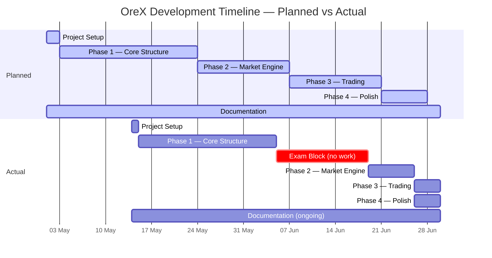
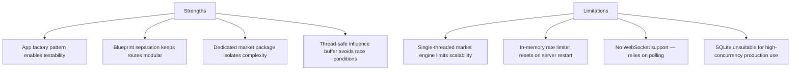
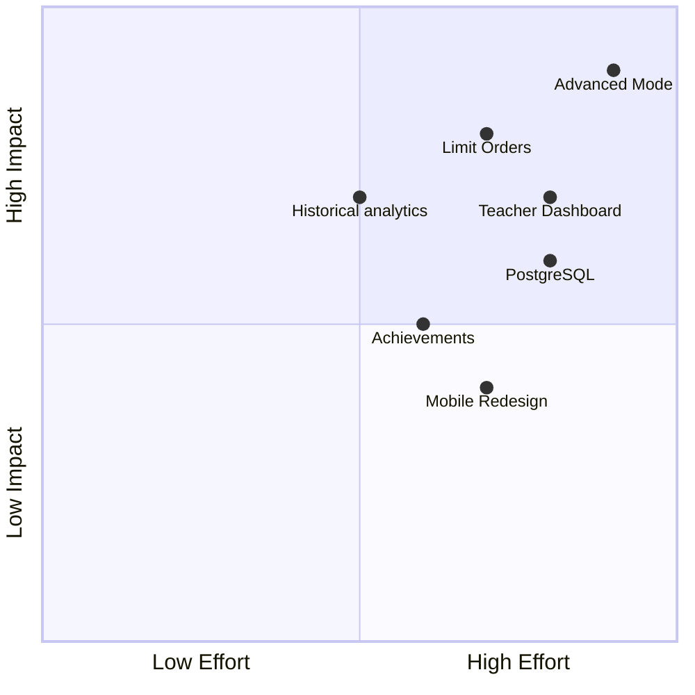

# Reflection and Evaluation — OreX

## 1. Document Purpose

This document provides a critical reflection on the development of OreX, evaluating the project against its original requirements, analysing the effectiveness of the development process, identifying strengths and limitations, and outlining potential future improvements.

---

## 2. Project Summary

OreX is a Minecraft-themed stock market simulation that allows multiple users to trade nine fictional ores simultaneously in a shared, real-time market environment. The application was built using Python (Flask), SQLite, and server-rendered HTML with HTMX for live updates. Multiple players connect to the same server and compete in the same market — their trades influence prices, they appear on a shared leaderboard, and they experience the same market events and bot activity. Key features include user authentication, a background market engine with algorithmic pricing, AI bot traders, portfolio tracking, a competitive leaderboard, and transaction history.

---

## 3. Requirements Evaluation

### 3.1 Functional Requirements Coverage

| Priority | Total | Implemented | Partially Implemented | Not Implemented |
|----------|-------|-------------|----------------------|-----------------|
| Must Have | 18 | 18 | 0 | 0 |
| Should Have | 13 | 13 | 0 | 0 |
| Could Have | 5 | 5 | 0 | 0 |
| **Total** | **36** | **36** | **0** | **0** |

### 3.2 Key Requirements Assessment

| Requirement Area | Assessment | Notes |
|-----------------|-----------|-------|
| User Authentication | Fully implemented | Registration, login, logout with rate limiting and secure password hashing |
| Market Engine | Fully implemented | 8-step algorithm runs every 20 seconds in a background thread |
| Trading System | Fully implemented | Buy/sell with confirmation, atomic transactions, weighted average pricing |
| Portfolio Management | Fully implemented | Per-holding and aggregate profit/loss, current value calculations |
| Bot Traders | Fully implemented | 9 bots with real accounts, balance-checked trades, leaderboard presence |
| Leaderboard | Fully implemented | All users ranked by total value (cash + holdings market value) |
| Transaction History | Fully implemented | Paginated, most recent first, with archived toggle |
| Live Updates (HTMX) | Fully implemented | Dashboard, market, portfolio, and leaderboard auto-refresh via HTMX polling |
| Security Features | Fully implemented | CSRF protection, parameterised queries, PBKDF2 hashing, rate limiting |
| Error Handling | Fully implemented | Custom 404 and 500 error pages with navigation back to the application |

---

## 4. Development Process Reflection

### 4.1 Methodology

The project followed an iterative development approach across four phases:

1. **Phase 1 — Core Structure:** Flask app factory, database schema, user authentication
2. **Phase 2 — Market Engine:** Background tick loop, pricing algorithm, bot traders
3. **Phase 3 — Trading:** Buy/sell flows, portfolio tracking, transaction history
4. **Phase 4 — Polish:** Leaderboard, HTMX live updates, responsive UI, settings

### 4.2 What Went Well

| Area | Reflection |
|------|-----------|
| Architecture | The Flask app factory pattern and blueprint separation made it straightforward to add new features without disrupting existing code. Each blueprint operates independently with clear responsibilities. |
| Technology Choices | Flask + SQLite was an appropriate stack for the project scale. Zero-configuration database setup eliminated deployment friction. Jinja2 templating integrated naturally with HTMX partial responses. |
| Market Algorithm | The 8-step pricing pipeline produces visually convincing market behaviour. Trend effects and gravity create natural-looking price cycles without requiring complex financial modelling. |
| Data Integrity | Atomic trade execution with try/except and rollback prevented any partial state corruption. SQLite WAL mode and foreign key enforcement maintained referential integrity. |
| Code Organisation | Separating the market logic into its own package (algorithm, bots, events, influence) kept the complexity isolated from the web layer. The thread-safe influence buffer cleanly bridges the two concerns. |
| Chart Visualisation | Using ApexCharts' stepline curve type for price history accurately represents the discrete 20-second tick model — prices hold flat between ticks and jump instantly to their new value. A smooth or straight-line interpolation would imply continuous price movement that does not occur in the engine, misleading users about market behaviour. |

### 4.3 Challenges Encountered

| Challenge | Impact | How It Was Addressed |
|-----------|--------|---------------------|
| SQLite threading limitations | Flask's per-request database connection cannot be shared with the background engine thread | Created a dedicated database connection for the engine thread, separate from Flask's `g` object |
| Debug mode double-start | Flask's reloader spawns two processes, causing the market engine to start twice | Added a check for `WERKZEUG_RUN_MAIN` environment variable to only start the engine in the reloader child process |
| Bot trade performance | 9 bots trading across 9 ores each tick (81 potential trades) needed to complete within the 20-second window | Optimised by batching all bot operations in a single commit rather than committing per trade |
| Price history data growth | Continuous 20-second ticks generate significant data over time | Implemented downsampling (max 100 points) for chart API responses to keep rendering fast |

### 4.4 Time Management

| Phase | Estimated Time | Actual Time | Variance | Notes |
|-------|---------------|-------------|----------|-------|
| Project Setup | 1–2 days | 1 day (14 May) | On schedule | Repository, dependencies, schema, seed data, app factory |
| Phase 1 — Core Structure | 2–3 weeks | ~3 weeks (15 May – 5 Jun) | On schedule | Full trading loop with static prices completed |
| Phase 2 — Market Engine | 1–2 weeks | ~1 week (19 Jun – 26 Jun) | Delayed start | Phase itself completed in 1 week, but exam block (5–19 Jun) pushed the start back by 2 weeks |
| Phase 3 — Trading | 1–2 weeks | ~4 days (26–30 Jun) | Compressed | Dashboard, history, and leaderboard delivered rapidly; ran concurrently with Phase 4 |
| Phase 4 — Polish | 1 week | ~4 days (26–30 Jun) | Compressed | HTMX live updates, responsive UI, and settings delivered concurrently with Phase 3 |
| Documentation | Ongoing | Ongoing | — | Produced concurrently with implementation |
| **Total Development** | **6–8 weeks** | **~6 weeks** | **On track despite delays** | Exam block caused a 2-week gap mid-project; compressed delivery of Phases 3–4 recovered lost time |

---

## 5. Technical Evaluation

### 5.1 Architecture Assessment

### 5.2 Code Quality

| Criterion | Assessment | Evidence |
|-----------|-----------|----------|
| Separation of Concerns | Strong | Routes handle HTTP, models handle data access, market package handles pricing logic. No business logic in templates. |
| DRY Principle | Good | Shared utilities for validation and formatting. Common template partials for reusable UI components. |
| Input Validation | Comprehensive | Centralised in `utils/validation.py` with consistent return pattern `(value, error)`. Applied to all user inputs. |
| Error Handling | Robust | Atomic trade transactions with rollback. Market engine catches and logs exceptions without crashing. Custom error pages for users. |
| Documentation (Docstrings) | Good | All modules and public functions have docstrings explaining purpose, parameters, and return values. |
| Naming Conventions | Consistent | snake_case for functions/variables, PascalCase for classes. Blueprint names match their URL prefix. File names describe content clearly. |

### 5.3 Security Evaluation

| Security Measure | Effectiveness | Limitations |
|-----------------|--------------|-------------|
| Password Hashing (PBKDF2) | Strong — industry-standard algorithm via Werkzeug | None identified for this project scale |
| CSRF Protection | Comprehensive — applied globally via Flask-WTF CSRFProtect | None identified |
| Parameterised Queries | Effective — all SQL uses `?` placeholders throughout models.py | None identified |
| Rate Limiting | Functional — prevents brute force on login | In-memory only; resets on restart; IP-based (can be bypassed with proxies) |
| Session Management | Standard Flask-Login implementation with secure cookies | Secret key is a hardcoded default for development; must be changed for production |
| Bot Account Protection | Adequate — `BOT_NO_LOGIN` hash cannot be verified by `check_password_hash` | Relies on convention rather than a dedicated `is_bot` database flag |

### 5.4 Performance Observations

| Metric | Observation | Acceptable? |
|--------|------------|-------------|
| Page Load Time (local) | Sub-second for all pages | Yes — well under the 2-second target |
| Market Tick Duration | Completes within 1–2 seconds (9 ores, 9 bots, 81 potential trades) | Yes — well within the 20-second interval |
| Chart Rendering | Fast due to downsampling to max 100 data points | Yes — no perceptible delay |
| Database Size Growth | ~9 price_history rows per tick (one per ore); ~1,600 rows per hour | Yes — SQLite handles millions of rows; periodic cleanup not required for assessment |
| Memory Usage | Minimal — Flask + SQLite + one background thread | Yes — suitable for classroom deployment |

---

## 6. Success Criteria Evaluation

| Criterion | Target | Achieved? | Evidence |
|-----------|--------|-----------|----------|
| Functional trading | Users can register, buy, sell, and view portfolio without errors | Yes | Complete buy/sell flow with validation, confirmation, atomic execution, and portfolio display |
| Live market | Prices update automatically every 20 seconds | Yes | Background engine thread ticks every 20 seconds; HTMX polls for updates on all live pages |
| Data integrity | No balance discrepancies or orphaned records under concurrent use | Yes | Atomic transactions with rollback; foreign key constraints; WAL mode for concurrent access |
| Security | No critical vulnerabilities in authentication or data access | Yes | PBKDF2 hashing, CSRF on all forms, parameterised queries, rate limiting |
| Usability | A new user can complete a trade within 2 minutes of registering | Yes | Register → Market → Select Ore → Enter Quantity → Confirm → Portfolio; achievable in under 60 seconds |
| Performance | Pages load within 2 seconds on a local machine | Yes | All pages load sub-second locally |

---

## 7. Comparison to Original Proposal

### 7.1 Scope Adherence

| Proposed Feature | Delivered? | Notes |
|-----------------|-----------|-------|
| 9 Tradeable Ores | Yes | Coal, Iron, Copper, Gold, Lapis Lazuli, Redstone, Emerald, Diamond, Netherite |
| User Accounts (Register/Login/Logout) | Yes | Full authentication with Flask-Login |
| Live Market (20-second ticks) | Yes | Background thread with 8-step algorithm |
| Buy/Sell with Confirmation | Yes | Two-step process: review then confirm |
| Portfolio Tracking | Yes | Per-holding P/L with totals |
| Bot Traders (9 bots) | Yes | Real accounts with balance-checked trades |
| Leaderboard | Yes | Ranked by total value (cash + holdings) |
| Transaction History (Paginated) | Yes | 20 per page with archived toggle |
| Account Reset | Yes | Restores balance, clears holdings, archives transactions |
| Market Events (3× shock) | Yes | 0.5% chance per ore per tick |
| Player Trade Influence | Yes | Thread-safe buffer consumed each tick |
| HTMX Live Updates | Yes | Dashboard, market, portfolio, leaderboard auto-refresh |
| Rate Limiting | Yes | 5 attempts per 15 minutes per IP |
| CSRF Protection | Yes | Flask-WTF CSRFProtect applied globally |

### 7.2 Scope Changes

| Change | Reason | Impact |
|--------|--------|--------|
| Email field removed from registration | Simplified the user experience (email verification was out of scope) and reduced collection of unessasary data | Reduced complexity without affecting core functionality |
| Two-factor authentication not implemented | Time allocated to documentation and testing instead; feature classified as stretch goal | No impact on core requirements; all Must Have and Should Have items delivered |
| Expandable stock cards replaced with dedicated detail pages | Detail pages provide more space for charts and trade forms | Improved usability; trade forms are clearer on a full page |

### 7.3 Client Correspondence

The following table documents rolling requirement modifications made in response to feedback from the EdTech client stakeholder. Each entry summarises the feature change and the conversation that prompted it.

| Rolling Requirement Modifications | Conversation Summary |
|-----------------------------------|---------------------|
| Added account reset functionality allowing students to restart with a fresh balance | The panel raised concerns that students who made poor early trades would disengage from the simulation entirely. A reset mechanism was requested so learners could retry without losing access to their transaction history for reflection purposes. |
| Introduced a confirmation step before all buy/sell actions | During a review session, the panel noted that students in a classroom setting are prone to mis-clicks and impulsive decisions. They requested a two-step trade flow (review → confirm) to encourage deliberate decision-making and reduce accidental trades. |
| Expanded the leaderboard to rank by total portfolio value rather than cash alone | Initial design ranked users by cash balance only. The panel pointed out this incentivised hoarding over trading, which undermined the educational goal of teaching active market participation. Ranking by total value (cash + holdings at market price) was agreed upon. |
| Added paginated transaction history with an archived toggle | The panel emphasised the importance of reflection in financial literacy education. They requested that students be able to review their full trade history, including trades from before an account reset, to support self-assessment activities and class discussions. |
| Increased bot trader count from 3 to 9 with balanced strategies | Early testing with only 3 bots produced a market that felt static when few students were online. The panel requested more bot participants to ensure the market remains dynamic during off-peak hours (e.g. outside class time), maintaining engagement for students who log in independently. |
| Strengthened password requirements from a simple 8-character minimum to a full complexity policy (8+ characters, at least one uppercase letter, one lowercase letter, one number, and one symbol) | The panel raised concerns that students would choose weak passwords (e.g. "password" or "12345678") that technically met the original 8-character rule but offered no real security. They requested stricter validation to teach good password hygiene and to protect student accounts in a shared classroom environment where others might attempt to guess credentials. |

---

## 8. Strengths

| # | Strength | Explanation |
|---|----------|-------------|
| 1 | Complete feature delivery | All 36 functional requirements (Must Have, Should Have, and Could Have) were implemented without compromise |
| 2 | Realistic market simulation | The 8-step algorithm with trend effects, gravity, events, and player influence produces convincing price behaviour that teaches genuine market concepts |
| 3 | Data integrity and atomicity | All trades execute atomically with rollback on failure, ensuring no partial state or balance discrepancies |
| 4 | Clean architecture | App factory, blueprints, and separated market package make the codebase maintainable and extensible |
| 5 | Security-first approach | CSRF protection, parameterised queries, password hashing, and rate limiting implemented from the start rather than retrofitted |

---

## 9. Limitations and Known Issues

| # | Limitation | Impact | Potential Mitigation |
|---|-----------|--------|---------------------|
| 1 | Single-server SQLite deployment | Cannot scale horizontally; unsuitable for large user bases beyond ~30 concurrent users | Migrate to PostgreSQL for production |
| 2 | In-memory rate limiter | Resets on server restart; does not persist across instances | Use Redis or database-backed rate limiting |
| 3 | No WebSocket real-time push | Relies on HTMX polling; prices may be up to one polling interval behind | Implement Flask-SocketIO for push-based updates |
| 4 | No automated test suite | Testing relies on manual execution of test cases; regression risk on code changes | Implement pytest with Flask test client for unit and integration tests |
| 5 | Hardcoded development secret key | The default SECRET_KEY in config.py is not secure for production deployment | Read from environment variable with no fallback in production mode |
| 6 | Bot strategy is simplistic | Bots make random decisions weighted by price vs base; no learning or adaptive behaviour | Implement momentum-based or pattern-recognition strategies for more realistic competition |

---

## 10. Future Improvements

### 10.1 Long-Term Improvments

| # | Improvement | Justification |
|---|------------|---------------|
| 1 | PostgreSQL migration | Enables multi-server deployment and higher concurrency for school-wide rollout |
| 2 | Limit orders (buy/sell at a target price) | Adds strategic depth; mirrors real market mechanics; teaches patience and planning |
| 3 | Advanced Mode, allowing experiementation with advanced concepts such as hedging, stop losses, and portfolio following | Increases realism and exposes more volatile and complex concepts while maintaining a convenient environment for both beginners and advanced players |
| 4 | Achievement system | Gamification increases engagement and provides structured learning milestones |
| 5 | Teacher dashboard | Allows educators to monitor student progress, pause the market, and inject events |
| 6 | Historical analytics and performance graphs | Per-user performance over time; supports self-reflection on trading decisions |
| 7 | Mobile-responsive redesign | Broader accessibility for students on tablets and phones |

### 10.2 Improvement Priority Map

---

## 11. Skills and Learning

### 11.1 Technical Skills Developed

| Skill | Level Before | Level After | Evidence |
|-------|-------------|-------------|----------|
| Python / Flask | Intermediate | Advanced | App factory pattern, blueprints, background threads, template filters, context processors |
| SQLite / Database Design | Basic | Intermediate | Schema design with indexes, WAL mode, foreign keys, parameterised queries, atomic transactions |
| HTML / CSS / Jinja2 | Intermediate | Advanced | Template inheritance, partials, conditional rendering, custom filters, responsive layouts |
| HTMX | None | Competent | Polling-based auto-refresh, HX-Request header detection, partial template responses |
| Threading and Concurrency | Basic | Intermediate | Background daemon thread, thread-safe shared buffer with locks, separate database connections per thread |
| Security Best Practices | Basic | Intermediate | CSRF protection, password hashing, rate limiting, parameterised queries, secure session management |
| Algorithm Design | Intermediate | Advanced | Multi-step probabilistic pricing engine with trend effects, gravity, events, and external influence |
| Git Version Control | Intermediate | Intermediate | Feature commits, structured commit messages, repository organisation |

### 11.2 Key Lessons Learned

| # | Lesson | How It Will Be Applied in Future |
|---|--------|----------------------------------|
| 1 | SQLite threading requires careful connection management — each thread needs its own connection | In future projects, use connection pooling or an ORM (like SQLAlchemy) that handles threading transparently |
| 2 | Atomic database operations are essential for financial data; partial state leads to bugs that are difficult to diagnose | Always wrap multi-step mutations in explicit transactions with rollback on failure |
| 3 | A well-designed algorithm with multiple competing forces (trend, gravity, events, influence) produces emergent behaviour more realistic than any single mechanism alone | Apply similar layered-effect design when building other simulations or game systems |
| 4 | HTMX provides most of the user experience benefits of a SPA with a fraction of the complexity for server-rendered applications | Prefer HTMX over full JavaScript frameworks for projects that are primarily server-rendered |
| 5 | Conservative time estimates and phased delivery eliminate deadline stress and leave room for quality improvements | Always structure projects so a submittable product exists early, then iterate towards the ideal |

---

## 12. Conclusion

OreX successfully delivered all planned functionality across its original requirements. The application provides a complete, working stock market simulation that teaches financial literacy concepts through an engaging Minecraft-themed interface. All 36 functional requirements were implemented, including every Must Have, Should Have, and Could Have item. The six success criteria (functional trading, live market, data integrity, security, usability, and performance) were all met.

The iterative development approach and conservative technology choices (Flask, SQLite, server-rendered HTML) proved effective for the project's scale and constraints. The architecture is clean, maintainable, and extensible. Security was addressed from the outset rather than bolted on later.

The primary areas for improvement are operational: automated testing, persistent rate limiting, and WebSocket-based real-time updates would strengthen the application for production use. The educational core — the market algorithm and trading mechanics — functions as designed and produces engaging, realistic market behaviour.

Overall, the project demonstrates competency in full-stack web development, database design, algorithm engineering, security implementation, and software architecture within a cohesive, polished product.
