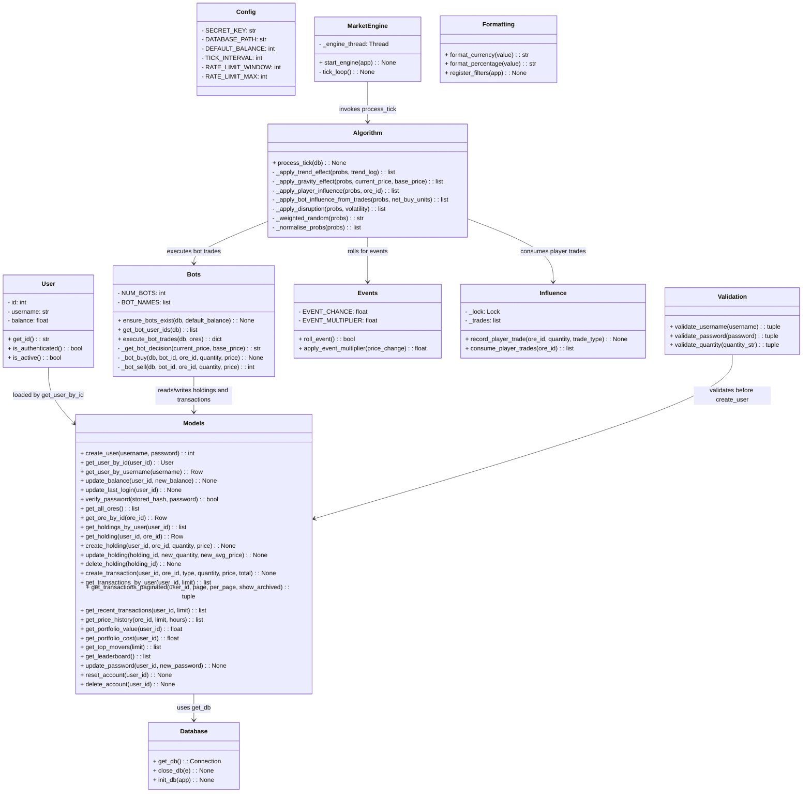

# 🧩 Class Diagram — OreX

A **Class Diagram** showing the object-oriented structure of the OreX system:
classes, attributes, methods, and relationships.

---

## Class Diagram

---

## ✔️ Checklist

- [x] All classes included
- [x] Attributes + types shown
- [x] Methods listed
- [x] Relationships correct
- [x] Diagram renders on GitHub
- [x] File renamed to **ClassDiagram.md**
