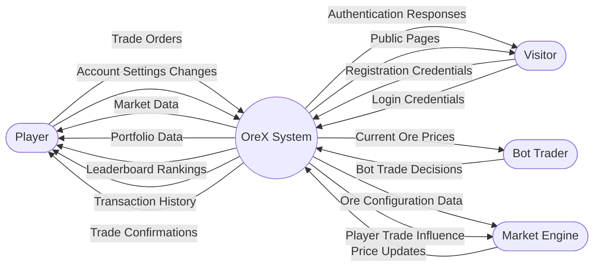

# 🌐 Context Diagram — OreX

*(Level 0 Data Flow Diagram)*

A **Context Diagram** showing the OreX system as a single process
and all external entities that interact with it.

---

## Context Diagram

---

## External Entities

| Entity | Description |
|--------|-------------|
| Visitor | An unauthenticated user who registers, logs in, or views public pages |
| Player | An authenticated human user who trades ores, views portfolio, and manages their account |
| Bot Trader | An automated AI trader that executes buy/sell decisions each market tick |
| Market Engine | The background process that calculates and applies price changes every 20 seconds |

---

## ✔️ Checklist

- [x] System shown as a **single process**
- [x] All **external entities** included
- [x] All **data flows** labelled clearly
- [x] Diagram matches the **Level 1 DFD**
- [x] Diagram renders correctly on GitHub
- [x] File renamed to **ContextDiagram.md**
