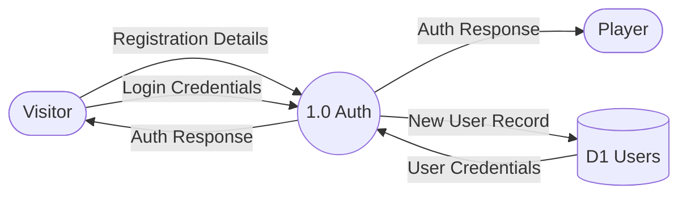
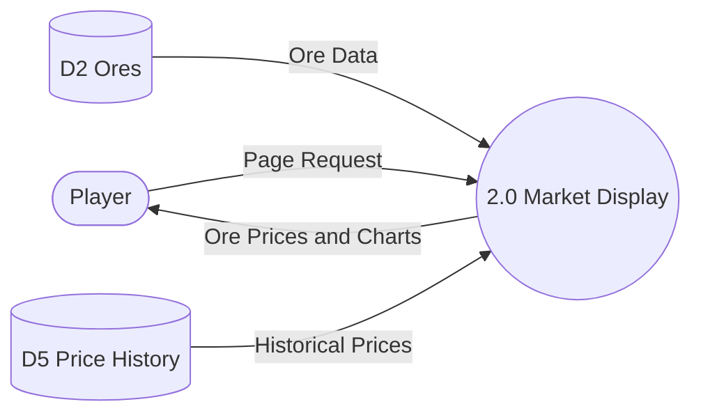
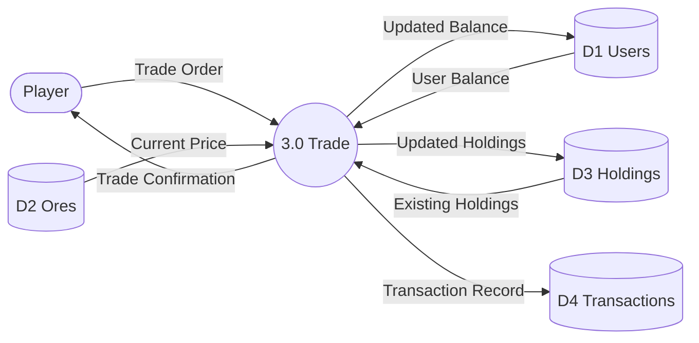
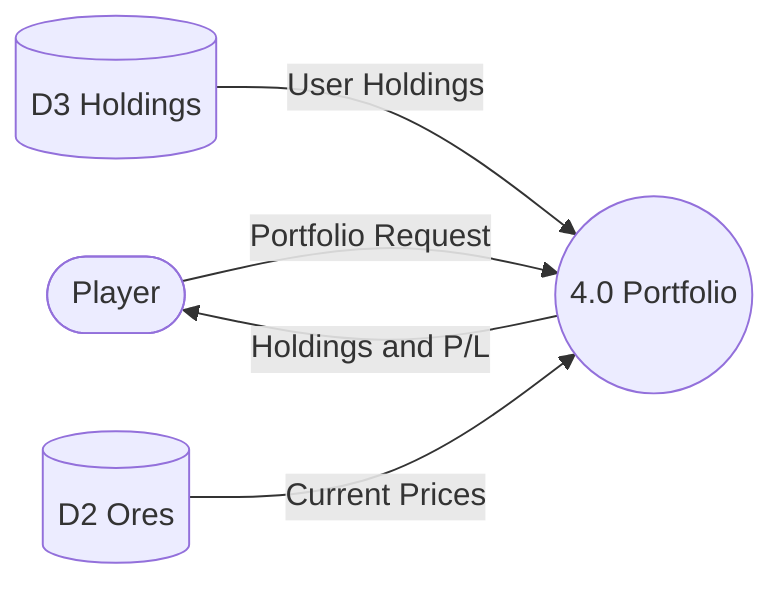
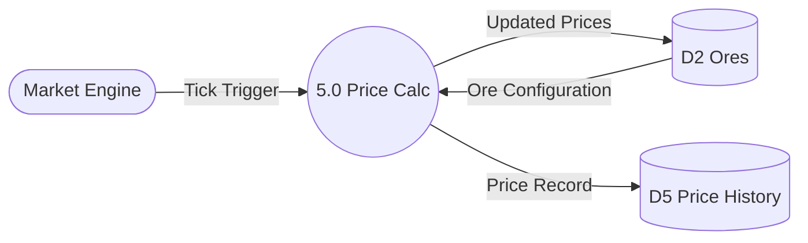
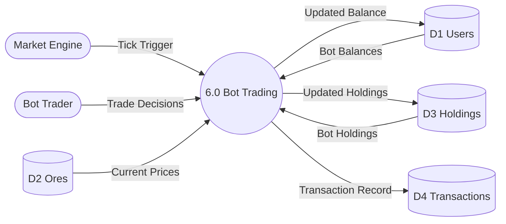
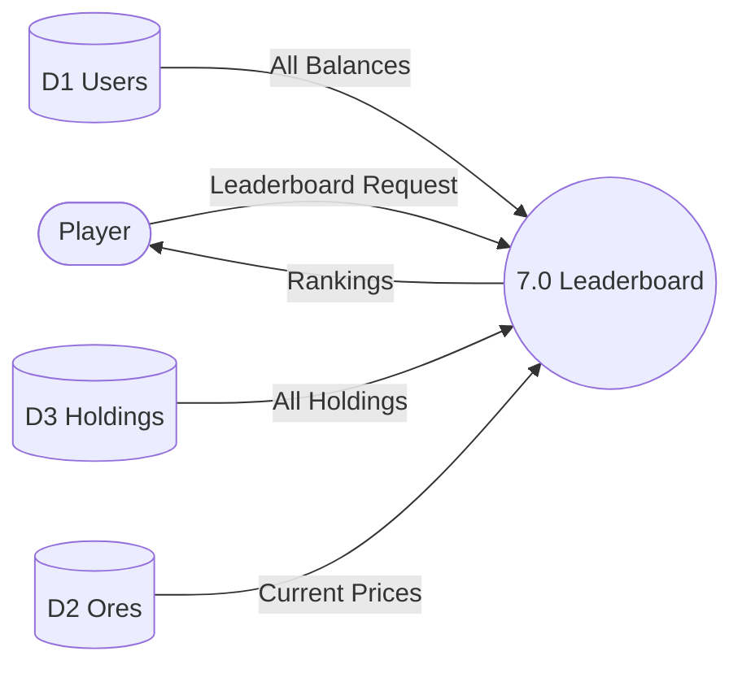
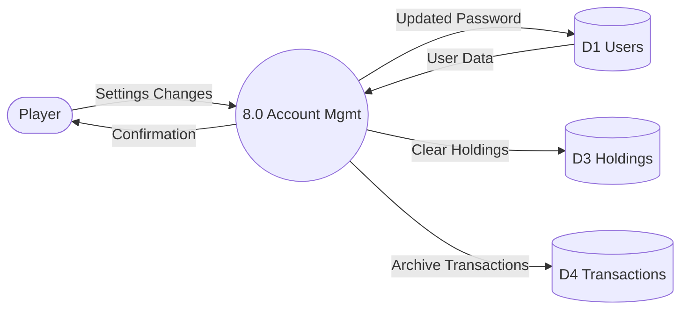
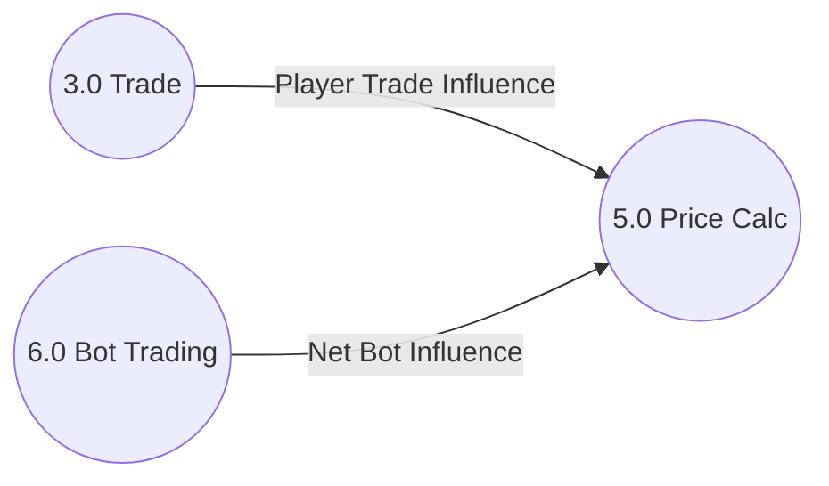

# 🔁 Data Flow Diagram (Level 1) — OreX

A **Level 1 DFD** expanding the Context Diagram by breaking the OreX system
into multiple processes, data stores, external entities, and labelled data flows.

---

## Level 1 DFD

### 1.0 Authentication

### 2.0 Market Display

### 3.0 Trade Execution

### 4.0 Portfolio Management

### 5.0 Price Calculation

### 6.0 Bot Trading

### 7.0 Leaderboard

### 8.0 Account Management

### Cross-Process Influence Flows

---

## Processes

| Process | Description |
|---------|-------------|
| 1.0 Authentication | Handles user registration, login, logout, rate limiting, and session management |
| 2.0 Market Display | Retrieves ore data and price history for market overview and ore detail pages |
| 3.0 Trade Execution | Validates and executes buy/sell orders atomically; records influence for next tick |
| 4.0 Portfolio Management | Calculates and displays user holdings with profit/loss metrics |
| 5.0 Price Calculation | Applies the 8-step algorithm to update ore prices each tick |
| 6.0 Bot Trading | Executes automated bot trades with balance checks and transaction recording |
| 7.0 Leaderboard | Calculates total value (cash + holdings) for all users and ranks them |
| 8.0 Account Management | Handles password changes and account resets |

## Data Stores

| Store | Description |
|-------|-------------|
| D1 Users | User accounts (human and bot) with credentials and balances |
| D2 Ores | Ore definitions with current prices, configuration, and trend logs |
| D3 Holdings | Per-user ore holdings with quantities and average purchase prices |
| D4 Transactions | Complete trade history for all users |
| D5 Price History | Timestamped price records for each ore (used for charting) |

---

## ✔️ Checklist

- [x] All processes numbered (1.0, 2.0, 3.0…)
- [x] All data stores included and labelled
- [x] All external entities match the Context Diagram
- [x] All arrows labelled with meaningful data flows
- [x] Diagram matches the System Flow Diagram
- [x] Diagram renders correctly on GitHub
- [x] File renamed to **DFDLevel1.md**
