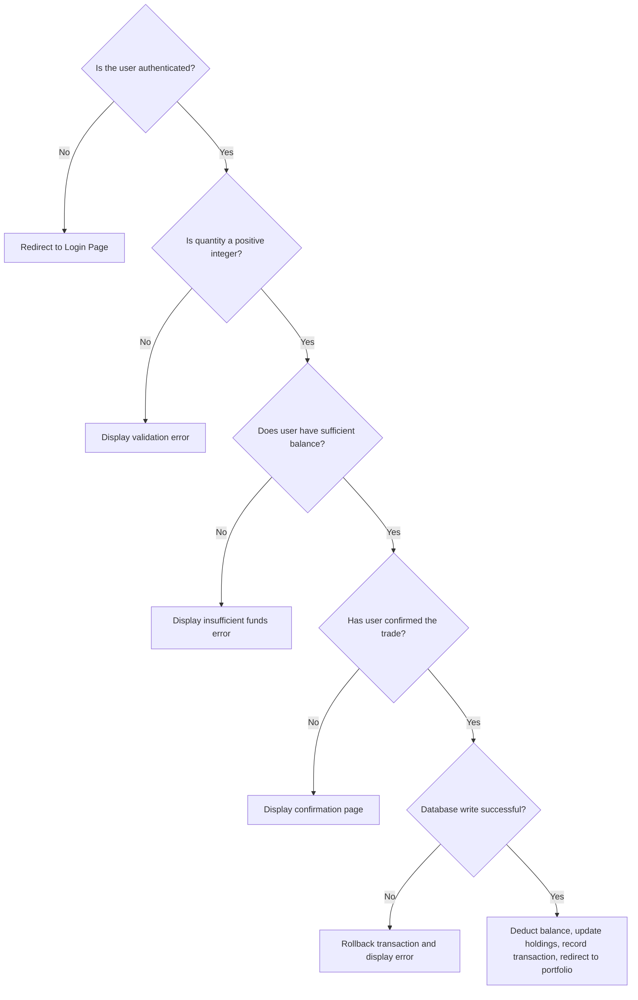
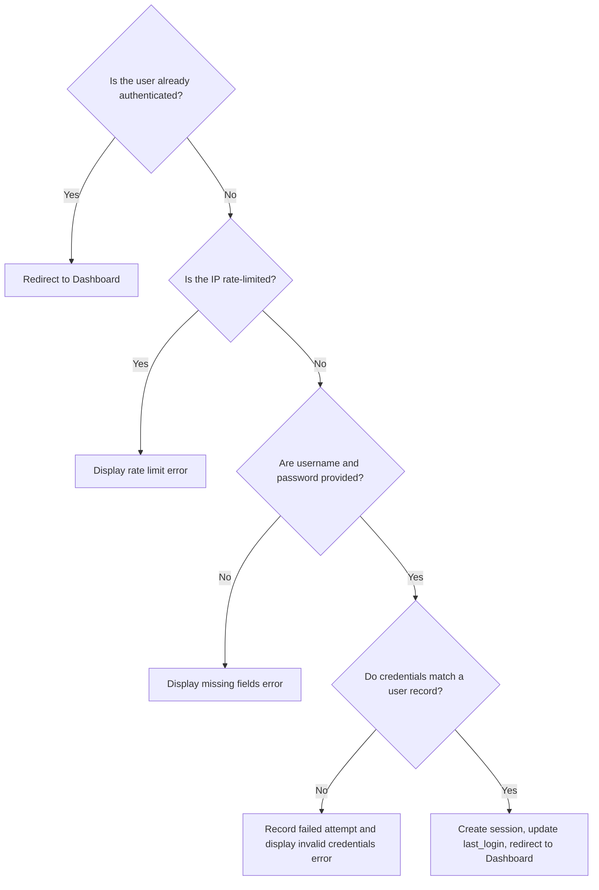
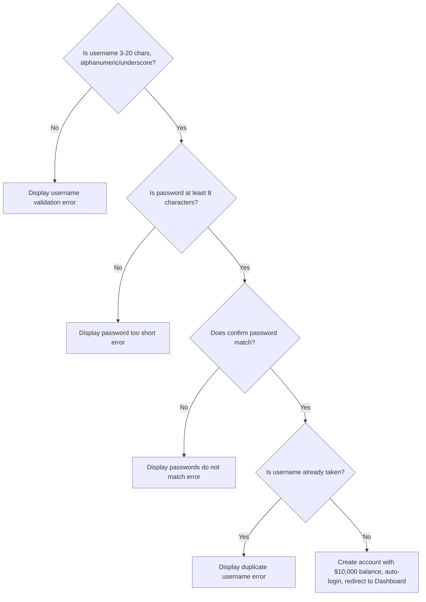
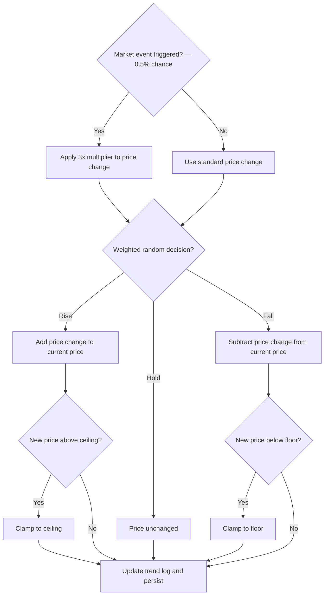

# 🌲 Decision Tree — OreX

A **Decision Tree** showing the branching logic and outcomes
for key decision points in the OreX system.

---

## Decision Tree — Trade Execution (Buy)

---

## Decision Tree — Trade Execution (Sell)

---

## Decision Tree — User Login

---

## Decision Tree — User Registration

---

## Decision Tree — Market Engine Tick (Per Ore)

---

## ✔️ Checklist

- [x] All decisions included
- [x] All outcomes shown
- [x] Branches labelled clearly
- [x] Matches program logic
- [x] File renamed to **DecisionTree.md**
