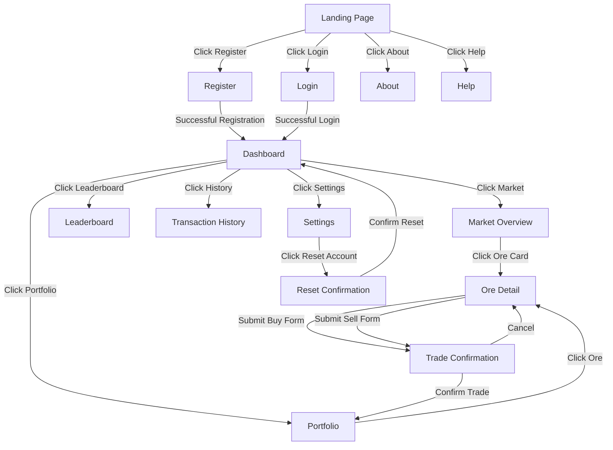

# 🎬 Storyboard — OreX

A **Storyboard** showing the sequence of screens in the OreX system
and how the user navigates between them.

---

## Screen Navigation Diagram

---

## Screen Details

| Screen # | Screen Name | Purpose / Description | Layout Notes | Navigation |
|----------|-------------|------------------------|--------------|------------|
| 1 | Landing Page | First screen visitors see; introduces OreX and encourages sign-up | Logo centred, hero text, two prominent buttons (Register, Login), footer links to About and Help | → Register, → Login, → About, → Help |
| 2 | Register | Account creation form | Form with username, password, confirm password fields; validation errors inline; submit button | → Dashboard (on success), → Landing (logo link) |
| 3 | Login | User authentication form | Form with username and password fields; error messages for invalid credentials or rate limiting | → Dashboard (on success), → Register (link), → Landing (logo link) |
| 4 | Dashboard | Personalised at-a-glance summary | Balance card, portfolio value card, profit/loss indicator, top 5 movers list, recent 5 transactions list; auto-refreshes via HTMX | → Market, → Portfolio, → Leaderboard, → History, → Settings, → Logout |
| 5 | Market Overview | Grid of all tradeable ores with live prices | 3-column card grid; each card shows ore icon, name, current price, and trend arrow (up/down/neutral); Sort_Control icon-button in header with dropdown for Default/Rising/Falling/Custom sort modes; drag-and-drop reorder capability on cards; tip text "Click and drag cards to reorder" near grid; auto-refreshes | → Ore Detail (click any card), → Dashboard (nav) |
| 6 | Ore Detail | Detailed view of a single ore with trade forms | Ore name/icon/price header, price history line chart with time range selector, buy form (quantity input + button), sell form (quantity input + button) | → Trade Confirmation (on form submit), → Market (back link) |
| 7 | Portfolio | All current holdings with profit/loss | Table with columns: ore icon, name, quantity, avg price, current price, invested, current value, P/L ($), P/L (%); totals row; auto-refreshes | → Ore Detail (click ore name), → Dashboard (nav) |
| 8 | Trade Confirmation | Review trade before execution | Summary showing ore name, trade type (buy/sell), quantity, unit price, total cost/proceeds, balance after trade; Confirm button, Cancel button | → Portfolio (on confirm), → Ore Detail (on cancel) |
| 9 | Leaderboard | Ranked table of all users | Table with columns: rank, username, cash balance, holdings value, total value; current user's row highlighted; auto-refreshes | → Dashboard (nav) |
| 10 | Transaction History | Paginated log of past trades | Table with columns: date, ore name, type (buy/sell), quantity, price, total; pagination controls (prev/next); archived toggle | → Dashboard (nav) |
| 11 | Settings | Account management options | Username display, password change form (current + new + confirm), Appearance section with Theme Switcher (Light/Dark/System toggle using CSS custom properties), link to Reset Account page | → Reset Confirmation, → Dashboard (nav) |
| 12 | About | How OreX works | Text content explaining the simulation mechanics, ore descriptions, and trading tips; no authentication required | → Landing (nav), → Help |
| 13 | Help | FAQ page | Expandable Q&A sections covering registration, trading, portfolio, leaderboard, and account reset; no authentication required | → Landing (nav), → About |
| 14 | Reset Confirmation | Confirm account reset | Warning text explaining consequences, username input field for confirmation, Reset button | → Dashboard (on success), → Settings (on cancel) |
| 15 | 404 Error | Page not found | Friendly error message with OreX branding, link back to Dashboard or Landing | → Dashboard, → Landing |
| 16 | 500 Error | Server error | Friendly error message advising to try again, link back to Dashboard or Landing | → Dashboard, → Landing |

---

## ✔️ Checklist

- [x] All major screens included
- [x] Each screen has a clear purpose
- [x] Navigation between screens is logical
- [x] Layout notes are clear and helpful
- [x] Storyboard aligns with Use Cases and System Flow
- [x] File renamed to **Storyboard.md**
