# 🧱 Structure Chart — OreX

A **Structure Chart** showing the modular decomposition of the OreX application —
the hierarchy of modules, functions, and subroutines that match the actual code.

---

## Structure Chart

### Top-Level Modules

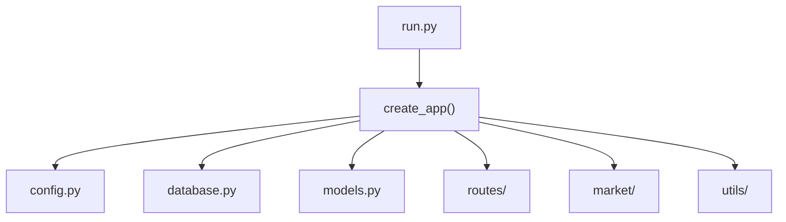

### database.py

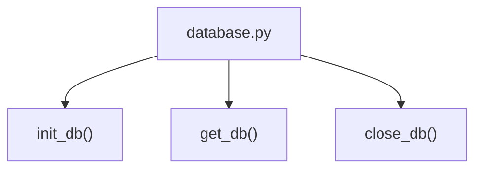

### models.py — User Functions

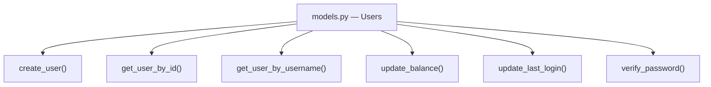

### models.py — Ore and Holdings Functions

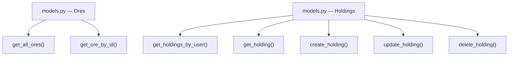

### models.py — Transaction, Dashboard, and Account Functions

```mermaid
flowchart TD
    MT["models.py — Transactions"]
    MT --> MT1["create_transaction()"]
    MT --> MT2["get_transactions_by_user()"]
    MT --> MT3["get_transactions_paginated()"]
    MT --> MT4["get_recent_transactions()"]

    MD["models.py — Dashboard"]
    MD --> MD1["get_portfolio_value()"]
    MD --> MD2["get_portfolio_cost()"]
    MD --> MD3["get_top_movers()"]
    MD --> MD4["get_price_history()"]

    MA["models.py — Account"]
    MA --> MA1["get_leaderboard()"]
    MA --> MA2["update_password()"]
    MA --> MA3["reset_account()"]
    MA --> MA4["delete_account()"]
```

### routes/ — Blueprints

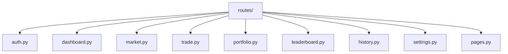

### routes/auth.py

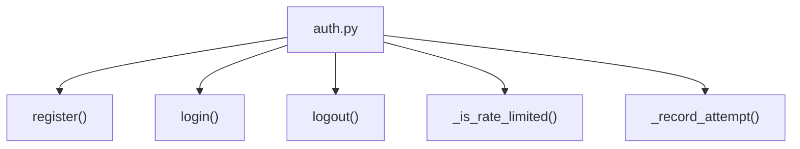

### routes/trade.py and routes/market.py

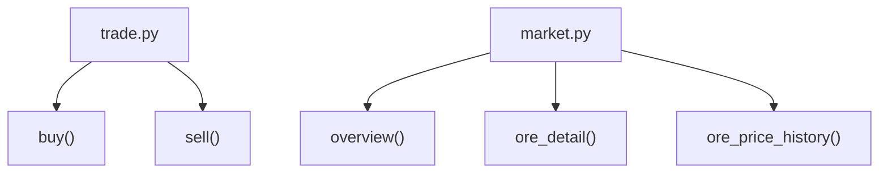

### market/ — Engine Package

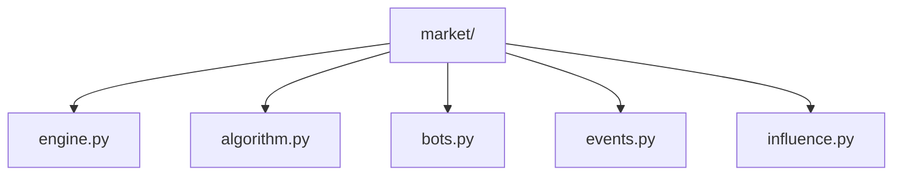

### market/engine.py and market/events.py

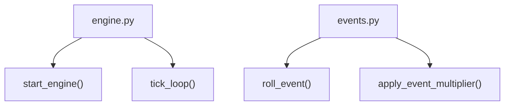

### market/algorithm.py

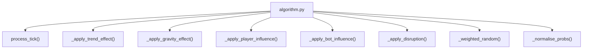

### market/bots.py

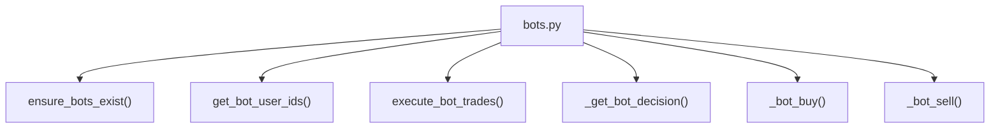

### market/influence.py and utils/

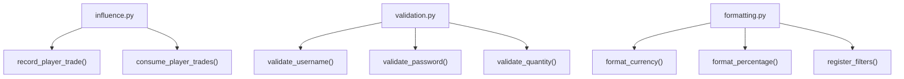

---

## ✔️ Checklist

- [x] Main module shown at the top
- [x] All major functions included
- [x] Helper functions shown under their parent modules
- [x] Names match the actual code
- [x] Diagram renders correctly on GitHub
- [x] File renamed to **StructureChart.md**
