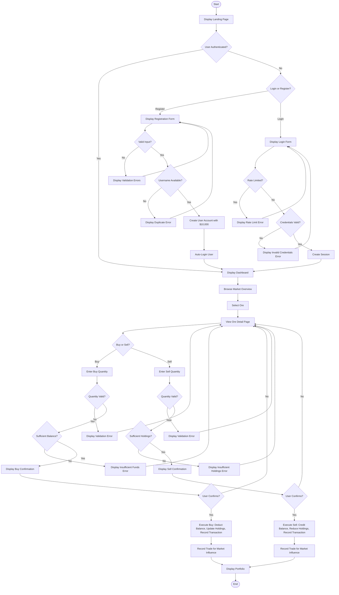
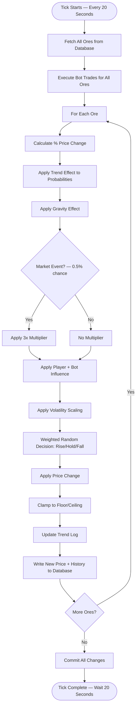

# 🔄 System Flow Diagram — OreX

A **System Flow Diagram** showing the sequence of processing steps and decisions
for the core user trading workflow in OreX.

---

## System Flow — Trading Workflow

---

## System Flow — Market Engine Tick

---

## ✔️ Checklist

- [x] All major steps included
- [x] All decisions shown
- [x] Alternate paths included
- [x] Matches program behaviour
- [x] File renamed to **SystemFlow.md**
