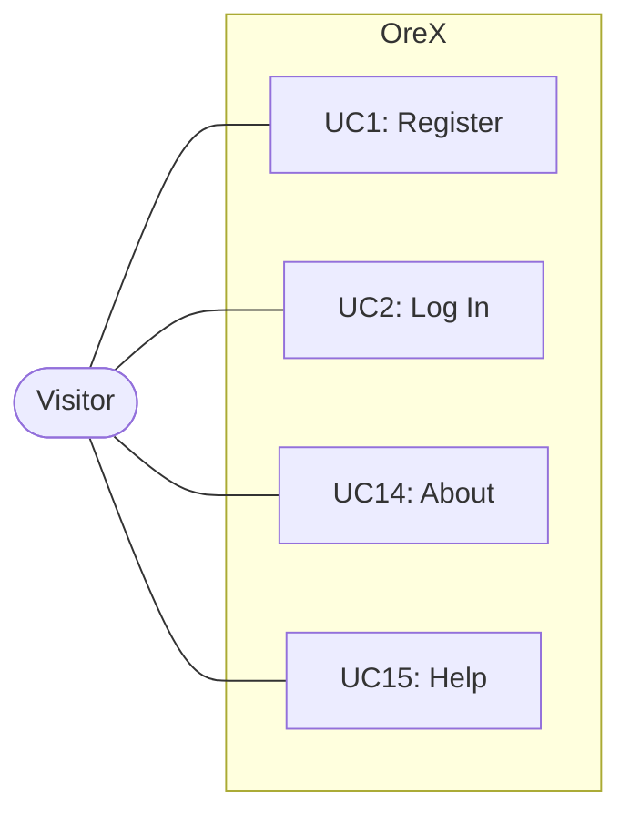
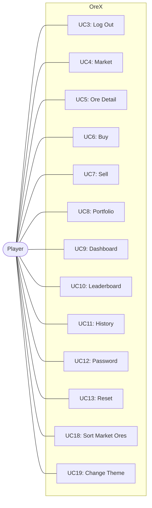
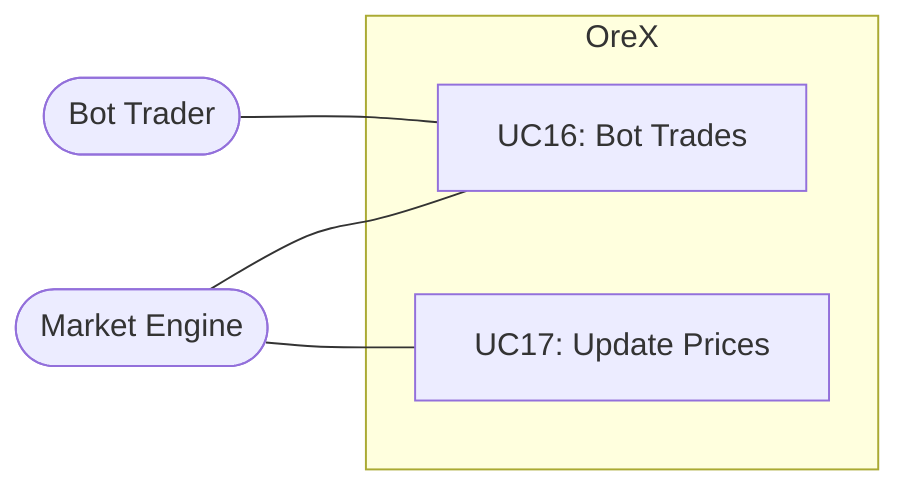

# 🎭 Use Case Diagram — OreX

A **Use Case Diagram** showing the actors, use cases, and interactions
within the OreX system.

---

## Use Case Diagram

---

## Use Case Descriptions

| ID | Use Case | Description |
|----|----------|-------------|
| UC1 | Register | Create a new account with username and password |
| UC2 | Log In | Authenticate with credentials to access the system |
| UC3 | Log Out | End the current session |
| UC4 | Market | Browse all ores and their current prices |
| UC5 | Ore Detail | View a single ore's price chart and statistics |
| UC6 | Buy | Purchase a quantity of ore at market price |
| UC7 | Sell | Sell a held quantity of ore at market price |
| UC8 | Portfolio | View all holdings with profit/loss |
| UC9 | Dashboard | View at-a-glance summary of portfolio and market |
| UC10 | Leaderboard | View ranked list of all players by total value |
| UC11 | History | View paginated transaction history |
| UC12 | Password | Change account password |
| UC13 | Reset | Reset account to starting state |
| UC14 | About | View how OreX works |
| UC15 | Help | View FAQ and usage guidance |
| UC16 | Bot Trades | Execute automated buy/sell decisions each tick |
| UC17 | Update Prices | Recalculate ore prices using the 8-step algorithm |
| UC18 | Sort Market Ores | Use the sort control on the market page to reorder ore cards by trend (Rising/Falling), reset to Default server order, or drag-and-drop to create a Custom arrangement. Includes selecting sort mode from dropdown, drag-and-drop reorder, persistence via localStorage, and re-application after HTMX refresh |
| UC19 | Change Theme | Select a colour theme (Light/Dark/System) from the settings page Appearance section. Includes immediate application via CSS custom properties, persistence via localStorage, FOUC prevention on page load, and live OS preference tracking in System mode |

---

## Actors

| Actor | Description |
|-------|-------------|
| Visitor | An unauthenticated user who can register, log in, and view public pages |
| Player | An authenticated human user who can trade, view portfolio, and manage their account |
| Bot Trader | An automated AI account that executes trades each market tick |
| Market Engine | The background process that updates ore prices every 20 seconds |

---

## ✔️ Checklist

- [x] System boundary correct
- [x] All actors included
- [x] All use cases included
- [x] Associations correct
- [x] File renamed to **UseCaseDiagram.md**
