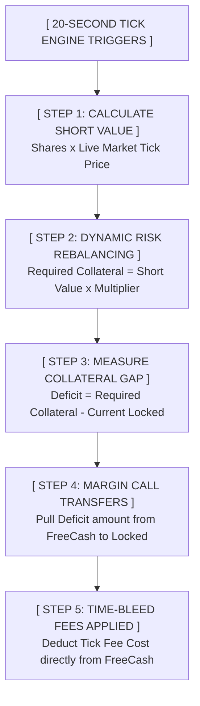
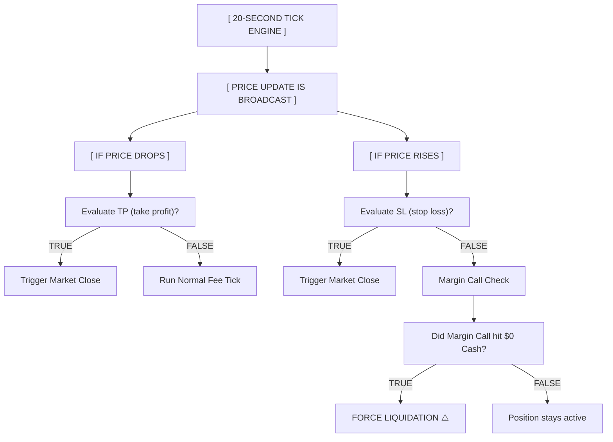

# OreX Shorting Plans

## 1. High Level Overview and Player Flow Abstraction

To keep the game fast-paced, the back-end financial math is abstracted into an intuitive, high-stakes system. The player interacts with short positions via a **reverse long position with a fuse** framework.

1. Market research: The initial evaluation phase.

* Analyze Volatility
* Check Short Interest

2. Trade Configuration: Setting up the transaction parameters.

* View Squeeze Price
* Set Locked Collateral

3. Active Engagement: Tracking and monitoring the live trade.

* Track Profit/Loss Line
* Monitor Fuel Meter (fees)

4. Outcomes: The trade concludes through one of two pathways.

* 4A. Voluntary Close: User-initiated termination.
  * Cash Out Profits/Losses
  * Unfreeze Remaining Cash
* 4B. Default Liquidation: System-enforced termination.
  * Free Cash Hits $0
  * Engine Auto-Buys Shares

## The Three UI Visual Anchors

* **The Profit/Loss Line**: A standard real-time P&L indicator, but completely reversed. As the underlying stock price crashes, this value turns green and climbs higher.
* **The Squeeze Price (The Red Line)**: A clear, static price barrier displayed on the asset chart. If the stock ticker rises to hit this price, the position instantly liquidates.
* **The Fuel Meter (The Fuse)**: Instead of overwhelming the user with background multi-variable fee logs, their main wallet balance (FreeCash) is framed as a fuel tank. The UI displays a ticking countdown timer: *"At current market volatility, your wallet can sustain this short for 45 seconds before a forced margin call closure."*

## 2. Important Concepts and Terms

* **Free Cash (Buying Power)**: The player's uninvested, liquid wallet balance. This serves as the pool used to pay continuous borrowing fees and acts as the backup capital to fund mandatory margin increases.
* **Short Value**: The live, fluctuating cash cost required to buy back all borrowed shares on the open market at the current exact tick price.
* **Initial Collateral Multiplier**: A calculated percentage (e.g., $150\%$) that determines how much total capital must back a short position upon opening to protect the system from instant defaults.
* **Locked Collateral (The Safety Vault)**: The escrow account managed by the game engine. It holds the original short sale proceeds plus the player’s upfront cash margin. These funds are frozen and completely unusable for other trades until the short position is resolved.
* **Short Ratio ($R_s$)**: The crowdedness metric of an asset. It measures the number of active short positions relative to the total positions (long + short) currently held across the entire global player base for that stock.
* **Volatility ($\sigma$)**: The localized metric tracking how fast and drastically a stock's price swings within a set timeframe.
* **Tick Engine**: The core clock loop of the game. In this specific configuration, **1 tick occurs every 20 seconds** (resulting in exactly **180 ticks per hour**).
* **Margin Call Transfer**: The dynamic backend sweep that automatically pulls money out of FreeCash and pushes it into LockedCollateral if a rising stock price expands the underlying position's risk profile.

## 3. Entrance Requirements

Before a player's short order is submitted and written to the database, the engine runs calculations based on base flat rates, economic crowdedness, and historical volatility to establish the upfront cash hurdle.

### Core Calculation Formulas

#### 1. Short Ratio Formula

$$R_s = \frac{\text{Total Global Short Positions}}{\text{Total Global Positions (Long + Short)}}$$
*(If total positions equal 0, $R_s$ defaults to $0.0$ to prevent division-by-zero crashes.)*

#### 2. Total Collateral Multiplier Formula

$$\text{Multiplier} = \text{Base Requirement} + \left( \text{Max Penalty} \times (R_s)^{\text{Steepness}} \right)$$

#### 3. Initial Capital Vault Lockup

$$\text{Total Locked Collateral} = \text{Initial Short Value} \times \text{Multiplier}$$

### Fine-Tuning Variables

* Base Requirement *(Default: 0.50)*: The baseline cash penalty matching real-world Regulation T rules. Raising this limits overall player leverage.
* Max Penalty *(Default: 2.0)*: Dictates how severely the economy punishes crowded trades. If set to 2.0, an asset shorted by 100% of the player base will demand a massive 250% total collateral backing.
* Steepness *(Default: 3)*: Controls the curvature of the penalty. A higher number ensures the penalty stays virtually invisible for lightly shorted stocks but spikes aggressively into a steep "hockey-stick" shape if a herd mentality forms.

### Scenario Examples

#### Scenario A: The Safe Blue-Chip

A player wants to open a **\$100,000 short** on a stable stock. The asset is uncrowded: only 100 out of 1,000 total global positions are shorts ($R_s = 0.10$).

* **Penalty Math**: $2.0 \times (0.10)^3 = 0.002$ (A negligible $0.2\%$ crowding penalty).
* **Total Multiplier**: $0.50 \text{ (Base)} + 0.002 = 0.502 \text{ (or } 50.2\%\text{)}$.
* **The Hurdle**: The system locks **\$50,200** of the player's cash alongside the \$100,000 short sale proceeds. Total frozen vault cash = **\$150,200**.

#### Scenario B: The Crowded Meme Stock

A player tries to open a **\$100,000 short** on a highly trended stock. The trade is heavily crowded: 800 out of 1,000 global positions are shorts ($R_s = 0.80$).

* **Penalty Math**: $2.0 \times (0.80)^3 = 1.024$ (A harsh $102.4\%$ crowding penalty).
* **Total Multiplier**: $0.50 \text{ (Base)} + 1.024 = 1.524 \text{ (or } 152.4\%\text{)}$.
* **The Hurdle**: To protect the infinite stock supply mechanic from an economic collapse, the engine forces the player to lock up **\$152,400** of their own cash. Total frozen vault cash = **\$252,400**.

## 4. Running Calculations

Every 20 seconds, the tick clock executes. The game engine processes a dual-action calculation sweep against all active database rows.

### The Per-Tick Fee Formula

To simulate real stock borrow premiums and adjust them to compressed gaming sessions, fees are calculated using an hourly framework divided across your **180 ticks per hour** system capacity:

$$\text{Tick Fee Cost} = \text{Current Short Value} \times \left( \frac{\text{Base Hourly Rate} + \left( \text{Max Hourly Fee} \times (\sigma)^2 \right)}{180} \right)$$

### Fine-Tuning Variables

* Base Hourly Rate *(Default: 0.005)*: A minor flat fee (0.5% of short value per hour) to guarantee that holding a short position indefinitely always incurs a cost, regardless of asset stability.
* Max Hourly Fee *(Default: 0.10)*: The maximum percentage of short value an asset can burn per hour under hyper-volatile market spikes (10% per hour).
* σ (Volatility) *(Scale: 0.0 to 1.5)*: Live calculation of the stock's price fluctuation intensity.

## 5. Exit Conditions

Positions resolve through one of three specific exit states. Because you are utilizing **Path B (The Automatic Rolling Margin Account)**, the interaction between cash reserves and collateral tracking requires specific architectural handling.

### Exit Scenario 1: Voluntary Pullout (Successful Harvest)

The trade went as planned. The stock price crashed, reducing the Short Value down to **\$40,000**. The player clicks "Close Position."

1. The engine reads the Locked Collateral pool (e.g., \$150,000).
2. It uses that frozen pool to purchase the shares back at the active market cost: $\text{\$150,000} - \text{\$40,000} = \text{\$110,000}$.
3. The remaining **\$110,000** is unfrozen and credited back to the player's FreeCash wallet.

### Exit Scenario 2: Default Liquidation (The Core Cash Bleed Out)

Under the Path B rolling margin engine, **collateral running out and free cash running out happen together as a single unified event**. They do not conflict; rather, one directly precipitates the other.

#### How It Works

* As the underlying stock price climbs, the engine constantly runs the **Margin Call Transfer**, siphoning cash out of FreeCash to artificially inflate Locked Collateral and maintain the safety ratio.
* Concurrently, the time-bleed volatility tick fee is systematically eating away at FreeCash.
* Eventually, a tick arrives where FreeCash drops to **\$0**. The player can no longer afford the tick fee, nor can they fund the required margin transfer to match the rising stock price.

#### The Engine's Resolution

At the exact millisecond FreeCash hits \$0, a **Forced Default Liquidation** triggers. The engine instantly claims the fully funded Locked Collateral vault, buys back the borrowed stock at market value to clear the asset debt, closes the trade, and returns whatever small cash remainder is left over into the player's wallet.

#### System Protection Checklist

This unified event eliminates the systemic threat of runaway debt. Because the engine was forcefully updating the collateral pool every 20 seconds, the vault is **mathematically guaranteed** to have enough cash to cover the stock buyback, entirely protecting your educational game from unbacked "phantom" debt or game-breaking negative wallet balances.

## 6. Stop Loss (SL) and Take Profit (TP) Implementation

Integrating automated order constraints into a fast-paced 20-second tick loop introduces distinct implementation guidelines.

### System Boundaries and Trigger Priorities

### Critical Implementation Guidelines

* **The Race Condition**: Automated constraints must be evaluated at the **very beginning of the tick loop**, immediately after the new price is generated but before the rolling margin call or tick fees are calculated. If a stock drops drastically and hits a player's Take Profit trigger, they should receive their cash reward immediately without being penalized by a final volatility fee deduction.
* **The Liquidation Override**: If a stock gaps upward violently, the system must check the Stop Loss threshold before evaluating a FreeCash default. If the price gaps beyond both boundaries simultaneously, execute the Stop Loss parameters to cleanly close the trade, preventing an unneeded and frustrating bankruptcy sequence for a player who took the time to set up proper risk controls.

## 7. UI and UX Design Implications (Optional Info)

To make this mathematically intensive engine engaging and playable, the user interface should prioritize visual data hierarchy over raw numerical logging.

### 1. The Interactive Dashboard Widget

* **The Threat Horizon Meter**: Replace complex balance rows with a prominent horizontal color bar tracking FreeCash runway. As cash dries up or margin transfers expand, the bar shrinks from green, to flashing amber, to solid red. A clear countdown text sits beneath it: *"Estimated Margin Collapse: 4 Ticks."*
* **The Squeeze Target**: Mark the liquidation boundary explicitly on the active stock graph using a bold, dashed crimson line labeled **"Squeeze Zone"** ⚠️. This provides immediate spatial context, allowing players to visually track how close the moving stock candlesticks are to destroying their trade.

### 2. Transaction Previews (The "Before You Short" Screen)

Before a player finalizes a short order, the system must present a clear structural breakdown of the entrance requirements to completely avoid user frustration:

| Metric | Display Style | Educational Purpose |
| :---- | :---- | :---- |
| **Position Size** | Plain Text (Left-Aligned) | The raw value of the asset being shorted. |
| **Upfront Safety Lockup** | **Highlighted Numeric Value** | Shows exactly how much of their wallet cash is being frozen. |
| **Crowding Surcharge** | Red Percentage Indicator (e.g., +42.3% Crowd Fee) | Explicitly teaches the player that entering a massive herd trend carries an immediate capital premium. |
| **Est. Tick Burn** | Static Cost Label (e.g., -$24.50 / Every 20s) | Outlines the continuous cash bleed caused by current asset volatility before they lock in the trade. |

### 3. Feedback Strings (Game Juice)

When a position closes via a default liquidation, do not simply erase the row from the UI. Trigger an alert overlay explaining the economic event:

* *Cash Bleed Message*: "Forced liquidation executed. Your Free Cash reserves dropped below operational levels required to sustain the stock borrow fee."
* *Margin Squeeze Message*: "Your short was forcefully squeezed! The asset price climbed rapidly, exhausting your backup capital reserves to maintain the collateral vault."
